# Arm mounting

This page provides instructions for mounting an arm onto the mobile base.

!!! note

    Make sure the mobile base controller is set up and functioning correctly before mounting an arm, as erratic base movements can damage a mounted arm.

## Arm mounting

=== "Kinova"

    Install four M6 roll-in T-nuts into the top crossbars using the [T-nut alignment jig](https://github.com/jimmyyhwu/tidybot2-resources/blob/main/3D%20Printing/Kinova/Kinova%20T-Nut%20Alignment%20Jig.stl) and the [mounting plate alignment jig](https://github.com/jimmyyhwu/tidybot2-resources/blob/main/3D%20Printing/Kinova/Kinova%20Mounting%20Plate%20Alignment%20Jig.stl):

    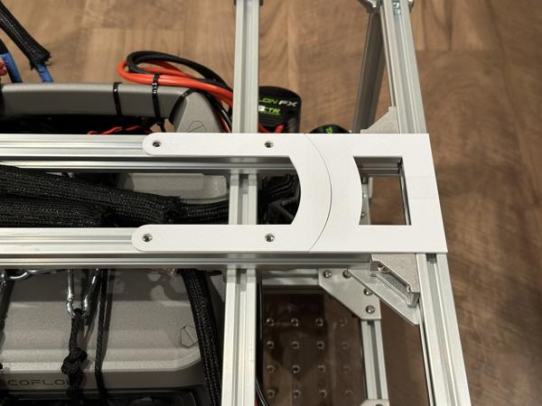{ width="49.45%" }
    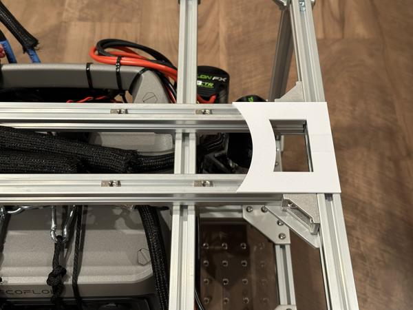{ width="49.45%" }

    Secure the Kinova mounting plate to the frame with four M6 25mm flat head screws:

    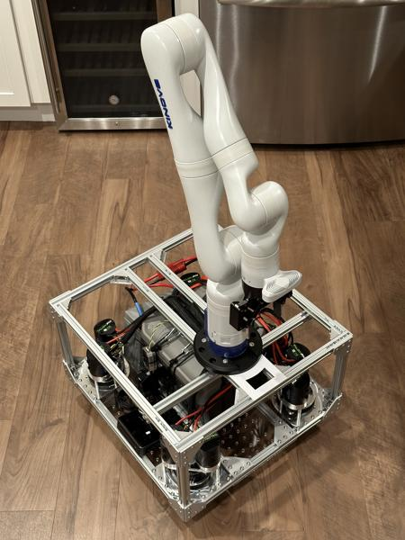{ width="32.55%" }

    !!! tip

        These screws should tighten smoothly but are very sensitive to misalignment.
        If you find a screw difficult to turn, loosen it, wiggle the mounting plate to correct the alignment, then try again.

    Secure the power adapter on the right side of the base using four 20mm gussets, zip ties, and Velcro cable ties:

    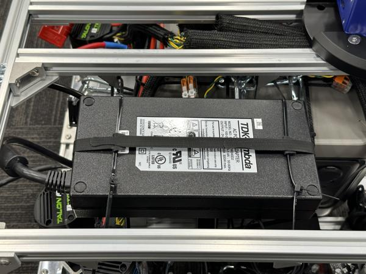{ width="49.45%" }

    Secure the E-stop next to the power adapter using zip ties:

    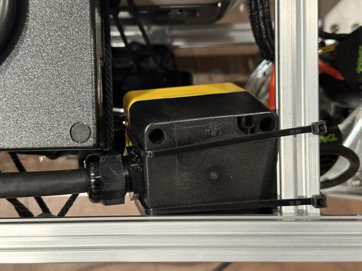{ width="49.45%" }
    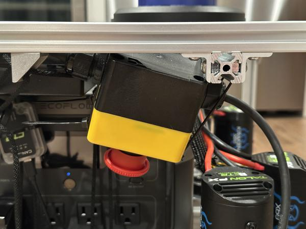{ width="49.45%" }

    !!! note

        We used this zip tie arrangement:

        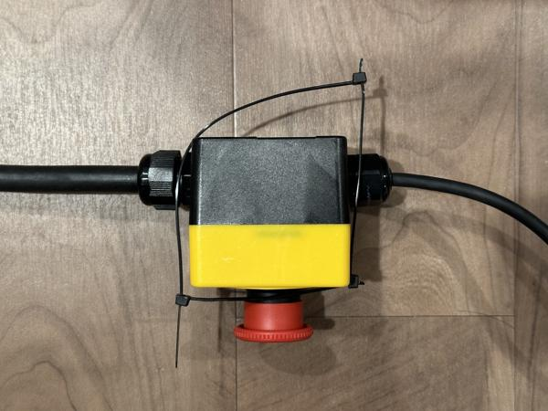{ width="49.45%" }

    !!! note

        The E-stop is mounted at an angle against the rails so that it does not move when pressed.

    !!! note

        We intentionally avoid mounting the E-stop on top of the mobile base to prevent it from being misconstrued as an E-stop for the mobile base.

    Tuck the power cable into the space around the power adapter:

    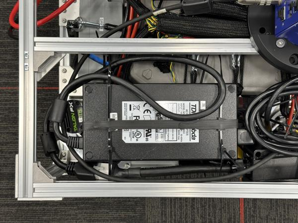{ width="49.45%" }

    Connect the AC power cord:

    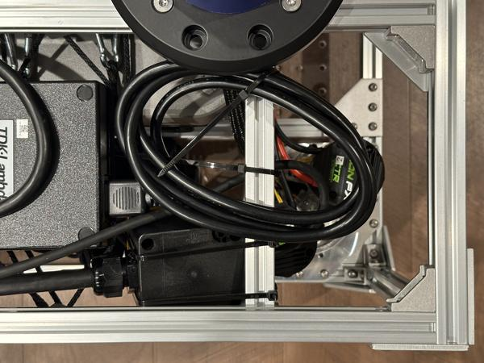{ width="49.45%" }

    Connect the Ethernet cable:

    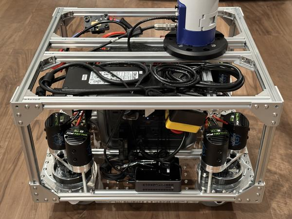{ width="49.45%" }

    Install the top acrylic plates using M5 8mm screws:

    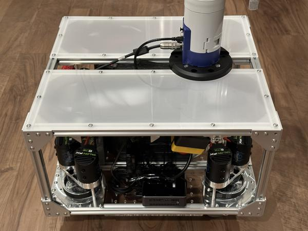{ width="49.45%" }

    Arm mounting complete:

    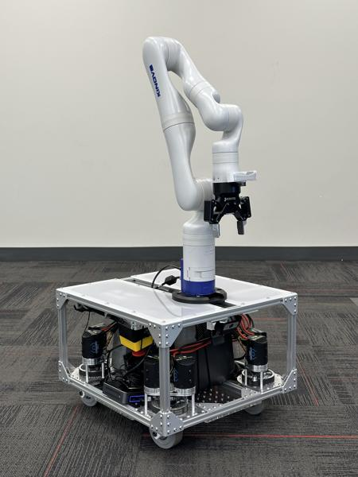{ width="49.45%" }

=== "Franka"

    Install the top acrylic plates using M5 8mm screws:

    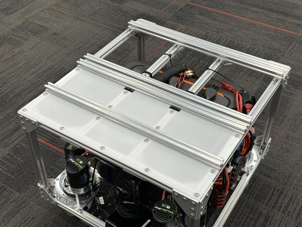{ width="49.45%" }

    Secure the control box to the top of the frame with two rope ratchets:

    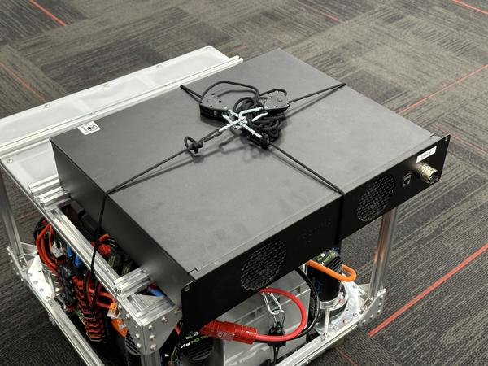{ width="49.45%" }

    Install four M6 slide-in T-nuts into the front crossbars:

    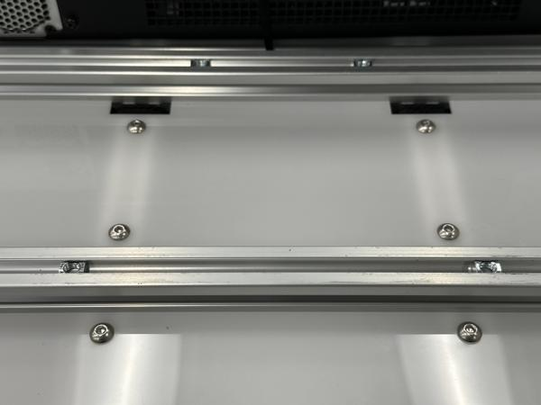{ width="49.45%" }

    !!! tip

        We provide an [alignment jig](https://github.com/jimmyyhwu/tidybot2-resources/blob/main/3D%20Printing/Franka/Franka%20T-Nut%20Alignment%20Jig.stl) to help align the T-nuts with the base flange screw holes.

    Secure the Franka base flange to the frame using four M6 14mm socket head cap screws and four M6 washers (OD 15.9mm):

    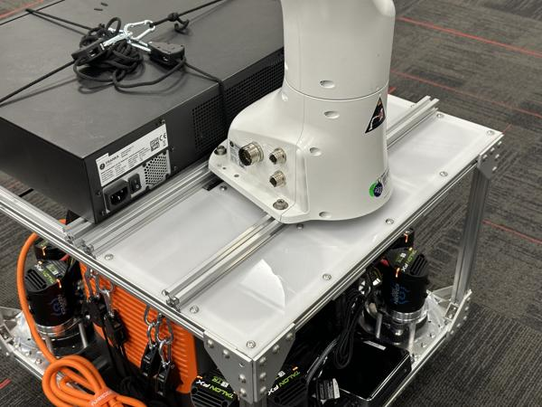{ width="49.45%" }

    Connect all cables:

    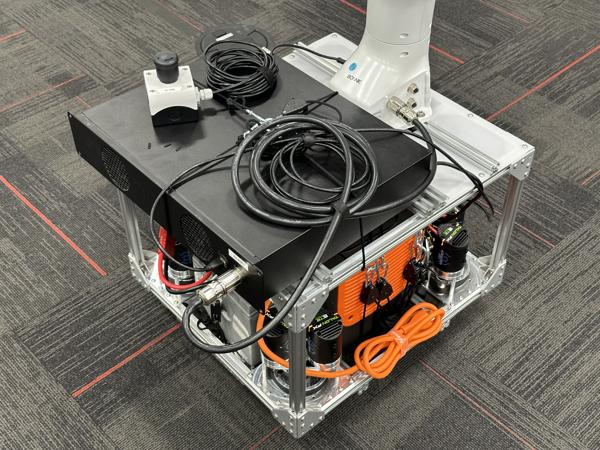{ width="49.45%" }

    Arm mounting complete:

    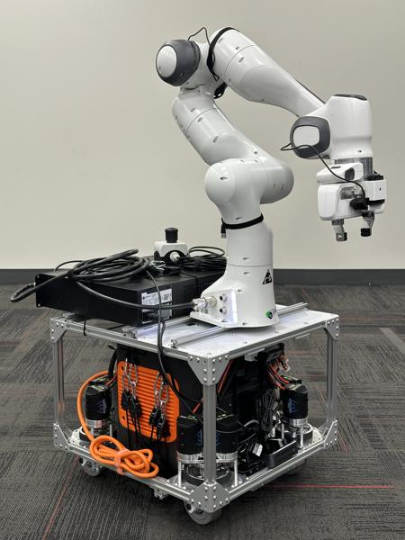{ width="49.45%" }

=== "ARX5"

    Install the arm and the [riser](https://github.com/jimmyyhwu/tidybot2-resources/blob/main/3D%20Printing/ARX5/ARX5%20Riser.stl) onto the mounting plate using four M3 100mm screws:

    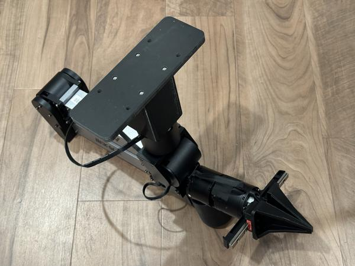{ width="49.45%" }
    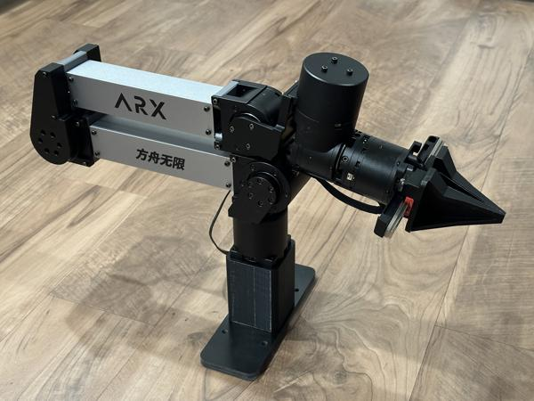{ width="49.45%" }

    !!! note

        The riser elevates the base of the arm by 9 cm.

    Secure the power adapter to the back of the frame using two 20mm gussets and four zip ties:

    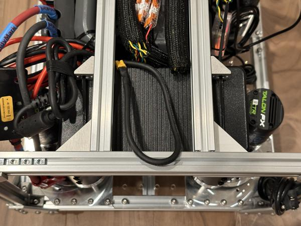{ width="49.45%" }
    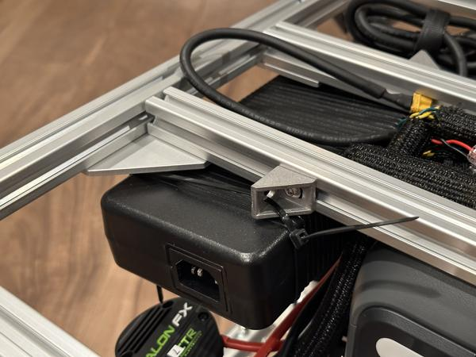{ width="49.45%" }

    Connect the AC power cord:

    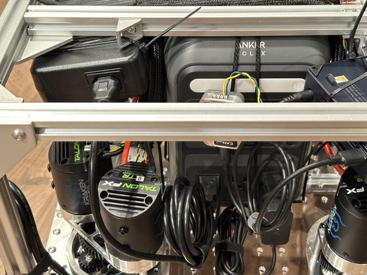{ width="49.45%" }

    Connect the CAN adapter:

    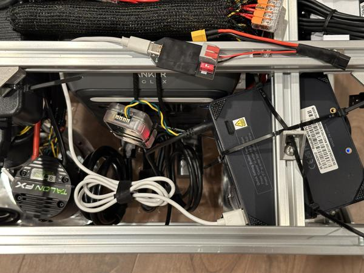{ width="49.45%" }

    !!! note

        These photos show the AC outlets of the portable power station on the side of the mobile base, but they should actually be on the front.

    Place the top acrylic plate onto the frame and route the cables through the mounting hole:

    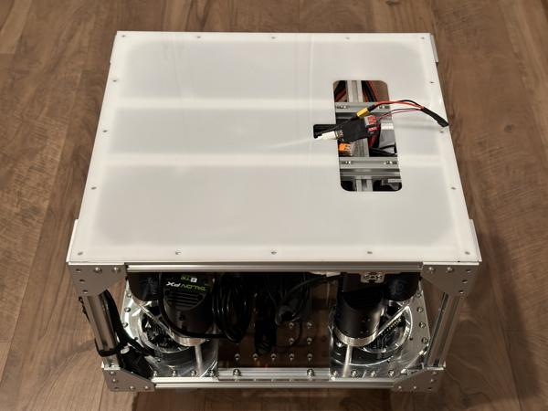{ width="49.45%" }

    !!! note

        Do not install the screws for the top plate yet.

    Install four M6 roll-in T-nuts into the top crossbars:

    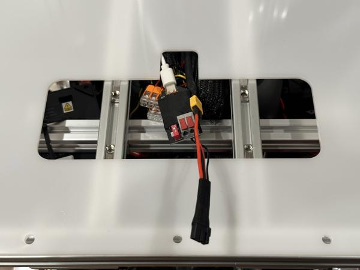{ width="49.45%" }

    Secure the ARX5 mounting plate to the frame using four M6 16mm screws, then plug the connector into the arm:

    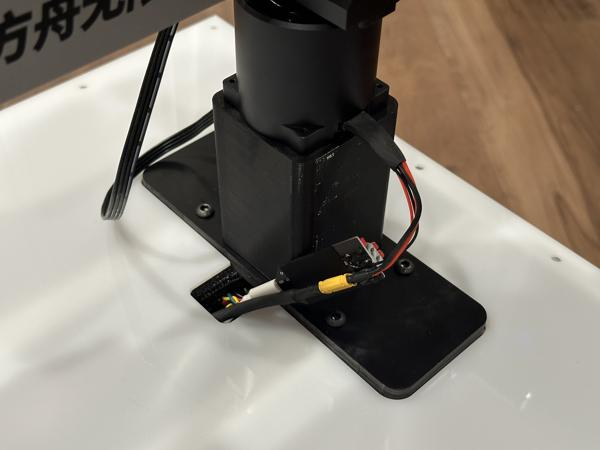{ width="49.45%" }

    Check that no cables are caught between the top acrylic plate and the frame, then secure the plate with M5 8mm screws:

    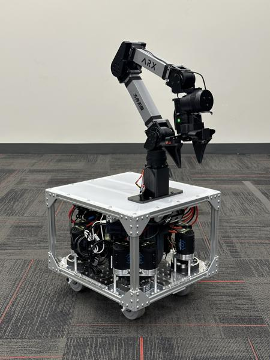{ width="49.45%" }

=== "xArm"

    !!! note

        These instructions assume the "Kinova" mobile base reference design.

    Adjust the top crossbars so that their centers are 95.3 mm apart, then install four M5 roll-in T-nuts:

    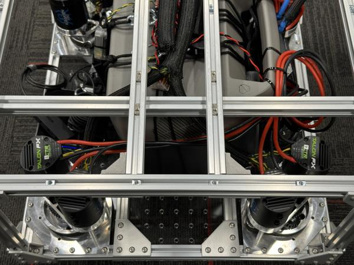{ width="49.45%" }

    Secure the xArm base flange to the frame using four M5 10mm socket head cap screws:

    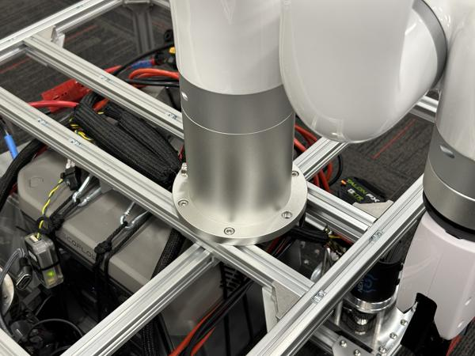{ width="49.45%" }

    Secure the power adapter with a rope ratchet:

    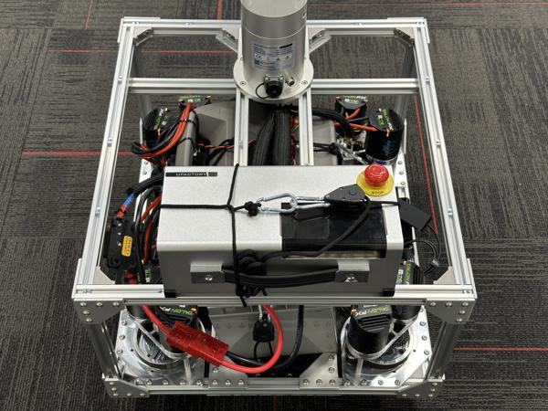{ width="49.45%" }

    Connect all cables:

    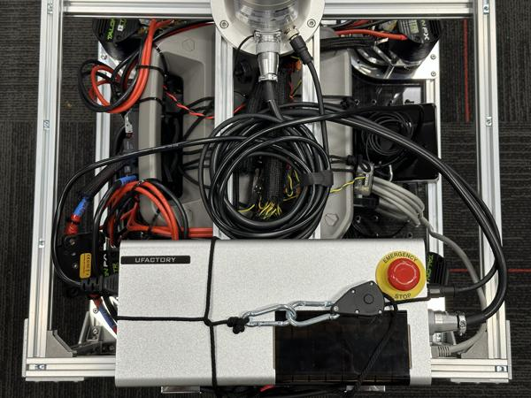{ width="49.45%" }

    Arm mounting complete:

    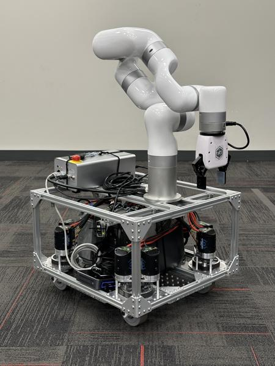{ width="49.45%" }

=== "UR5"

    !!! note

        These instructions assume the "Franka" mobile base reference design.

    Adjust the front crossbars so that their centers are 93.3 mm apart, then install four M6 slide-in T-nuts:

    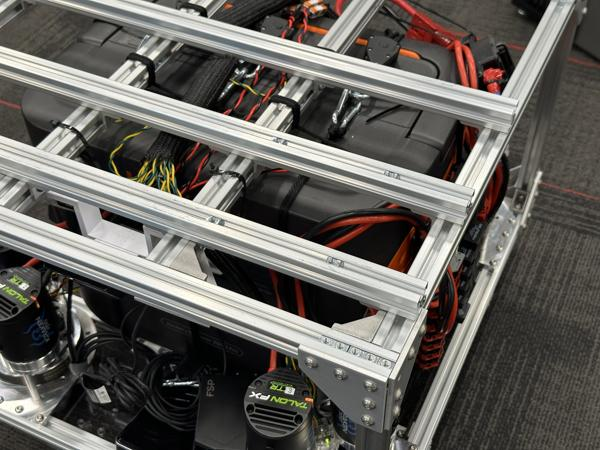{ width="49.45%" }

    Secure the UR5 base flange to the frame with four M6 25mm socket head cap screws and eight M6 washers:

    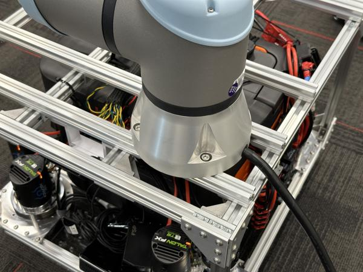{ width="49.45%" }

    Secure the control box with two rope ratchets:

    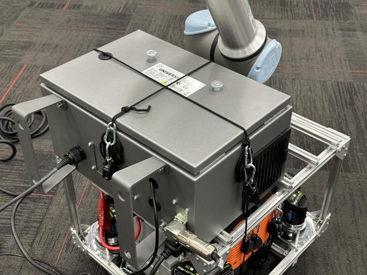{ width="49.45%" }

    Connect all cables:

    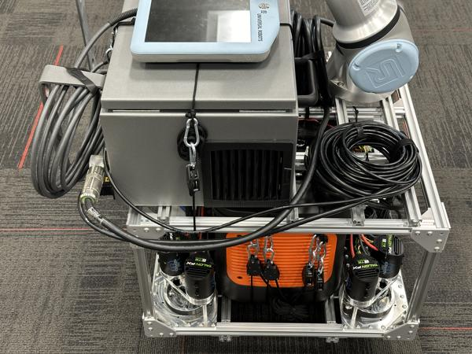{ width="49.45%" }

    Arm mounting complete:

    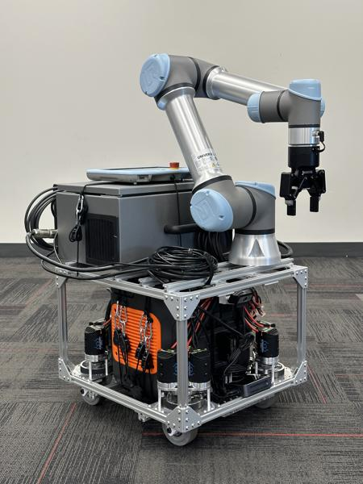{ width="49.45%" }

=== "ViperX"

    !!! note

        These instructions assume the "ARX5" mobile base reference design.

    Adjust the top crossbars so that their centers are 190 mm apart, then install four M5 roll-in T-nuts:

    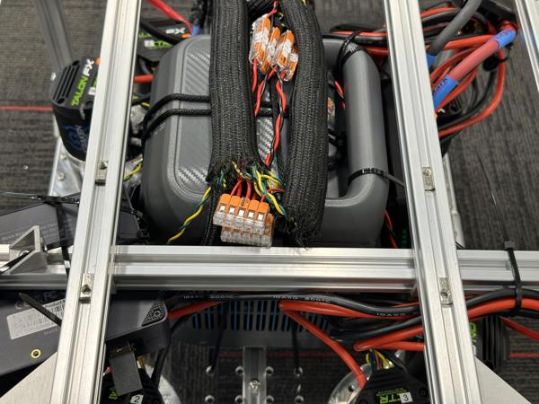{ width="49.45%" }

    Secure the ViperX base plate to the frame using four M5 14mm screws:

    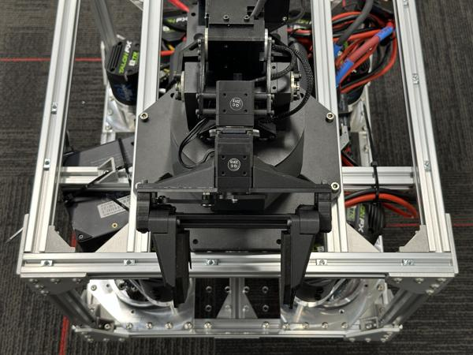{ width="49.45%" }

    Secure the power adapter to the frame with a rope ratchet:

    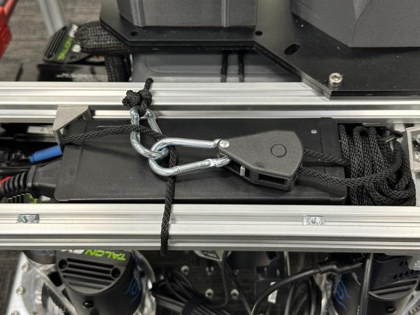{ width="49.45%" }

    Connect all cables:

    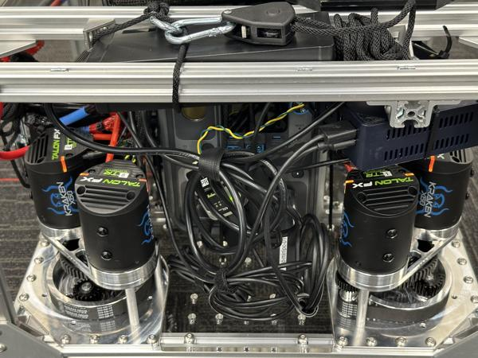{ width="49.45%" }

    !!! note

        These photos show the AC outlets of the portable power station on the side of the mobile base, but they should actually be on the front.

    Arm mounting complete:

    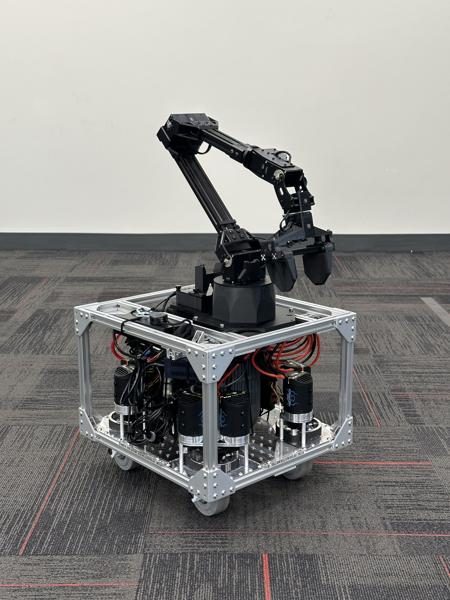{ width="49.45%" }

## Wrist camera

Each of our reference designs includes a wrist camera on the arm, equipped with a fisheye lens to increase the field of view.
The steps below describe how to install these components onto your arm.

First, install the fisheye lens onto the wrist camera:

=== "Kinova camera"

    Use the [Kinova fisheye mount](https://github.com/jimmyyhwu/tidybot2-resources/blob/main/3D%20Printing/Kinova/Kinova%20Fisheye%20Mount.stl) to install the fisheye lens.
    See video (2x speed):

    <video data-src="../videos/arm-mounting/IMG_7006-2x.mp4#t=0.001" controls playsinline></video>

    Here are example views from the Kinova camera, with and without the fisheye lens:

    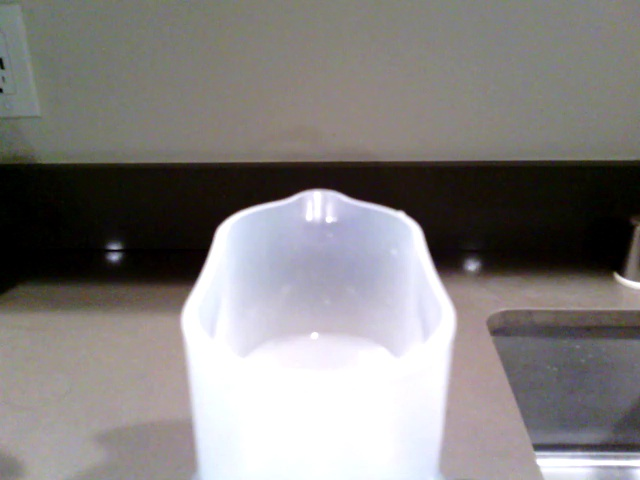{ width="49.45%" }
    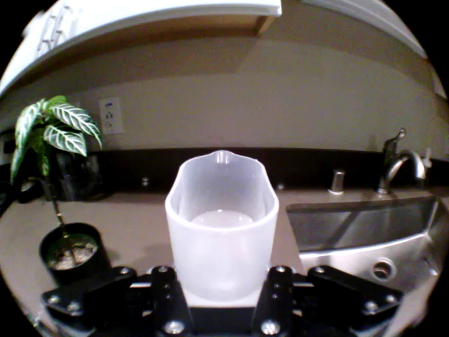{ width="49.45%" }

=== "Logitech camera"

    Use the [Logitech fisheye mount](https://github.com/jimmyyhwu/tidybot2-resources/blob/main/3D%20Printing/Logitech%20Fisheye%20Mount.stl) to install the fisheye lens.
    See video (2x speed):

    <video data-src="../videos/arm-mounting/IMG_1644-2x.mp4#t=0.001" controls playsinline></video>

    !!! note

        Make sure the bottom clip of the fisheye mount is fully inserted into the notch beneath the camera.
        This helps to align the fisheye center with the camera center.

    Here are example views from the Logitech camera, with and without the fisheye lens:

    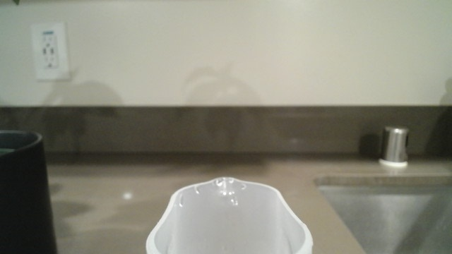{ width="49.45%" }
    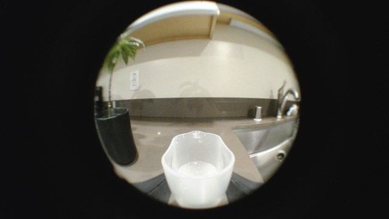{ width="49.45%" }

    !!! note

        When using the image from the Logitech camera, you may want to crop out the black portions on the sides.

=== "Other"

    For other cameras, we provide the CAD file for the fisheye lens mounting ring, which you can use as a starting point to design your own mount:

    | Fisheye mount |
    |:-:|
    | 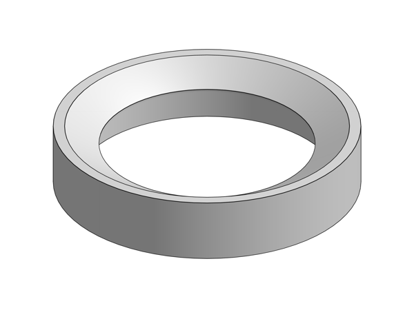{ width="32.55%" } [[STEP](https://github.com/jimmyyhwu/tidybot2-resources/blob/main/STEP/Fisheye%20Mount.step)] |

    !!! note

        Design your mount so that the bottom of the mounting ring sits flush with the front surface of your camera.

!!! note

    The circular part of the 3D-printed fisheye mount has very precise features.
    To ensure proper installation, be sure to fully remove all support material.
    We recommend using a [pick](https://www.amazon.com/HARDK-Hook-Pick-Set-B/dp/B07JYWND74) for easier removal.

!!! note

    The fisheye lens mounting ring can be installed in two different orientations (180° apart).
    Since the lens may not be symmetrical, make sure to keep the orientation consistent if you remove and remount the lens after collecting data.

Next, install the camera with the fisheye lens onto the wrist of the arm:

=== "Kinova"

    For the Kinova arm, we use the integrated wrist camera, so no camera mount is needed.
    Simply install the fisheye lens mount directly onto the camera:

    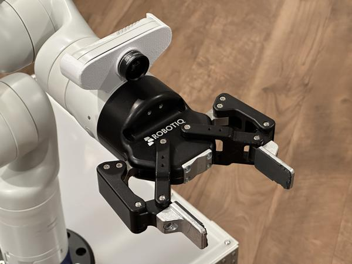{ width="49.45%" }

=== "Franka"

    Insert the Logitech camera into the [Franka wrist camera mount](https://github.com/jimmyyhwu/tidybot2-resources/blob/main/3D%20Printing/Franka/Franka%20Wrist%20Camera%20Mount.stl) to verify the fit:

    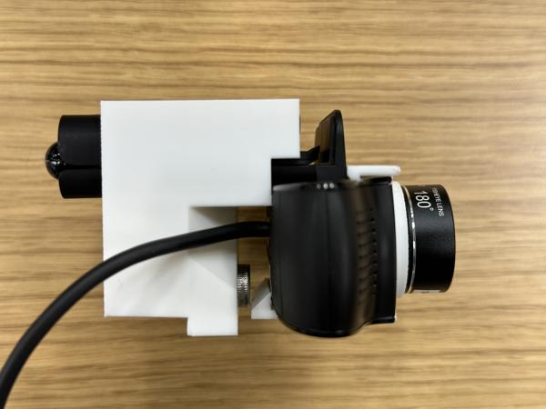{ width="49.45%" }

    !!! note

        Make sure the camera is fully inserted into the mount like in the photo above.
        The mount contains an integrated shim that inserts into the hinge to keep the camera angle fixed.

    Install the mount on top of the gripper using an M6 22mm socket head cap screw:

    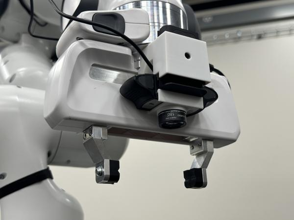{ width="49.45%" }

    !!! note

        Since the camera blocks the screw hole, you'll need to remove the camera to install the mount and then reinsert it.

    !!! note

        The camera is mounted upside down on the gripper so that the gripper fingertips are visible in the camera image.

=== "ARX5"

    Insert the Logitech camera into the [top part](https://github.com/jimmyyhwu/tidybot2-resources/blob/main/3D%20Printing/ARX5/ARX5%20Wrist%20Camera%20Mount%20Top.stl) of the ARX5 wrist camera mount:

    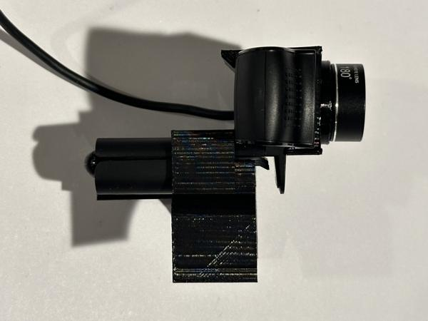{ width="49.45%" }

    !!! note

        Make sure the camera is fully inserted into the mount like in the photo above.
        The mount contains an integrated shim that inserts into the hinge to keep the camera angle fixed.

    Install the [bottom part](https://github.com/jimmyyhwu/tidybot2-resources/blob/main/3D%20Printing/ARX5/ARX5%20Wrist%20Camera%20Mount%20Bottom.stl) of the camera mount:

    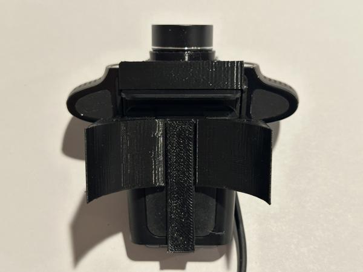{ width="49.45%" }

    !!! note

        The bottom part of the mount prevents the camera from sliding out.

    Install the mount above the gripper using the M3 screws included with the arm:

    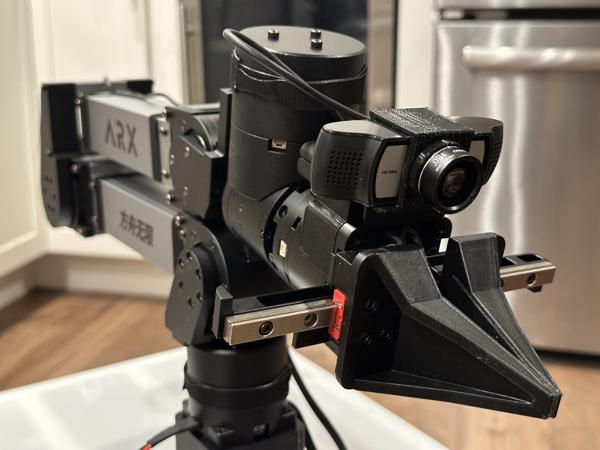{ width="49.45%" }

    !!! note

        We highly recommend using Velcro cable ties for cable management to provide strain relief.

        Check for maximum strain by moving joint 2 to its limits:

        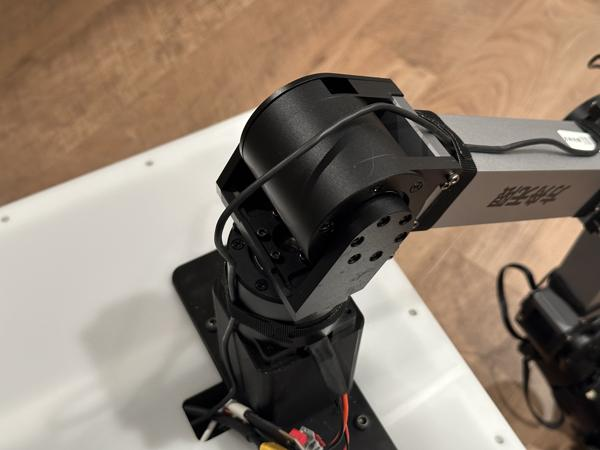{ width="49.45%" }

        Check the limits of the wrist joints (4, 5, and 6) as well:

        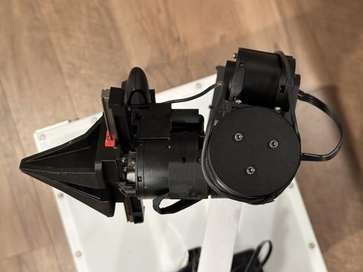{ width="49.45%" }
        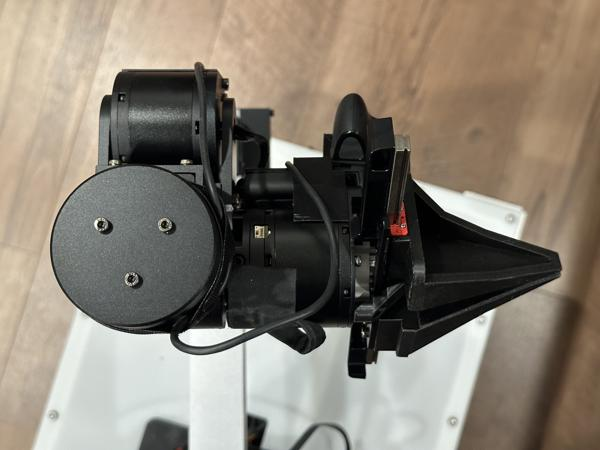{ width="49.45%" }

        Final result after cable management:

        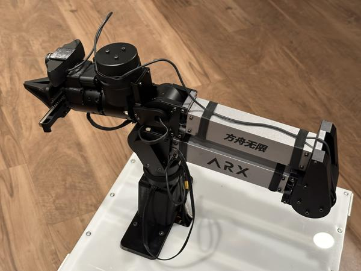{ width="49.45%" }

=== "Other"

    For other arms, we provide CAD files for a minimal Logitech camera mount, which you can adapt to design your own wrist camera mount:

    | Logitech camera mount (top) | Logitech camera mount (bottom) |
    |:-:|:-:|
    | 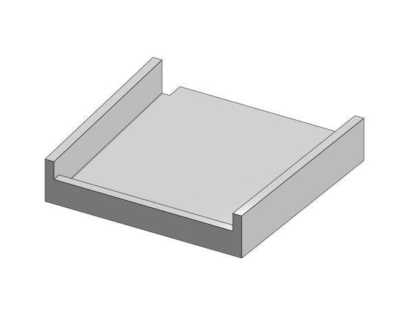 [[STEP](https://github.com/jimmyyhwu/tidybot2-resources/blob/main/STEP/Logitech%20Camera%20Mount%20Top.step)] | 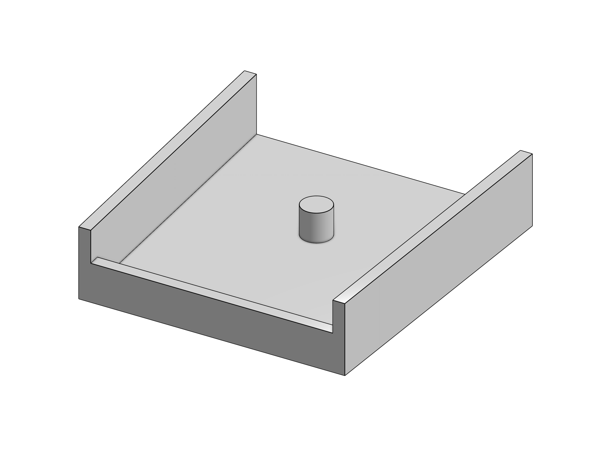 [[STEP](https://github.com/jimmyyhwu/tidybot2-resources/blob/main/STEP/Logitech%20Camera%20Mount%20Bottom.step)] |
