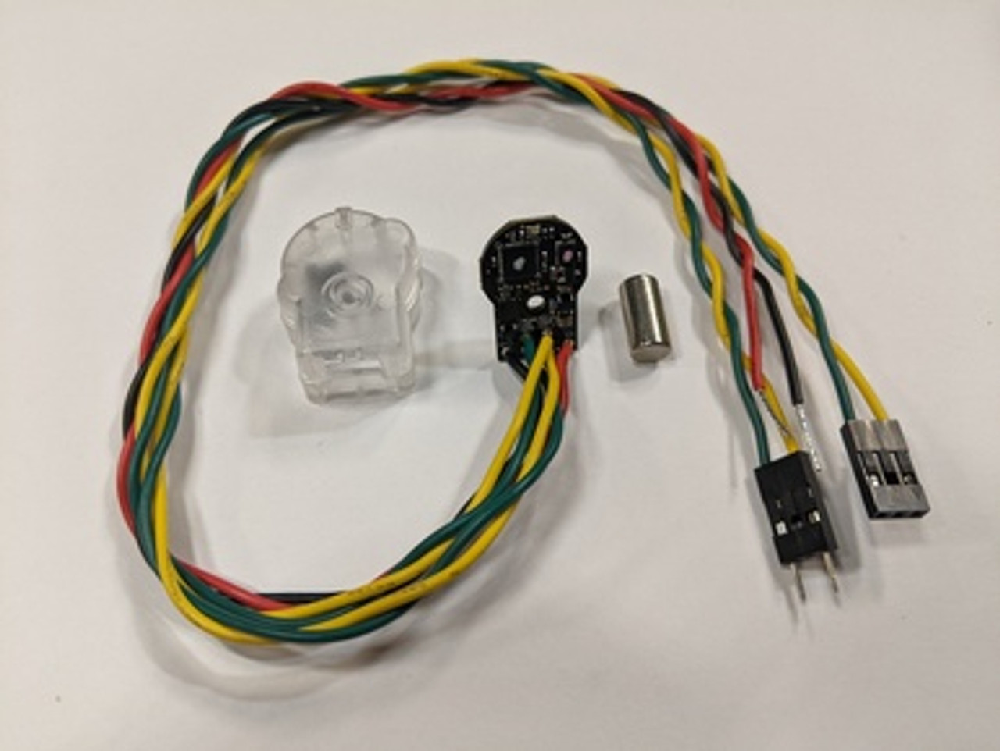

# Bill of materials (BOM)

This page provides the complete list of parts needed to build the TidyBot++ open-source robot.
The BOM includes approximately 50 parts which can be purchased online from seven vendors: [CTRE](https://store.ctr-electronics.com), [WCP](https://wcproducts.com), [SDS](https://www.swervedrivespecialties.com), [AndyMark](https://www.andymark.com), [Amazon](https://www.amazon.com), [TAP Plastics](https://www.tapplastics.com), and [Xometry](https://www.xometry.com).
Placing these orders online typically takes around 30 minutes.

!!! note

    When ordering, please double-check that the product page matches the BOM item description, especially for Amazon links.
    While the provided URLs are current as of October 2024, links may change and redirect to different items.
    For example, if the BOM specifies M6 screws but the URL opens a page for M3 screws, the link may have been modified.

In addition, there are a few parts that require 3D printing or laser cutting, as well as a single machined part which can be ordered from [Xometry](https://www.xometry.com).
Detailed instructions for preparing these parts are provided in the [Manufacturing](#manufacturing) section below.

There is a separate BOM for each of the three reference designs.
Please make sure that the correct tab ([Kinova](#kinova), [Franka](#franka), or [ARX5](#arx5)) is selected below.

=== "Kinova"

    { width="49.45%" }

=== "Franka"

    { width="49.45%" }

=== "ARX5"

    { width="49.45%" }

We also provide the BOM for each reference design in spreadsheet format:

* [BOM - Kinova](https://github.com/jimmyyhwu/tidybot2-resources/blob/main/BOM/BOM%20-%20Kinova.csv)
* [BOM - Franka](https://github.com/jimmyyhwu/tidybot2-resources/blob/main/BOM/BOM%20-%20Franka.csv)
* [BOM - ARX5](https://github.com/jimmyyhwu/tidybot2-resources/blob/main/BOM/BOM%20-%20ARX5.csv)
* [BOM - Tools](https://github.com/jimmyyhwu/tidybot2-resources/blob/main/BOM/BOM%20-%20Tools.csv)

!!! note

    The BOM spreadsheets are provided for reference only.
    We highly recommend directly using this webpage to order parts, as it contains the most complete information.

## Main components

=== "Kinova"

    **Total cost of mobile base: $5,379.63**

    --8<-- "bom-main-kinova.snippet"

=== "Franka"

    **Total cost of mobile base: $6,272.77**

    --8<-- "bom-main-franka.snippet"

=== "ARX5"

    **Total cost of mobile base: $5,205.71**

    --8<-- "bom-main-arx5.snippet"

## Drive system

{ width="49.45%" }

=== "Kinova"

    **Total cost of drive system: $4,370.92**

=== "Franka"

    **Total cost of drive system: $4,396.05**

=== "ARX5"

    **Total cost of drive system: $4,410.91**

### Caster modules

/// html | div.bom-table
| Item | Unit Cost | Quantity | Total Cost | Notes |
|-|-:|:-:|-:|-|
| MK4 swerve module<br> | $300.00<br>[[SDS](https://www.swervedrivespecialties.com/products/mk4-swerve-module?variant=47316033995053)] | 4 | $1,200.00 | **Make sure to select "Kraken X60", NOT "Falcon 500".** Select these options: Kraken X60, L1, Colson. If you purchase the Falcon version by accident, please contact the vendor to correct the order. |
| Kraken X60 motor<br> | $199.99<br>[[WCP](https://wcproducts.com/products/wcp-0940)] [[CTRE](https://store.ctr-electronics.com/products/kraken-x60)] | 8 | $1,599.92 | All academic institutions can use the same academic pricing as FRC teams ($199.99). For non-academic use, please contact the vendor directly. |
| CANcoder encoder<br> | $89.99<br>[[CTRE](https://store.ctr-electronics.com/products/cancoder?variant=43631126642861)] | 4 | $359.96 | **Make sure to select the "Wired" option, NOT the "Standard" option.** The wired option comes with pre-soldered wires. |
| MK4 motor riser kit<br> | $28.00<br>[[SDS](https://www.swervedrivespecialties.com/products/kit-riser-motor?variant=47673275089197)] | 4 | $112.00 | **Make sure to select "Kraken X60", NOT "Falcon 500"** |
| Custom machined shaft<br> | $15.00<br>[[Xometry](https://www.xometry.com/)] | 4 | $60.00 | See [Machining](#machining) section for more details |
///

!!! note

    Please double-check the selected options for these caster module parts very carefully.
    If you select the default options, you may receive parts that do not fit.

!!! tip

    While we have not encountered any reliability issues with these parts so far, it is still a good idea to keep a few spares on hand, especially the motors and encoders.

### Power system

=== "Kinova"

    --8<-- "bom-power-system-kinova.snippet"

=== "Franka"

    --8<-- "bom-power-system-franka.snippet"

=== "ARX5"

    --8<-- "bom-power-system-arx5.snippet"

### CAN system

/// html | div.bom-table
| Item | Unit Cost | Quantity | Total Cost | Notes |
|-|-:|:-:|-:|-|
| Windows computer<br> | | 1 | | Windows is only needed for initial setup of the motors and encoders with the [Phoenix Tuner X](https://pro.docs.ctr-electronics.com/en/stable/docs/tuner/index.html) application. Our low-level control codebase uses Ubuntu. |
| CANivore USB-to-CAN adapter<br> | $299.99<br>[[CTRE](https://store.ctr-electronics.com/products/canivore)] | 1 | $299.99 | For communication with the motors and encoders |
| Phoenix Pro license<br> | $100.00<br>[[CTRE](https://store.ctr-electronics.com/products/phoenix-pro?variant=43631137489069)] | 1 | $100.00 | **Select the "2024 CANivore Bus x2" option, NOT the "Single Device" or "Season Pass" options.** This software license enables field-oriented control (FOC) on the motors. |
| CAN bus and power cable kit<br> | $9.99<br>[[CTRE](https://store.ctr-electronics.com/products/can-bus-power-cable-kit)] | 1 | $9.99 | For connecting the CANivore USB-to-CAN adapter at one end of the bus and the termination resistor at the other end |
| 120 Ohm resistor<br> | $4.99<br>[[CTRE](https://store.ctr-electronics.com/products/120-ohm-axial-resistors)] | 1 | $4.99 | CAN bus termination resistor |
///

## Frame

=== "Kinova"

    { width="49.45%" }

    **Total cost of frame: $390.35**

    --8<-- "bom-frame-kinova.snippet"

=== "Franka"

    { width="49.45%" }

    **Total cost of frame: $379.07**

    --8<-- "bom-frame-franka.snippet"

=== "ARX5"

    { width="49.45%" }

    **Total cost of frame: $285.21**

    --8<-- "bom-frame-arx5.snippet"

## Arm mounting hardware

=== "Kinova"

    **Total cost of arm mounting hardware: $20.26**

    /// html | div.bom-table
    | Item | Unit Cost | Quantity | Total Cost | Notes |
    |-|-:|:-:|-:|-|
    | 2020 M6 roll-in T-nuts<br> | $11.99<br>[[Amazon](https://www.amazon.com/Rierdge-European-Standard-Aluminum-Extrusion/dp/B0B7RR2W69)] | 1 | $11.99 | For securing the Kinova mounting plate to the frame |
    | M6 25mm flat head screws<br> | $8.27<br>[[Amazon](https://www.amazon.com/M6-1-0-Socket-Screws-Alloy-Steel/dp/B085M3HN8V)] | 1 | $8.27 | For securing the Kinova mounting plate to the frame |
    ///

=== "Franka"

    **Total cost of arm mounting hardware: $19.56**

    /// html | div.bom-table
    | Item | Unit Cost | Quantity | Total Cost | Notes |
    |-|-:|:-:|-:|-|
    | 2020 M6 slide-in T-nuts<br> | $5.99<br>[[Amazon](https://www.amazon.com/PHITUODA-30pcs-Sliding-Hammer-Fastener/dp/B09X16W3KX)] | 1 | $5.99 | For securing the Franka base flange to the frame |
    | M6 14mm socket head cap screws<br> | $7.78<br>[[Amazon](https://www.amazon.com/10-M6-1-0-8mm-Stainless-MonsterBolts/dp/B078KRYVTW)] | 1 | $7.78 | For securing the Franka base flange to the frame |
    | M6 washers (OD 15.9mm)<br> | $5.79<br>[[Amazon](https://www.amazon.com/Stainless-Washer-Outside-Diameter-Washers/dp/B08V5MJCX3)] | 1 | $5.79 | For securing the Franka base flange to the frame |
    ///

=== "ARX5"

    **Total cost of arm mounting hardware: $30.51**

    /// html | div.bom-table
    | Item | Unit Cost | Quantity | Total Cost | Notes |
    |-|-:|:-:|-:|-|
    | 2020 M6 roll-in T-nuts<br> | $11.99<br>[[Amazon](https://www.amazon.com/Rierdge-European-Standard-Aluminum-Extrusion/dp/B0B7RR2W69)] | 1 | $11.99 | For securing the ARX5 mounting plate to the frame |
    | M6 16mm screws<br> | $8.54<br>[[Amazon](https://www.amazon.com/Socket-Screws-Metric-Machine-Thread/dp/B0BHZTQTK4)] | 1 | $8.54 | For securing the ARX5 mounting plate to the frame |
    | M3 100mm screws<br> | $9.98<br>[[Amazon](https://www.amazon.com/iexcell-Thread-Stainless-Socket-Screws/dp/B0D5LQH3X5)] | 1 | $9.98 | For installing a riser between the base of the ARX5 arm and the mounting plate |
    ///

=== "xArm"

    /// html | div.bom-table
    | Item | Unit Cost | Quantity | Total Cost | Notes |
    |-|-:|:-:|-:|-|
    | M5 10mm socket head cap screws<br> | $9.02<br>[[Amazon](https://www.amazon.com/M5-0-8-Socket-Screws-Stainless-Machine/dp/B08JL9NJ4T)] | 1 | $9.02 | For securing the xArm base flange to the frame |
    ///

=== "UR5"

    /// html | div.bom-table
    | Item | Unit Cost | Quantity | Total Cost | Notes |
    |-|-:|:-:|-:|-|
    | 2020 M6 slide-in T-nuts<br> | $5.99<br>[[Amazon](https://www.amazon.com/PHITUODA-30pcs-Sliding-Hammer-Fastener/dp/B09X16W3KX)] | 1 | $5.99 | For securing the UR5 base flange to the frame |
    | M6 25mm socket head cap screws<br> | $8.99<br>[[Amazon](https://www.amazon.com/M6-1-0-Socket-Screws-Stainless-Machine/dp/B07D9P9KKH)] | 1 | $8.99 | For securing the UR5 base flange to the frame |
    | M6 washers (OD 12mm)<br> | $4.57<br>[[Amazon](https://www.amazon.com/Washer-Stainless-Steel-Washers-100PCS/dp/B0BGH5GWQJ)] | 1 | $4.57 | For securing the UR5 base flange to the frame |
    ///

=== "ViperX"

    /// html | div.bom-table
    | Item | Unit Cost | Quantity | Total Cost | Notes |
    |-|-:|:-:|-:|-|
    | M5 14mm screws<br> | $8.46<br>[[Amazon](https://www.amazon.com/iExcell-Thread-Socket-Screws-Finish/dp/B08S7FLZ1C)] | 1 | $8.46 | For securing the ViperX base plate to the frame |
    ///

## Accessories

**Total cost of accessories: $67.93**

/// html | div.bom-table
| Item | Unit Cost | Quantity | Total Cost | Notes |
|-|-:|:-:|-:|-|
| Rope ratchets<br> | $22.99<br>[[Amazon](https://www.amazon.com/VIPARSPECTRA-Retractable-Ratchet-Carabiner-Tie-Down/dp/B07Z613ZM2)] | 1 | $22.99 | For securing components to the frame to prevent movement during operation |
| Cable sleeves<br> | $8.99<br>[[Amazon](https://www.amazon.com/Alex-Tech-25ft-Protector-Sleeving/dp/B07FW3GTXB)] | 1 | $8.99 | For organizing CAN bus cables |
| Velcro cable ties<br> | $10.98<br>[[Amazon](https://www.amazon.com/VELCRO-Brand-Cable-Ties-100Pk/dp/B001E1Y5O6)] | 1 | $10.98 | |
| Zip ties<br> | $3.99<br>[[Amazon](https://www.amazon.com/Tensile-Strength-indoor-outdoor-Skalon/dp/B09PJ8L58G)] | 1 | $3.99 | |
| USB hub<br> | $14.99<br>[[Amazon](https://www.amazon.com/Anker-Extended-MacBook-Surface-Notebook/dp/B07L32B9C2)] | 1 | $14.99 | This makes it easier to plug peripherals into the onboard mini PC |
| HDMI extender<br> | $5.99<br>[[Amazon](https://www.amazon.com/Extension-Highwings-High-Speed-Compatible-Chromecast/dp/B09MJ3M5NJ)] | 1 | $5.99 | This makes it easier to plug a monitor into the onboard mini PC |
///

## Tools

/// html | div.bom-table
| Item | Unit Cost | Quantity | Total Cost | Notes |
|-|-:|:-:|-:|-|
| 3D printer<br> | | 1 | | We recommend using a [Bambu Lab](https://bambulab.com/en-us) or [Original Prusa](https://www.prusa3d.com/) printer |
| PLA filament (white)<br> | | 1 | | |
| PLA filament (black)<br> | | 1 | | |
| Pliers<br> | | 1 | | For 3D print support removal |
| Hook and pick set<br> | $8.09<br>[[Amazon](https://www.amazon.com/HARDK-Hook-Pick-Set-B/dp/B07JYWND74)] | 1 | $8.09 | For 3D print support removal |
| Imperial hex T-handles<br> | $52.12<br>[[Amazon](https://www.amazon.com/Bondhus-13190-Balldriver-T-handles-8-Inch/dp/B00012WYEM)] | 1 | $52.12 | For caster module assembly |
| Metric hex T-handles<br> | $40.96<br>[[Amazon](https://www.amazon.com/Bondhus-13189-Balldriver-T-handles-2-10mm/dp/B00012Y38M)] | 1 | $40.96 | For frame assembly |
| Hex key set<br> | $31.19<br>[[Amazon](https://www.amazon.com/Bondhus-20199-Balldriver-L-Wrench-1-5-10mm/dp/B00012Y38W)] | 1 | $31.19 | |
| Phillips screwdriver (#1)<br> | | 1 | | For encoder assembly |
| Torx screwdriver (T9, T10)<br> | | 1 | | For motor assembly |
| Socket wrench set<br> | | 1 | | For power system assembly |
| Loctite 609 retaining compound<br> | $16.05<br>[[Amazon](https://www.amazon.com/Genuine-Loctite-Retaining-Compound-General/dp/B07BCDYD2C)] | 1 | $16.05 | For caster module assembly |
| Loctite 243 threadlocker<br> | $16.42<br>[[Amazon](https://www.amazon.com/Loctite-1329467-Medium-Strength-Threadlockers/dp/B009I2UC3Q)] | 1 | $16.42 | For caster module assembly |
| White lithium grease<br> | $7.99<br>[[Amazon](https://www.amazon.com/Lucas-Oil-Products-LUC10533-Lithium/dp/B06XSYB7VL)] | 1 | $7.99 | For lubricating caster module gears |
| Wire stripper<br> | $10.99<br>[[Amazon](https://www.amazon.com/VISE-GRIP-Stripping-Cutter-8-Inch-2078309/dp/B000JNNWQ2)] | 1 | $10.99 | For encoder power cables (22 AWG solid) |
| Large-gauge wire stripper<br> | $12.14<br>[[Amazon](https://www.amazon.com/Southwire-Equipment-S612STR-Ergonomic-Stripper/dp/B00N4TW2BE)] | 1 | $12.14 | For motor power cables (10 AWG stranded) |
| Electrical tape (black, red)<br> | | 1 | | For power system assembly |
| Straightedge (50cm)<br> | | 1 | | For aligning the wheels when setting encoder magnet offsets. You can also just use an extra T-slot extrusion. |
///

!!! note

    The imperial and metric hex tools are NOT interchangeable.
    Please make sure you have both sets.
    Using one in place of the other can result in stripped screws.

## Manufacturing

### 3D printing

*Estimated time: 3 days*

We provide STL files for our 3D-printed parts below, along with the required quantities for each.
All parts can be printed with PLA filament on a consumer-grade 3D printer.
Please make sure to enable supports where specified.

!!! note

    We have tested a variety of 3D printers to verify that our parts can be easily reproduced in other labs.
    We recommend using a printer from [Bambu Lab](https://bambulab.com/en-us) or [Original Prusa](https://www.prusa3d.com/) for high print quality, speed, and overall ease of use.
    We do not recommend using a Creality Ender series printer.

=== "Kinova"

    --8<-- "3d-printing-kinova.snippet"

=== "Franka"

    --8<-- "3d-printing-franka.snippet"

=== "ARX5"

    --8<-- "3d-printing-arx5.snippet"

!!! note

    All STL files are in their intended print orientation.
    You should not need to reorient any of them.

!!! tip

    Some of the support material may be difficult to remove by hand.
    We recommend using pliers and [picks](https://www.amazon.com/HARDK-Hook-Pick-Set-B/dp/B07JYWND74) for easier removal.

### Laser cutting

*Estimated time: 30 minutes*

We use laser-cut acrylic plates on the top and bottom of our mobile base.
The 6mm bottom plate supports internal components, while the 3mm top plate prevents objects from falling into the robot.
We purchase cut-to-size acrylic sheets from TAP Plastics (as specified in the BOM) and laser cut them into final plate designs.

!!! note

    If you do not have access to a laser cutter, you can order pre-cut plates from a service like Xometry, but expect to pay roughly 4x the cost of buying uncut sheets.

Below are the DXF drawings for each plate, along with the corresponding uncut sheet dimensions:

=== "Kinova"

    | Top (left) | Top (right) | Bottom |
    |:-:|:-:|:-:|
    | {: width="200px"}<br>3mm white<br>550 x 230 mm<br>[[DXF](https://github.com/jimmyyhwu/tidybot2-resources/blob/main/Laser%20Cutting/Kinova%20Top%20Plate%20Left.dxf)] | {: width="200px"}<br>3mm white<br>550 x 230 mm<br>[[DXF](https://github.com/jimmyyhwu/tidybot2-resources/blob/main/Laser%20Cutting/Kinova%20Top%20Plate%20Right.dxf)] | {: width="200px"}<br>6mm clear<br>550 x 510 mm<br>[[DXF](https://github.com/jimmyyhwu/tidybot2-resources/blob/main/Laser%20Cutting/Kinova%20Bottom%20Plate.dxf)] |

    !!! note

        If the bottom plate exceeds the bed size of your laser cutter, you can cut each half separately using these drawings:

        | Bottom (back) | Bottom (front) |
        |:-:|:-:|
        | {: width="100px"}<br>6mm clear<br>275 x 510 mm<br><br>[[DXF](https://github.com/jimmyyhwu/tidybot2-resources/blob/main/Laser%20Cutting/Kinova%20Bottom%20Plate%20Back.dxf)] | {: width="100px"}<br>6mm clear<br>275 x 510 mm<br><br>[[DXF](https://github.com/jimmyyhwu/tidybot2-resources/blob/main/Laser%20Cutting/Kinova%20Bottom%20Plate%20Front.dxf)]

=== "Franka"

    | Top (center) | Top (front) | Bottom (back) | Bottom (front) |
    |:-:|:-:|:-:|:-:|
    | {: width="39px"}<br>3mm white<br>117 x 510 mm<br>[[DXF](https://github.com/jimmyyhwu/tidybot2-resources/blob/main/Laser%20Cutting/Franka%20Top%20Plate%20Center.dxf)] | {: width="34px"}<br>3mm white<br>103 x 510 mm<br>[[DXF](https://github.com/jimmyyhwu/tidybot2-resources/blob/main/Laser%20Cutting/Franka%20Top%20Plate%20Front.dxf)] | {: width="56px"}<br>6mm clear<br>160 x 310 mm<br>[[DXF](https://github.com/jimmyyhwu/tidybot2-resources/blob/main/Laser%20Cutting/Franka%20Bottom%20Plate%20Back.dxf)] | {: width="56px"}<br>6mm clear<br>160 x 310 mm<br>[[DXF](https://github.com/jimmyyhwu/tidybot2-resources/blob/main/Laser%20Cutting/Franka%20Bottom%20Plate%20Front.dxf)] |

=== "ARX5"

    | Top | Bottom |
    |:-:|:-:|
    | {: width="163px"}<br>3mm white<br>450 x 410 mm<br>[[DXF](https://github.com/jimmyyhwu/tidybot2-resources/blob/main/Laser%20Cutting/ARX5%20Top%20Plate.dxf)] | {: width="163px"}<br>6mm clear<br>450 x 410 mm<br>[[DXF](https://github.com/jimmyyhwu/tidybot2-resources/blob/main/Laser%20Cutting/ARX5%20Bottom%20Plate.dxf)] |

!!! note

    All sheet dimensions are specified as (x, y), where x is the horizontal dimension.

!!! note
    The sheet dimensions include a 5mm margin on each side to be trimmed during the cutting process.
    When cutting, position the drawing slightly inside the sheet's edge to account for this margin.

### Machining

Our mobile base requires 4 custom shafts (one per caster module) which can be machined by a manufacturing service like Xometry.
To place your order on [Xometry](https://www.xometry.com), you will need to provide the following information:

| 3D model | 2D drawing | Specifications
|:-:|:-:|:-:|
| {: width="200px"}<br>[[STEP](https://github.com/jimmyyhwu/tidybot2-resources/blob/main/STEP/Caster%20Module/Intermediate%20Shaft.step)] | {: width="200px"}<br>[[PDF](https://github.com/jimmyyhwu/tidybot2-resources/blob/main/Machining/Intermediate%20Shaft%20-%202D%20Drawing.pdf)] | {: width="200px"}<br>[[PDF](https://github.com/jimmyyhwu/tidybot2-resources/blob/main/Machining/Intermediate%20Shaft%20-%20Specifications.pdf)] |

!!! note

    Due to the high setup costs of CNC machining, the unit cost of manufacturing this part drops dramatically with larger quantities: the 1st piece costs almost $100 whereas the 20th piece costs only $5. Therefore, instead of ordering just 4 pieces (which would cost $50 per piece), we recommend coordinating with other labs to place a large group order. For example, by ordering 24 pieces (for 6 robots), the cost drops to $15 per piece.

!!! note

    We used Xometry's "International Economy" option, which offers the lowest overall cost and arrives 2–3 weeks after the order is placed.

!!! note

    If you need shafts urgently and are located near Stanford, feel free to reach out as we may have some extras on hand.

## Component notes

### Portable power station

**Selection criteria**

The portable power station (camping battery) supplies power to the arm and onboard compute.
Our reference designs link to the exact models we used, but many other models can also work.
When choosing a battery, these are the main criteria we consider:

1. *Can it power the arm and onboard compute?*

    The battery must have pure sine wave AC outlets, as well as sufficient capacity and power output for both the arm and the onboard computer.

1. *Is it fast-charging?*

    This criterion is often overlooked but quickly eliminates most candidates. Many camping batteries require more than 8 hours to recharge, which can severely limit productivity as the robot remains immobile while plugged in for charging.
    To maximize uptime, we highly recommend using a battery that can recharge in 1 hour.

1. *Will it fit inside the frame?*

    To verify whether a battery might fit, we note the approximate dimensions (L x W x H) of the available space in the center of the frame and narrow down the options accordingly.

**Substitutions**

Below, we list potential substitutes for each reference design:

=== "Kinova"

    Available space: 16.5" x 10" x 9.8" (42 x 25.3 x 25 cm)

    Potential candidates:

    * EcoFlow RIVER 2 Pro (768 Wh)
    * EcoFlow RIVER 2 Max (512 Wh)
    * Jackery Explorer 600 Plus (632 Wh)
    * EcoFlow RIVER Pro (720 Wh)
    * EcoFlow DELTA Mini (882 Wh)

=== "Franka"

    Available space: 16.5" x 10" x 12.6" (42 x 25.3 x 32 cm)

    Potential candidates:

    * Jackery Explorer 2000 Pro (2160 Wh)
    * EcoFlow DELTA 2 Max (2048 Wh)
    * EcoFlow DELTA Max (2048 Wh)

=== "ARX5"

    Available space: 12.6" x 6" x 9.6" (32 x 15.3 x 24.4 cm)

    Potential candidates:

    * Anker SOLIX C300 (288 Wh)
    * EcoFlow RIVER 3 Plus (286 Wh)
    * Jackery Explorer 300 Plus (288 Wh)
    * EcoFlow RIVER 3 (245 Wh)
    * Jackery Explorer 240 v2 (256 Wh)
    * EcoFlow RIVER 2 (256 Wh)

!!! note

    Product listings may contain inaccurate dimensions.
    While the listed batteries likely fit, most of them have not been individually confirmed.

!!! note

    The provided dimensions are not hard limits.
    Certain features, such as handles, can exceed the limits without interfering with the frame.

We have verified a few camping batteries as viable substitutes.
These are listed below (click to expand), along with the modifications needed to accommodate them.

=== "Franka"

    ??? note "EcoFlow DELTA 2 Max (2048 Wh) [[Amazon](https://www.amazon.com/EF-ECOFLOW-Portable-Generator-Optional/dp/B0C4DW17PD)]"

        Compared to the camping battery used in our reference design, the DELTA 2 Max is much wider and requires several modifications to incorporate:

        * Order slightly larger acrylic sheets (6mm clear) for the bottom plates: 185 x 310 mm instead of 160 x 310 mm.
        * Use the modified DXF drawings below when laser cutting the acrylic bottom plates.
        * Move crossbars at the bottom of the frame closer together: 150 mm instead of 200 mm.
        * Mount the PDP on the back rather than the left side.
        * Use longer motor power cable extensions: 15 cm instead of 10 cm.
        * Use longer wires from PDP to encoder power harness: 55 cm instead of 45 cm.
        * Use [right-angle plug adapters](https://www.amazon.com/DEWENWILS-Extension-Profile-Grounded-Flexible/dp/B0891XFDJ2) so that power cords do not protrude from the side of the robot.

        DXF drawings for the larger acrylic bottom plates:

        | Bottom (back) | Bottom (front) |
        |:-:|:-:|
        | .png){: width="65px"}<br>6mm clear<br>185 x 310 mm<br>[[DXF](https://github.com/jimmyyhwu/tidybot2-resources/blob/main/Laser%20Cutting/Franka%20Bottom%20Plate%20Back%20(EcoFlow%20DELTA%202%20Max).dxf)] | .png){: width="65px"}<br>6mm clear<br>185 x 310 mm<br>[[DXF](https://github.com/jimmyyhwu/tidybot2-resources/blob/main/Laser%20Cutting/Franka%20Bottom%20Plate%20Front%20(EcoFlow%20DELTA%202%20Max).dxf)] |

        Securing the battery to the frame (7 rope ratchets):

        { width="49.45%" }
        { width="49.45%" }
        { width="49.45%" }

        Mounting the PDP on the back side:

        { width="49.45%" }
        { width="49.45%" }

        CAN bus wiring:

        { width="49.45%" }
        { width="49.45%" }

=== "ARX5"

    ??? note "EcoFlow RIVER 2 (256 Wh) [[Amazon](https://www.amazon.com/EF-ECOFLOW-Portable-Generator-Charging/dp/B0CMQYK2KW)]"

        This battery has lower capacity (256 Wh) compared to the one used in our reference design (288 Wh).
        No modifications are needed.
        Below are photos showing how to secure it to the frame with a single rope ratchet:

        { width="49.45%" }
        { width="49.45%" }
        { width="49.45%" }

### Mini PC

The onboard mini PC is a dedicated computer for running robot controllers.
It typically operates in headless mode with no monitor attached.
We connect to it via SSH and use `tmux` to maintain persistent sessions.

!!! note

    To minimize latency spikes in the control loop, we recommend running all other tasks on a separate computer, such as a GPU laptop or workstation.
    This includes workloads like deep learning, point cloud processing, visualization, VS Code, web browsing, TeamViewer, etc.
    While it is possible to run everything on one computer, you may need to spend additional effort to mitigate latency issues.

These are the basic criteria we look at when selecting a mini PC:

* **Compact form factor:** A smaller computer is easier to install inside the mobile base.
* **Low power consumption:** Since the onboard mini PC runs on battery power, lower power consumption is preferred.
* **Processor:** The processor does not need to be very powerful since it only runs robot controllers. For instance, we have found that the Intel N100 (a modern, energy-efficient entry-level processor) is adequate for low-level control of our robot, and consumes only 20W under load.

We have primarily used the following models:

* Intel NUC 7 (from Q1 2017)
* Beelink MINI S12 Pro [[Beelink](https://www.bee-link.com/products/beelink-mini-s12-pro-n100)] [[Amazon](https://www.amazon.com/Beelink-Desktop-Computer-Support-Ethernet/dp/B0BVLS7ZHP)]

### Logitech camera

We have purchased numerous Logitech C930e webcams from Amazon and have occasionally received counterfeit units.
Unfortunately, these fakes have poor image quality and lack support for adjusting basic camera settings in OpenCV.

To identify fake webcams, check the vendor and serial number of the device:

```bash
ls -l /dev/v4l/by-id/
```

Example output for a genuine webcam:

```
/dev/v4l/by-id/usb-046d_Logitech_Webcam_C930e_XXXXXXXX-video-index0
```

Example output for a fake webcam:

```
/dev/v4l/by-id/usb-Sonix_Technology_Co.__Ltd._Logitech_Webcam_C930e_SN0001-video-index0
```

Key differences:

* **Serial number:** Genuine webcams have a unique serial number, whereas fake devices use a generic one (`SN0001`).
* **Vendor:** Genuine devices list `Logitech` as the vendor, whereas fake devices show `Sonix Technology Co., Ltd.`.

Most recently, we have received genuine cameras from the Amazon sellers "ARF Tech" and "Lumege (Serial Numbers Recorded)", and fakes from the Amazon seller "TecTrove".
