# CAN system

*Estimated time: 30 minutes*

This page describes how to set up the CAN system so that you can communicate with the motors and encoders from your computer.

## CANivore assembly

Tools:

* WAGO tool
* Electrical tape
* Zip ties

Follow these steps to assemble the CANivore:

1. Locate the CAN cables in the cable kit: one with a female connector and one with a male connector.
1. Connect the female CAN cable to the green (G) and yellow (Y) slots on the CANivore.
1. Attach the male CAN cable to the termination resistor using two inline wire connectors.
1. Cover the resistor with electrical tape and secure the tape with a zip tie.

See video (2x speed):

<video data-src="../videos/can-system/IMG_4781-2x.mp4#t=0.001" controls playsinline></video>

!!! tip

    Press down on the white spring mechanism with the WAGO tool to open the wire slot:

    <video data-src="../videos/can-system/IMG_1486.mp4#t=0.001" controls playsinline style="width: 49.45%;"></video>

    Then, insert the wire while the slot is held open.

!!! tip

    Double-check the polarities of the CAN wires (green and yellow):

    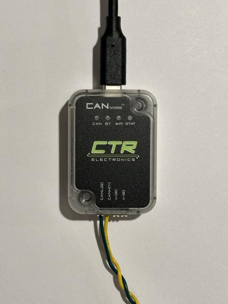{ width="32.55%" }

!!! tip

    Avoid leaving exposed metal, as shown with the green wire in the photo below:

    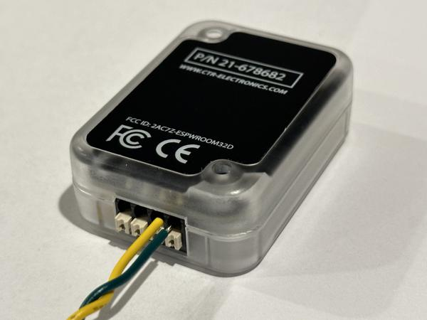{ width="49.45%" }

!!! tip

    Gently tug on each of the 6 new connections to make sure they are secure.

## CANivore setup

To set up the CANivore, first install Phoenix Tuner X on a Windows computer following the [official instructions](https://v6.docs.ctr-electronics.com/en/stable/docs/tuner/index.html).
We have previously tested both of these installation methods:

* [Microsoft Store](https://apps.microsoft.com/store/detail/phoenix-tuner/9NVV4PWDW27Z)
* [Offline EXE installer](https://github.com/CrossTheRoadElec/Phoenix-Releases/releases/download/v24.3.0/Phoenix-Offline_v24.3.0.exe)

!!! note

    Windows is only needed for initial setup of the motors and encoders.
    Our main codebase runs on Ubuntu.

After successfully installing Phoenix Tuner X, connect the CANivore USB-to-CAN adapter to your Windows computer.
Then, open Phoenix Tuner X and enable the "CANivore USB" toggle:

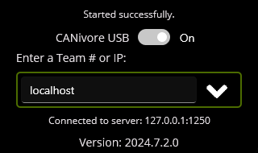{ width="49.45%" }

The CANivore should now appear in Phoenix Tuner X:

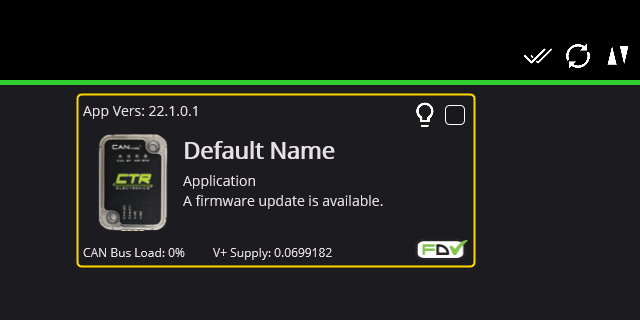{ width="49.45%" }

Click the checkbox next to the lightbulb to select the device, then click the up arrow in the top-right corner to open the firmware update dialog:

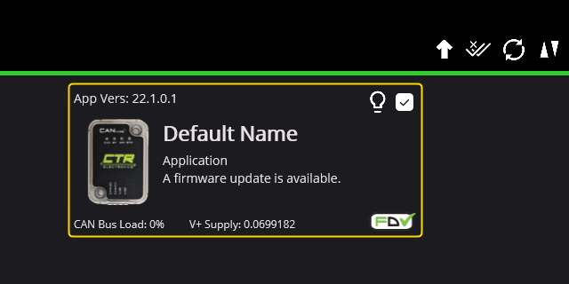{ width="49.45%" }

In the dialog, click the button to update the device to the latest firmware:

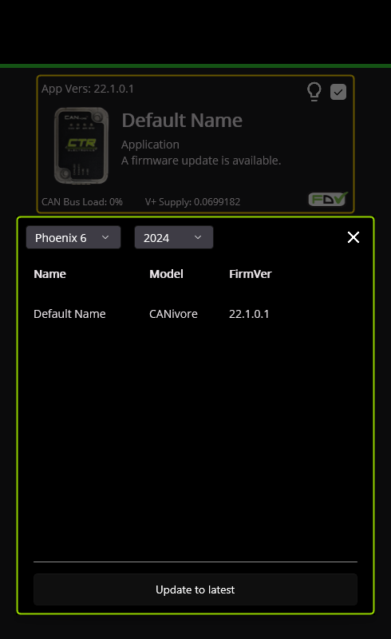{ width="32.55%" }
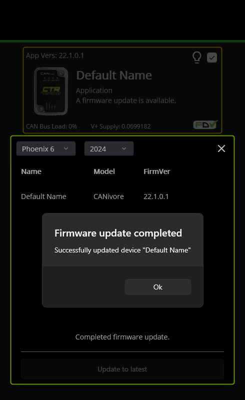{ width="32.55%" }

!!! note

    There are multiple ways to update firmware in Phoenix Tuner X.
    If you are prompted to upload a file, try again using the method described above.

After the firmware update is complete, the border should turn green:

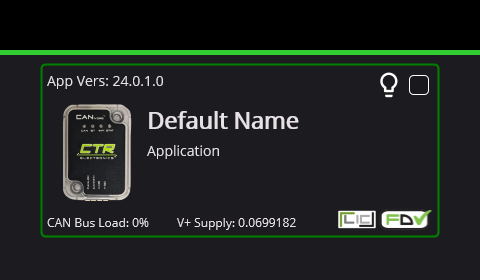{ width="49.45%" }

You can now assign a meaningful name to the device, such as "Drivetrain".

Next, click the "LIC" button in the bottom-right corner and use the dialog to activate your Phoenix Pro license:

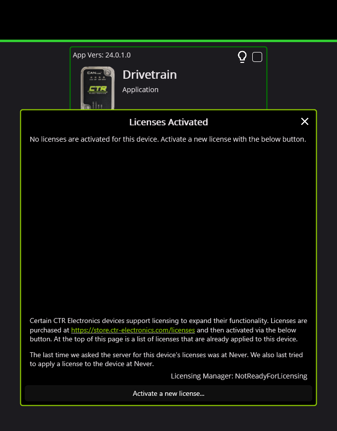{ width="32.55%" }
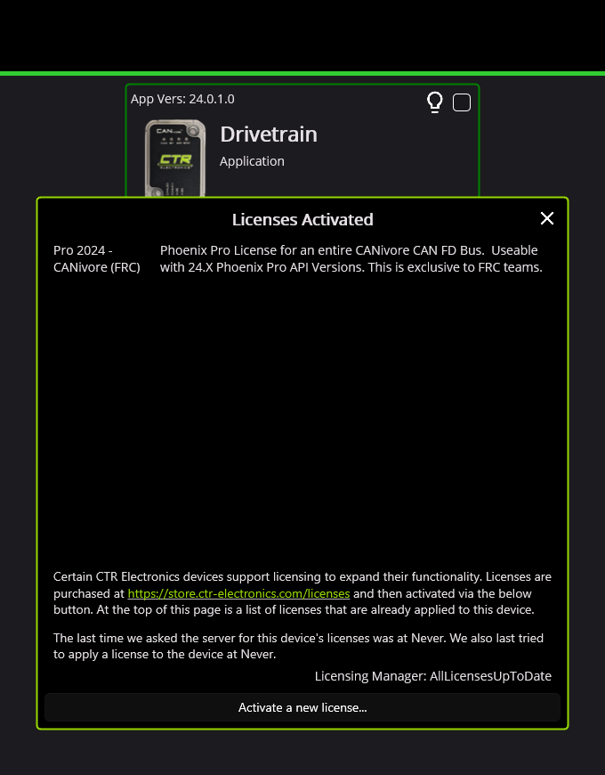{ width="32.55%" }

!!! note

    We use a "CANivore bus" Pro license, which enables all devices connected to an activated CANivore to access Pro features like field-oriented control.
    The "single device" license activates only one device.

!!! tip

    The official [CANivore setup guide](https://v6.docs.ctr-electronics.com/en/stable/docs/canivore/canivore-setup.html) can also be a helpful resource for this section.

!!! tip

    The Phoenix Tuner X software is maintained by CTR Electronics.
    Their contact information can be found [here](https://store.ctr-electronics.com/pages/contact).

## Motor setup

Please connect and set up one motor at a time using the following procedure:

1. Locate the two CAN wires on each motor: one with a male connector and one with a female connector.
1. Attach the termination resistor to the female connector.
1. Attach the CANivore to the male connector.
1. Make sure the connector polarities are correctly aligned (yellow to yellow, green to green).

See video (2x speed):

<video data-src="../videos/can-system/IMG_6714-2x.mp4#t=0.001" controls playsinline></video>

The resulting CAN bus should look like this:

Once connected, the motor should appear in Phoenix Tuner X:

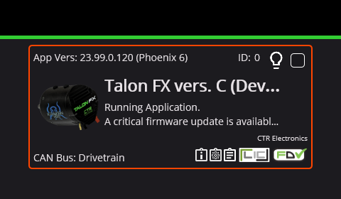{ width="49.45%" }

Update the motor's firmware using the same procedure as with the CANivore:

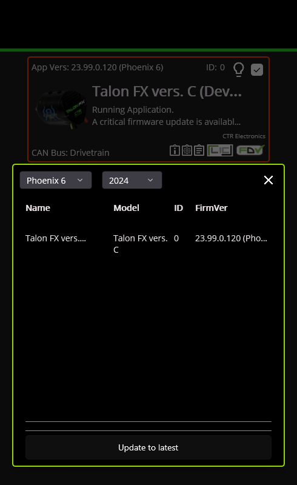{ width="32.55%" }
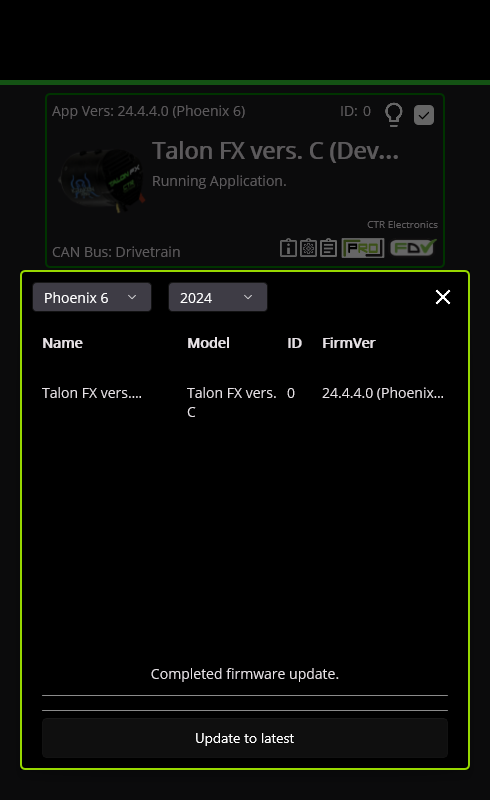{ width="32.55%" }

The border should turn green after the firmware update:

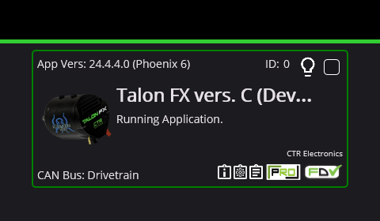{ width="49.45%" }

Then, use the following table to assign the motor's device ID and name accordingly:

| Caster No. | Motor No. | Motor Name        |
|------------|-----------|-------------------|
| 1          | 1         | Front Right Steer |
|            | 2         | Front Right Drive |
| 2          | 3         | Front Left Steer  |
|            | 4         | Front Left Drive  |
| 3          | 5         | Back Left Steer   |
|            | 6         | Back Left Drive   |
| 4          | 7         | Back Right Steer  |
|            | 8         | Back Right Drive  |

Repeat this process to set up all 8 motors.

!!! note

    Our convention is to list steer motors (odd numbers) before drive motors (even numbers):

    | Steer motor | Drive motor |
    |:-:|:-:|
    | 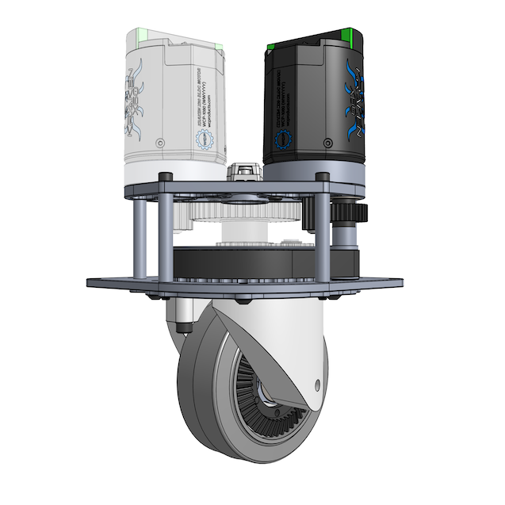 | 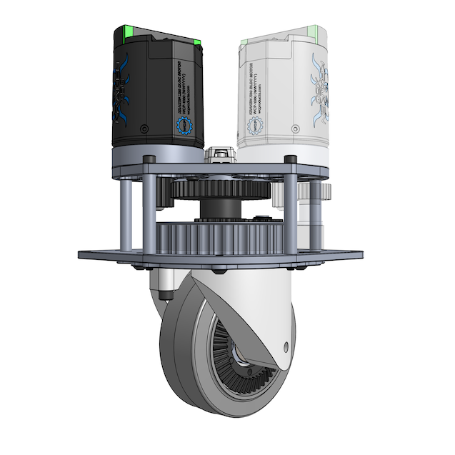 |

!!! note

    For reference, this will be the eventual layout of the motors and encoders within the frame:

    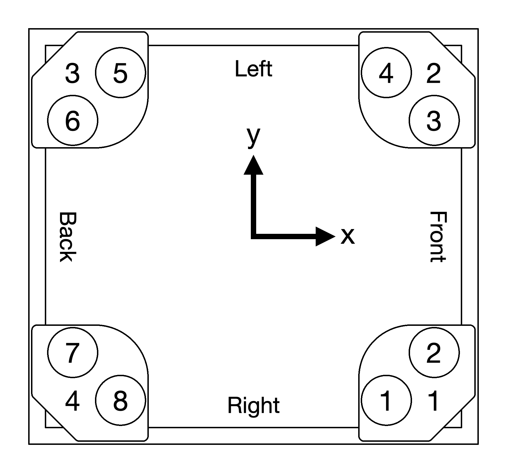{ width="49.45%" }

## Encoder setup

Please connect and set up one encoder at a time, following a process similar to the motor setup.
Connect the encoder to the CANivore and the termination resistor.
See video (2x speed):

<video data-src="../videos/can-system/IMG_6716-2x.mp4#t=0.001" controls playsinline></video>

The resulting CAN bus should look like this:

The encoder should appear in Phoenix Tuner X:

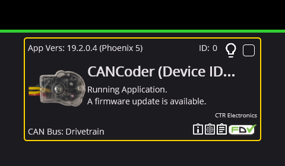{ width="49.45%" }

Update the encoder's firmware using the same procedure as before:

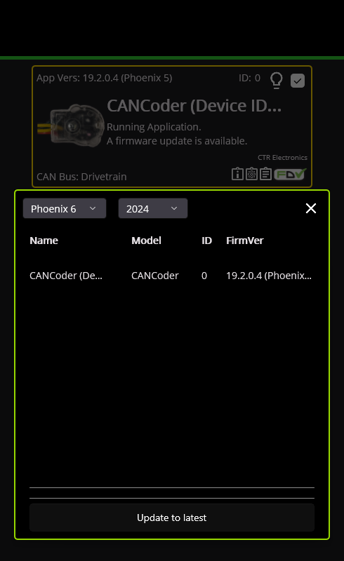{ width="32.55%" }
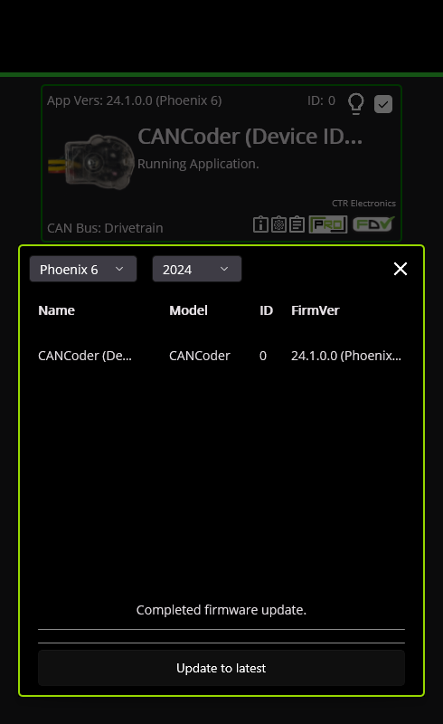{ width="32.55%" }

After the firmware update, the border should turn green:

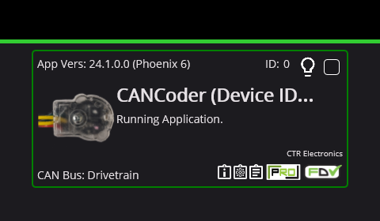{ width="49.45%" }

Use the following table to assign the encoder's device ID and name:

| Caster No. | Encoder No. | Encoder Name |
|------------|-------------|--------------|
| 1          | 1           | Front Right  |
| 2          | 2           | Front Left   |
| 3          | 3           | Back Left    |
| 4          | 4           | Back Right   |

Repeat this process to set up all 4 encoders.

## CAN bus wiring

After completing the firmware setup, connect the CAN wires of all devices in the following order:

Within each caster module, connect the motors and encoders in the following order:

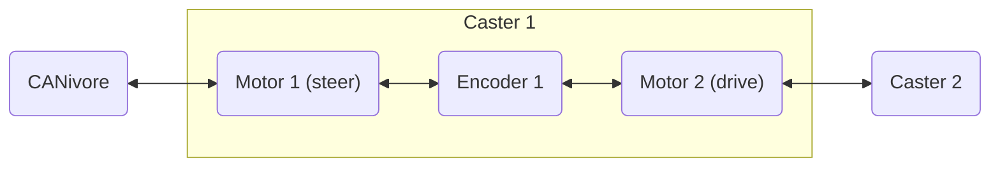

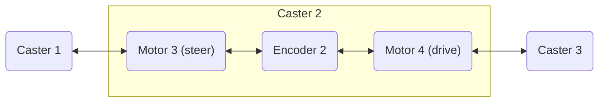

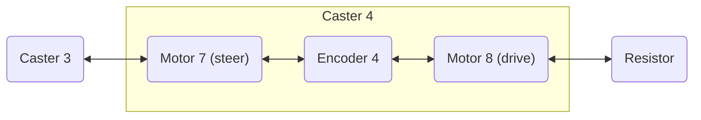

!!! note

    We recommend connecting the devices in the same order shown here.
    However, the devices can actually be connected in any order as long as the sequence starts with the CANivore and ends with the termination resistor.

See video (4x/16x speed):

<video data-src="../videos/can-system/IMG_6711-4x-16x.mp4#t=0.001" controls playsinline></video>

!!! note

    In the video above, the motors are arranged as 2, 1, 4, 3 instead of the expected order (1, 2, 3, 4) because the wires are facing upwards.
    Once the casters are installed in the frame later, the wires will face inward, and the motor numbers will align with the expected order.

After everything is connected, double-check that all 12 devices appear in Phoenix Tuner X:

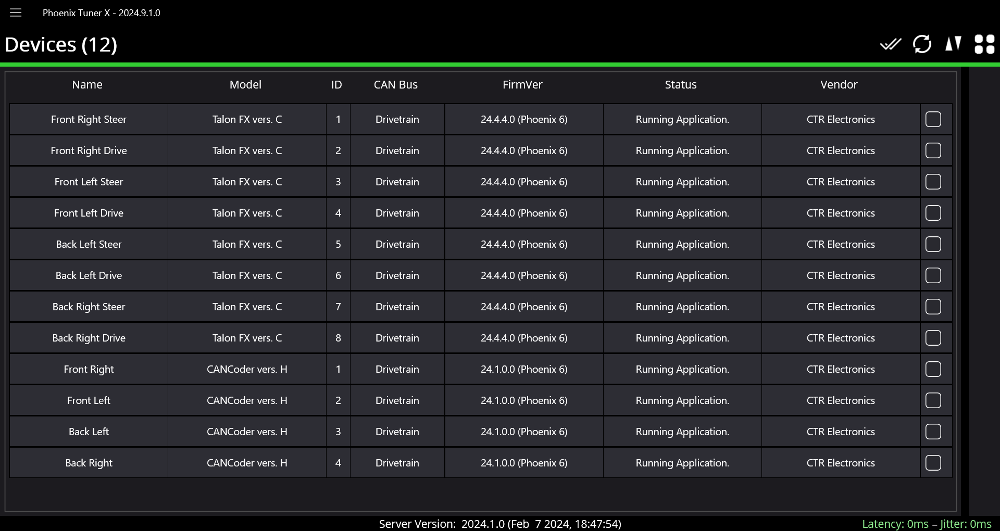

## Motor testing

For each caster module, start by testing the steer motor:

1. Open the steer motor in Phoenix Tuner X.
1. Set the control mode to "DutyCycleOut".
1. Click the red "Disabled" button to change it to "Enabled".
1. Set the "Output" to a small value, such as 0.1.

See screenshot below:

This should cause the caster to steer:

<video data-src="../videos/can-system/IMG_6718.mp4#t=0.001" controls playsinline></video>

!!! note

    If you decide to experiment with other control modes, be careful!
    The default min/max limits are very high for some modes.
    You might want to hold down the module or secure it in place, just in case.

Next, test the drive motor by following the same procedure:

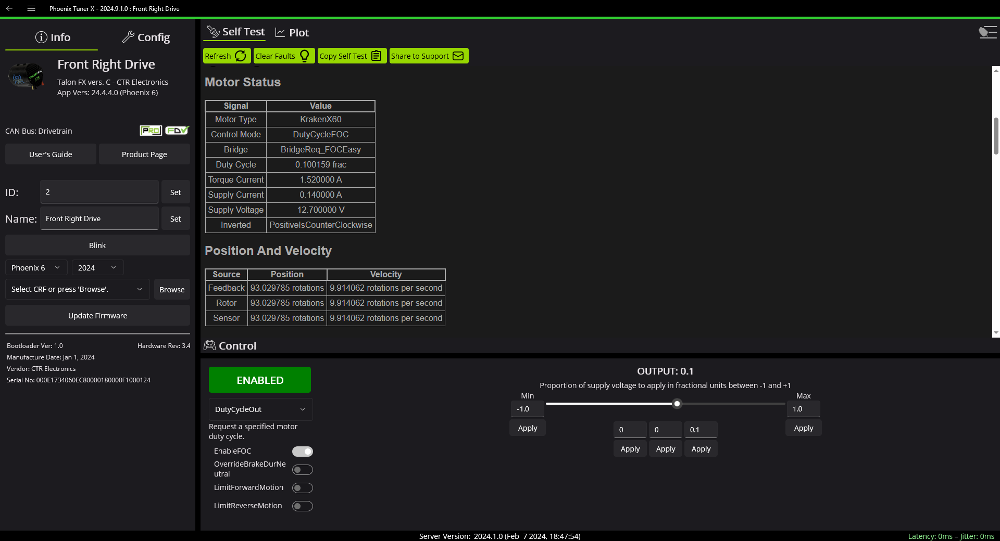

This should cause the wheel to turn:

<video data-src="../videos/can-system/IMG_6719.mp4#t=0.001" controls playsinline></video>

Repeat this process for all 8 motors across the 4 modules.

!!! note

    If you hear abnormally loud gear grinding sounds while the wheel is turning, it's likely due to gear misalignment.
    Please revisit [Step 8](caster-modules.md#step-8-wheel-mount-prep) in the caster module assembly guide and make sure the wheel mounts were installed properly.

!!! tip

    Unsure which motor is which? You can click the "Blink" button in Phoenix Tuner X to make the selected motor's lights blink rapidly.

!!! tip

    We recommend labeling each motor with a sticker showing its number.

## Encoder testing

For each caster, test its encoder by manually steering the module while monitoring the encoder position under "General Signals" (look for the "Position" reading and click "Refresh" to update).
Start by steering until the encoder position is close to 0:

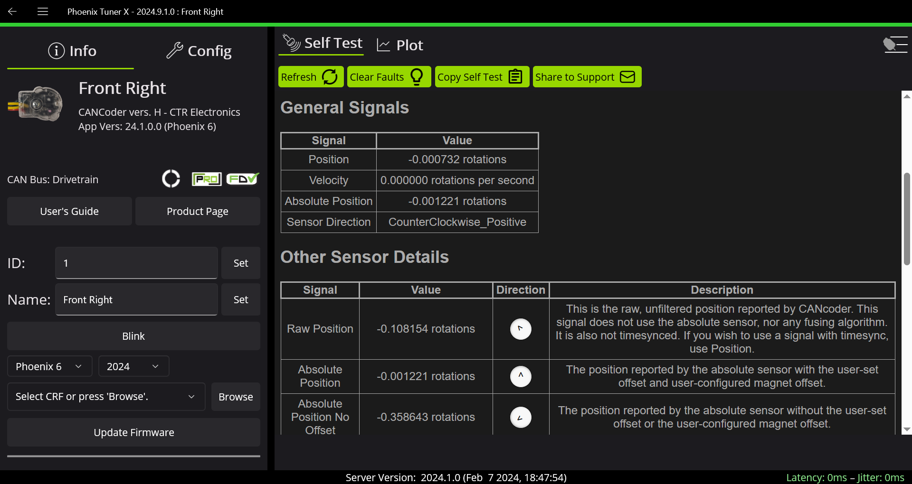

Once the encoder position is near 0, steer the module through one full revolution.
See video (2x speed):

<video data-src="../videos/can-system/IMG_6717-2x.mp4#t=0.001" controls playsinline></video>

After clicking "Refresh" again, the encoder position should now read close to 1:

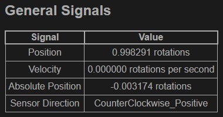{ width="49.45%" }

To test further, steer the module for several more revolutions and verify that the encoder reading accurately reflects the number of revolutions.
Repeat for all 4 encoders.

!!! tip

    If your encoder detects less rotation than expected, the encoder magnet might be loose.
    This can occur if the Loctite 609 retaining compound has not fully cured yet.

!!! tip

    To avoid having to repeatedly refresh the position reading, you can also use the plotting functionality:

    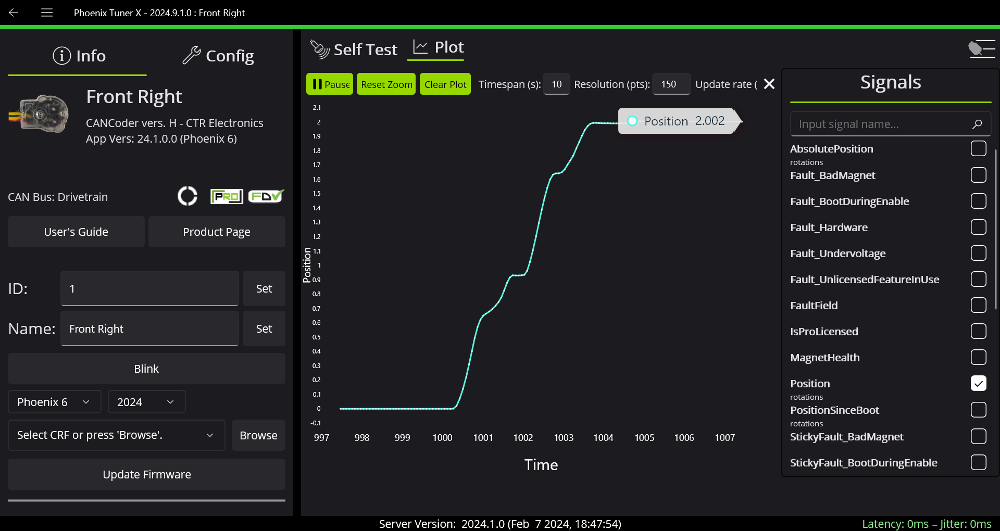

## Setup complete

After verifying that all motors and encoders are working correctly, your drive system is ready for installation into the frame.
Please disconnect all wires before proceeding.
You will reconnect them in the same way later, after the modules are installed in the frame.

!!! note

    Sealed lead acid (SLA) batteries should not be left in a discharged state, as it can degrade the battery.
    Please charge the battery after use.
    Refer to the [Usage guide](usage.md#power-off-procedure) for charging instructions.
