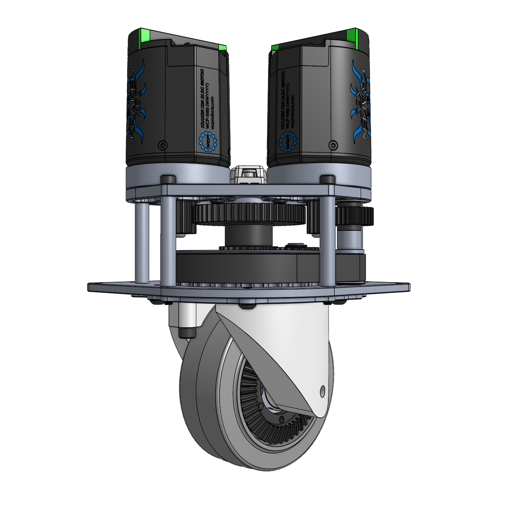

# Caster modules

*Estimated time: 4 hours*

This page will guide you through assembly of the four caster modules.

{ width="49.45%" }

## Swerve module assembly

*Estimated time: 1 hour*

Tools:

* Imperial hex keys (3/16", 5/32", and 1/8")

Our caster module is adapted from the [SDS MK4 swerve module](https://www.swervedrivespecialties.com/products/mk4-swerve-module?variant=47316033995053), widely used in the [FIRST robotics competition (FRC)](https://www.firstinspires.org/robotics/frc).
The adaptation involved minor modifications to the bottom portion of the module.

| Caster module | Swerve module |
|:-:|:-:|
|  |  |

!!! note

    The modifications add a caster offset to the wheel, similar to the offset found in office chair wheels.
    Our [paper](https://tidybot2.github.io/paper.pdf) explains in more detail why this offset is important.

    | Caster module | Swerve module |
    |:-:|:-:|
    |  |  |

In our caster module, aside from three custom parts, all other components are reused directly from the swerve module kit, so the assembly process is very similar.
Therefore, we highly recommend performing a practice assembly of an unmodified swerve module first to familiarize yourself with the process and all the different parts:

* [Swerve module assembly guide](https://drive.google.com/file/d/1AN1pVYBGM0WO-eisEzMd7OFO3_NO5MPg/view)
* [Swerve module assembly video](https://www.youtube.com/watch?v=PZWl8-QA-2U)

After you have completed the practice assembly, please disassemble the swerve module before proceeding.

!!! note

    There is no need to use threadlocker or carefully tighten screws during the practice assembly, as the swerve module will be disassembled afterward.
    You can also skip any steps involving the encoder and encoder magnet for now.

!!! note

    Use the following configurations when assembling the swerve module:

    * Motor: Kraken X60 with risers
    * Wheel: Colson wheel (secured with 3 screws instead of 6)
    * Intermediate shaft: V3

!!! note

    The swerve module kit uses hex screws in Imperial sizes only.
    To avoid accidentally stripping screws, do not use any metric hex keys during assembly.
    If you are using Bondhus hex tools, use only the yellow ones, not the red ones.

!!! note

    After assembly is complete, the only leftover parts should be four extra screws.
    They are not used because the Kraken motor risers require slightly longer screws.

!!! tip

    All screws should go in smoothly and not feel tight until they are fully inserted.
    If a screw encounters resistance when it is only partially inserted, it is likely due to misalignment.
    Loosen the screw, realign it, and try again.

!!! tip

    We highly recommend working in an uncluttered space and keeping parts in their original bags.
    Parts can easily be dropped during assembly, causing small screws to scatter everywhere.

!!! tip

    Please pay special attention to small parts such as the [E-clip](https://www.mcmaster.com/97431A310), [shim](https://www.mcmaster.com/98055A115), encoder magnet, and encoder housing screws, as they can easily get lost.

## Wheel mount printing

Each caster module uses a pair of custom 3D-printed wheel mounts.
Below are a few photos showing the wheel mounts installed on the caster module:

{ width="32.55%" }
{ width="32.55%" }
{ width="32.55%" }

The wheel mounts hold the two bevel gears in precise alignment, as shown below, so high print accuracy is required.
If the gears are too close together, gear interference will occur, preventing the wheel from turning smoothly.

{ width="32.55%" }

We have made successful prints on several 3D printers.
Below, we provide the print files we used.
If your printer is listed, we recommend using the provided 3MF or G-code files.
For other printers, we provide the STL files along with minimal slicer settings.

!!! note "Print files"

    === "Sindoh"

        **Sindoh 3DWOX 1**

        * [Wheel Mount A.gcode](https://github.com/jimmyyhwu/tidybot2-resources/blob/main/3D%20Printing/Caster%20Module/Sindoh%203DWOX%201/Wheel%20Mount%20A.gcode)
        * [Wheel Mount B.gcode](https://github.com/jimmyyhwu/tidybot2-resources/blob/main/3D%20Printing/Caster%20Module/Sindoh%203DWOX%201/Wheel%20Mount%20B.gcode)

        ??? note "Slicer settings"

            3DWOX Desktop

            * Both wheel mounts:
                * Settings > Support > Overhang Angle (deg): 30 (default is 60)
            * Wheel mount B only:
                * Settings > Quality / Shell > Shell > Wall Thickness (mm): 1.6 (default is 0.8)

    === "Bambu Lab"

        **Bambu Lab X1-Carbon**

        * [Wheel Mount A.3mf](https://github.com/jimmyyhwu/tidybot2-resources/blob/main/3D%20Printing/Caster%20Module/Bambu%20Lab%20X1-Carbon/Wheel%20Mount%20A.3mf)
        * [Wheel Mount B.3mf](https://github.com/jimmyyhwu/tidybot2-resources/blob/main/3D%20Printing/Caster%20Module/Bambu%20Lab%20X1-Carbon/Wheel%20Mount%20B.3mf)
        * [Wheel Mount A.gcode](https://github.com/jimmyyhwu/tidybot2-resources/blob/main/3D%20Printing/Caster%20Module/Bambu%20Lab%20X1-Carbon/Wheel%20Mount%20A_PLA_1h24m.gcode)
        * [Wheel Mount B.gcode](https://github.com/jimmyyhwu/tidybot2-resources/blob/main/3D%20Printing/Caster%20Module/Bambu%20Lab%20X1-Carbon/Wheel%20Mount%20B_PLA_1h29m.gcode)

        **Bambu Lab X1E**

        * [Wheel Mount A.3mf](https://github.com/jimmyyhwu/tidybot2-resources/blob/main/3D%20Printing/Caster%20Module/Bambu%20Lab%20X1E/Wheel%20Mount%20A.3mf)
        * [Wheel Mount B.3mf](https://github.com/jimmyyhwu/tidybot2-resources/blob/main/3D%20Printing/Caster%20Module/Bambu%20Lab%20X1E/Wheel%20Mount%20B.3mf)
        * [Wheel Mount A.gcode](https://github.com/jimmyyhwu/tidybot2-resources/blob/main/3D%20Printing/Caster%20Module/Bambu%20Lab%20X1E/Wheel%20Mount%20A_PLA_1h24m.gcode)
        * [Wheel Mount B.gcode](https://github.com/jimmyyhwu/tidybot2-resources/blob/main/3D%20Printing/Caster%20Module/Bambu%20Lab%20X1E/Wheel%20Mount%20B_PLA_1h29m.gcode)

        ??? note "Slicer settings"

            Bambu Studio

            * Both wheel mounts:
                * Filament: Bambu PLA Basic
                * Process: 0.20mm Standard @BBL X1C
                * Support > Enable support: true (default is false)
                * Supports Painting > Tool type: Fill (default is Circle)
                    * Apply to all overhang regions
            * Wheel mount B only:
                * Strength > Wall loops: 4 (default is 2)

    === "Original Prusa"

        **Original Prusa MK3.9**

        * [Wheel Mount A.3mf](https://github.com/jimmyyhwu/tidybot2-resources/blob/main/3D%20Printing/Caster%20Module/Original%20Prusa%20MK3.9/Wheel%20Mount%20A.3mf)
        * [Wheel Mount B.3mf](https://github.com/jimmyyhwu/tidybot2-resources/blob/main/3D%20Printing/Caster%20Module/Original%20Prusa%20MK3.9/Wheel%20Mount%20B.3mf)
        * [Wheel Mount A.bgcode](https://github.com/jimmyyhwu/tidybot2-resources/blob/main/3D%20Printing/Caster%20Module/Original%20Prusa%20MK3.9/Wheel%20Mount%20A_0.4n_0.2mm_PLA_MK3.9_1h55m.bgcode)
        * [Wheel Mount B.bgcode](https://github.com/jimmyyhwu/tidybot2-resources/blob/main/3D%20Printing/Caster%20Module/Original%20Prusa%20MK3.9/Wheel%20Mount%20B_0.4n_0.2mm_PLA_MK3.9_2h1m.bgcode)

        **Original Prusa MK3.5**

        * [Wheel Mount A.3mf](https://github.com/jimmyyhwu/tidybot2-resources/blob/main/3D%20Printing/Caster%20Module/Original%20Prusa%20MK3.5/Wheel%20Mount%20A.3mf)
        * [Wheel Mount B.3mf](https://github.com/jimmyyhwu/tidybot2-resources/blob/main/3D%20Printing/Caster%20Module/Original%20Prusa%20MK3.5/Wheel%20Mount%20B.3mf)
        * [Wheel Mount A.bgcode](https://github.com/jimmyyhwu/tidybot2-resources/blob/main/3D%20Printing/Caster%20Module/Original%20Prusa%20MK3.5/Wheel%20Mount%20A_0.4n_0.2mm_PLA_MK3.5_2h13m.bgcode)
        * [Wheel Mount B.bgcode](https://github.com/jimmyyhwu/tidybot2-resources/blob/main/3D%20Printing/Caster%20Module/Original%20Prusa%20MK3.5/Wheel%20Mount%20B_0.4n_0.2mm_PLA_MK3.5_2h20m.bgcode)

        ??? note "Slicer settings"

            PrusaSlicer

            * Both wheel mounts:
                * Filament: Generic PLA
                * Print Settings > Support material > Generate support material: true (default is false)
                * Paint-on supports > Tool type: Smart fill (default is Brush)
                    * Apply to all overhang regions
            * Wheel mount B only:
                * Layers and perimeters > Vertical shells > Perimeters: 4 (default is 2)

    === "Other"

        **STL files**

        * [Wheel Mount A.stl](https://github.com/jimmyyhwu/tidybot2-resources/blob/main/3D%20Printing/Caster%20Module/Wheel%20Mount%20A.stl)
        * [Wheel Mount B.stl](https://github.com/jimmyyhwu/tidybot2-resources/blob/main/3D%20Printing/Caster%20Module/Wheel%20Mount%20B.stl)

        **Minimal slicer settings**

        * Both wheel mounts:
            * Enable supports
            * Apply paint-on supports to all overhang regions
        * Wheel mount B only:
            * Increase wall/shell loops from 2 to 4 (0.8 mm to 1.6 mm)

        !!! note

            Please perform bed leveling to improve print accuracy.
            On higher-end printers, this process is often done automatically.

        !!! note

            We tested these printers and do not recommend using them due to their low print quality:

            * Creality Ender-3
            * Creality Ender-3 S1 Pro
            * Creality Ender-5 S1

??? note "Original STEP files"

    If you wish to make your own modifications to the CAD design, the original STEP files are available here:

    | Wheel mount A | Wheel mount B |
    |:-:|:-:|
    |  [[STEP](https://github.com/jimmyyhwu/tidybot2-resources/blob/main/STEP/Caster%20Module/Wheel%20Mount%20A.step)] |  [[STEP](https://github.com/jimmyyhwu/tidybot2-resources/blob/main/STEP/Caster%20Module/Wheel%20Mount%20B.step)] |

    For 3D printing, we made the following modifications to account for printer tolerances, then exported to STL format:

    * Both wheel mounts:
        * Reduce the width of the top protrusion that fits into the base pulley by 0.004" radially
        * Increase the width of the clearance portion of the shoulder screw hole by 0.004" radially
    * Wheel mount B only:
        * Apply a 0.05" chamfer to the edge of the two mounting holes to account for burr formation during screw self-tapping
        * Increase the width of the threaded portion of the shoulder screw hole by 0.015" radially (from 0.257" to 0.287")
        * Increase the width of the bearing housing by 0.004" radially
        * Add an integrated shim around the edge of the shoulder screw hole with a thickness of 0.008"

    Note that the integrated shim (highlighted in orange below) helps ensure proper bevel gear spacing:

    { width="32.55%" }

!!! note

    The top portions of the wheel mounts need to be printed accurately to ensure proper contact with the base pulley.
    Therefore, the wheel mounts should be printed in the upright orientation as shown below.
    Do not print them upside down.

    { width="49.45%" }
    { width="49.45%" }

!!! note

    All overhang regions must be fully supported during printing:

    { width="49.45%" }
    { width="49.45%" }

    In many slicers, the auto-generated supports may be incomplete, so you may need to add paint-on supports manually.
    For example, this video shows how to do this in Bambu Studio:

    <video data-src="../videos/caster-modules/Bambu Studio.mp4#t=0.001" controls playsinline style="width: 49.45%;"></video>

!!! tip

    We recommend printing a few extra copies of wheel mount B, as the screw holes can sometimes be damaged during assembly.

## Motor assembly

*Estimated time: 30 minutes*

Tools:

* Torx screwdriver (T9)
* Torx screwdriver (T10)
* Large-gauge wire stripper (10 AWG stranded)

Follow these steps to assemble each motor:

1. Connect the power cables (red/black) using the thick screws.
1. Connect the CAN bus cables (yellow/green) using the short, thin screws.
1. Install the terminal cover using the long screws.

See video (4x speed):

<video data-src="../videos/caster-modules/IMG_1243-4x.mp4#t=0.001" controls playsinline></video>

!!! note

    The ring terminals should be installed with the flat side facing downward:

    { width="49.45%" }
    { width="49.45%" }

!!! note

    Make sure all four connections are tight! Loose connections can be very difficult to troubleshoot later.

!!! note

    When installing the terminal cover, make sure that the thin CAN bus cables are not pinched.

Next, use a large-gauge (10 AWG stranded) wire stripper to remove 3/8" (1 cm) of insulation from the free end of each power cable:

{ width="49.45%" }

!!! note

    Many wire strippers are designed for a maximum gauge of 12 AWG stranded (10 AWG solid), but the motor power cables are 10 AWG stranded, which is slightly larger.
    If using such a wire stripper, take extra care to avoid cutting the wire strands.

!!! tip

    After assembling all eight motors, go through each one individually and double-check the polarity of all four wires.
    The wire colors should match those shown in this photo (black, yellow, green, red):

    { width="32.55%" }

!!! tip

    If you are building this robot for the first time, consider leaving the terminal covers off until you have verified that the robot is operational.
    The covers can be easily installed later.

## Caster module assembly

*Estimated time: 2 hours*

Tools:

* Phillips screwdriver (#1)
* Imperial hex keys (3/16", 5/32", and 1/8")
* Loctite 609 retaining compound
* Loctite 243 threadlocker
* Paper towels

You should now be ready to assemble the caster modules.
In the following subsections, we will follow the swerve module [assembly guide](https://drive.google.com/file/d/1AN1pVYBGM0WO-eisEzMd7OFO3_NO5MPg/view) to build the modules, with a few slight modifications.

!!! note

    Screws used in the caster module should be fairly tight.
    Fully insert each screw and tighten slightly past the point of firm resistance.
    The exception is any screw that threads into a plastic part rather than metal (be very careful not to overtighten those screws).

!!! note

    Apply Loctite 243 threadlocker (blue) to all screws that thread into metal.
    Do not apply threadlocker to screws that thread into plastic.

!!! note

    For caster module assembly, use only Imperial hex keys (Bondhus yellow). Do not use any metric hex keys (Bondhus red).

### Step 1: Encoder mounting

Follow these steps to mount the encoder onto the motor plate:

1. Attach the encoder housing to the plate using the two shorter screws.
1. Insert the encoder circuit board.
1. Secure the housing cap on top with the longer screw.

See video (2x speed):

<video data-src="../videos/caster-modules/IMG_1247-2x.mp4#t=0.001" controls playsinline></video>

!!! note

    The CANcoder encoder is not part of the MK4 swerve module kit.

!!! tip

    Do not overtighten the screw for the housing cap, as this can crack the plastic.

!!! tip

    Press down on the housing cap to ensure it is fully seated. In this photo, the cap is partially seated:

    { width="49.45%" }

Next, insert the encoder magnet into the center column and secure it using Loctite 609 retaining compound.
See video (4x speed):

<video data-src="../videos/caster-modules/IMG_1245-4x.mp4#t=0.001" controls playsinline></video>

!!! tip

    Loctite 609 is green, be careful not to mix it up with Loctite 243 (blue).

!!! tip

    The retaining compound can take up to 24 hours to fully cure.
    If the magnet is not fixed in place by the time you run software, the encoder will produce inaccurate readings.
    You can check whether the magnet is secure by using a hex key to see if it can still move via magnetic force.
    This video (2x speed) shows a magnet that can still move because the retaining compound has not yet cured:

    <video data-src="../videos/caster-modules/IMG_1246-2x.mp4#t=0.001" controls playsinline style="width: 49.45%;"></video>

### Step 2: Motor configurations

Follow these steps to secure the motors to the motor plate:

1. Attach each motor to the plate using a motor riser and 7/8" screw.
1. On each motor shaft, place 2 spacers (0.125" and 0.375"), followed by the appropriate pinion gear.
1. Secure the pinion gears with motor screws.

See video (2x speed):

<video data-src="../videos/caster-modules/IMG_1256-2x.mp4#t=0.001" controls playsinline></video>

!!! note

    Since the Kraken motor requires risers, the longer screws included in the motor riser kit (right) should be used instead of the shorter ones from the swerve module kit (left).

    { width="49.45%" }

!!! note

    Make sure to use these specific screw holes on the motors:

    { width="49.45%" }

!!! tip

    The screws should go in smoothly without resistance.
    If you encounter resistance, check for misalignment between the riser and the motor plate like in the photo below:

    { width="49.45%" }

!!! tip

    If the pinion gears are placed on the wrong shafts, the larger gear will collide with the motor plate:

    { width="49.45%" }

### Step 3: Wheel assembly

Use the three screws included with the Colson wheel kit to mount the 45T bevel gear onto the wheel hub. See video (2x speed):

<video data-src="../videos/caster-modules/IMG_1257-2x.mp4#t=0.001" controls playsinline></video>

!!! note

    These screws should turn smoothly with no resistance until fully inserted.
    However, we have found that the bevel gear's screw hole threads sometimes have quality issues.
    In the video, we first insert the three screws directly into the gear to check that the threads were tapped properly.

!!! note

    The inner face of the bevel gear should be flush against the wheel hub, and the three screws should extend slightly beyond the face:

    { width="49.45%" }

Next, insert the R8 bearing and wheel spacer into the wheel hub on the bevel gear side, and the R6 bearing on the opposite side.
See video (2x speed):

<video data-src="../videos/caster-modules/IMG_1260-2x.mp4#t=0.001" controls playsinline></video>

!!! tip

    Make sure the bearings are inserted perpendicular to the housing.
    If a bearing becomes stuck due to misalignment like in the photo below, remove it and try again.
    Do not try to force it in, as this can make removal very difficult.

    { width="49.45%" }

### Step 4: Bearing mounting

Secure the X-contact bearing with five 0.25" screws.
See video (4x speed):

<video data-src="../videos/caster-modules/IMG_1350-4x.mp4#t=0.001" controls playsinline></video>

!!! tip

    There are 7 screw holes around the bearing but only 5 of them are used to mount it.

### Step 5: Intermediate shaft assembly

Follow these steps to install the intermediate shaft:

1. Insert a 6802 bearing into the base pulley, followed by the custom intermediate shaft.
1. Install the hex bore gear onto the shaft.
1. Secure the gear with the E-clip.

See video (2x speed):

<video data-src="../videos/caster-modules/IMG_1352-2x.mp4#t=0.001" controls playsinline></video>

!!! note

    Our caster module uses a custom-machined intermediate shaft that is 3/8" longer than the original swerve module shaft.
    Here is a photo comparing the two shafts:

    { width="49.45%" }

!!! tip

    Make sure the bearing is inserted perpendicular to the housing.
    If it does not go in all the way (see photo below), remove it and try again. Do not force it in.

    { width="49.45%" }

!!! tip

    Check that the E-clip is fully seated in its groove, as shown in the right image.

    { width="49.45%" }
    { width="49.45%" }

### Step 6: Center column assembly

Insert two 6802 bearings into the double gear and capture with the center column and a 0.625" screw.
See video (2x speed):

<video data-src="../videos/caster-modules/IMG_1354-2x.mp4#t=0.001" controls playsinline></video>

!!! note

    Check that the encoder magnet is already installed inside the center column.

!!! tip

    If a bearing does not go all the way in, it is likely due to misalignment.
    Remove the bearing, ensure it is perpendicular to the housing, and try again.
    Do not force a misaligned bearing into place.

!!! tip

    Make sure the bottom bearing is fully inserted, with the bottom surfaces flush (as shown in the right image).

    { width="49.45%" }
    { width="49.45%" }

!!! tip

    When the center column is fully inserted into the base pulley, it should be fixed in place (as shown in the right image).

    { width="49.45%" }
    { width="49.45%" }

### Step 7: Pulley mounting

Follow these steps to mount the base pulley:

1. Install the R188 bearing into the main plate.
1. Install the timing belt and steering shaft onto the base pulley.
1. Mount the base pulley into the main plate.
1. Fully insert the journal of the steering shaft into the R188 bearing.

See video (2x speed):

<video data-src="../videos/caster-modules/IMG_1355-2x.mp4#t=0.001" controls playsinline></video>

!!! tip

    The base pulley should be properly aligned with the X-contact bearing and fully inserted.
    Make sure it is not partially inserted, like in this photo:

    { width="49.45%" }

### Step 8: Wheel mount prep

Follow these steps to install wheel mount B:

1. Install the 688 bearing and 15T bevel gear into wheel mount B.
1. Insert the intermediate shaft through the bevel gear (but not into the bearing yet).
1. Place the 1mm shim underneath the bevel gear.
1. Insert the intermediate shaft through the shim and into the bearing.
1. Use two 0.625" screws to secure the wheel mount.

See video (2x speed):

<video data-src="../videos/caster-modules/IMG_1366-2x.mp4#t=0.001" controls playsinline></video>

!!! note

    Do not overtighten the two screws going into the 3D-printed wheel mount, as this can strip the threads.
    If a screw suddenly becomes loose after fully inserting it, the threads have likely been stripped.
    If this happens, please discard the wheel mount and reprint it.
    To mitigate this potential issue, the 3D printing instructions for wheel mount B include reinforced walls (1.6 mm instead of the default 0.8 mm)

!!! note

    Do not tighten the screws too quickly as the resulting force can strip the plastic threads in the screw holes.

!!! note

    Threadlocker should not be applied to the two screws because they thread into plastic.

!!! note

    After installation, wheel mount B should sit completely flush against the base pulley.
    If there is a visible gap like in the photo below, please discard the part (since the tapped holes are misaligned) and print a new one.

    { width="49.45%" }

    This issue may also result from an inaccurate print.
    Double-check that bed leveling was performed recently, or consider using a higher-quality 3D printer.

!!! note

    It is very important that there is no gap between the wheel mount and the base pulley.
    This video demonstrates how such a gap can cause the gears on top to mesh too tightly:

    <video data-src="../videos/caster-modules/IMG_1390.mp4#t=0.001" controls playsinline style="width: 49.45%;"></video>

    When the gears are too close, they will produce loud grinding sounds.
    This video provides an auditory comparison between normally spaced gears and gears that are improperly spaced:

    <video data-src="../videos/caster-modules/IMG_1394.mp4#t=0.001" controls playsinline style="width: 49.45%;"></video>

    With correct spacing, the gears should spin freely, as shown in this video:

    <video data-src="../videos/caster-modules/IMG_1380.mp4#t=0.001" controls playsinline style="width: 49.45%;"></video>

!!! note

    The wheel mounts should not exhibit any cracking, such as shown in the photo below.
    If cracking occurs, double-check that the part was printed with proper support for all overhang regions.

    { width="49.45%" }

!!! tip

    Don't forget to include the shim underneath the 15T bevel gear:

    { width="10%" }

!!! tip

    We use the partially inserted shaft to prevent the shim from falling into the recessed area behind the gear:

    { width="49.45%" }

### Step 9: Wheel mount assembly

Use two 1" screws to install wheel mount A. See video (4x speed):

<video data-src="../videos/caster-modules/IMG_1373-4x.mp4#t=0.001" controls playsinline></video>

!!! note

    Do not overtighten these screws, as it can make it difficult to insert the wheel in the next step.

!!! note

    While we mostly follow the same steps as the official swerve module assembly guide, we reordered steps 9, 10, and 11 because our modified wheel mount A must be installed before the wheel to avoid obstructing one of the screw holes.

!!! tip

    If you are having trouble aligning the screws, it might help to look more closely at how the wheel mounts fit into the base pulley.
    See video (2x speed):

    <video data-src="../videos/caster-modules/IMG_1360-2x.mp4#t=0.001" controls playsinline></video>

### Step 10: Attach wheel

Insert the wheel between the wheel mounts and secure it with the shoulder bolt.
See video (2x speed):

<video data-src="../videos/caster-modules/IMG_1382-2x.mp4#t=0.001" controls playsinline></video>

!!! note

    Do not overtighten the shoulder bolt as it may bring the bevel gears too close together, leading to loud grinding sounds.

!!! note

    The wheel should spin freely once installed, as shown at the end of the video.
    If it does not, try adjusting the shoulder bolt tightness or using a different 3D-printed wheel mount, as slight variations can occur between prints.

!!! note

    Threadlocker should not be applied to the shoulder bolt, as it threads into a plastic part.

!!! note

    To avoid stripping the plastic material in the screw hole, do not tighten the bolt too quickly.

### Step 11: Motor plate mounting

Follow these steps to mount the motor plate onto the rest of the assembly:

1. Install the steering gear and the F689 bearing onto the steering shaft.
1. Install a 6802 bearing onto the center shaft.
1. Mount the motor plate onto the assembly, making sure both shafts are fully inserted.

See video (2x speed):

<video data-src="../videos/caster-modules/IMG_1387-2x.mp4#t=0.001" controls playsinline></video>

Next, secure the four spacers with four socket head cap screws.
See video (4x speed):

<video data-src="../videos/caster-modules/IMG_1389-4x.mp4#t=0.001" controls playsinline></video>

!!! tip

    The socket head cap screws used here have two different lengths: two of them are 2.5" long, the other two are 3" long.

### Assembly complete

Your caster module is now fully assembled.
Please repeat the process to build a total of four caster modules.

!!! note

    The following parts should be the only ones left over after assembly:

    * The two wheel mounts and the intermediate shaft are not used because of the swerve-to-caster modification.
    * The four black screws are not used because the Kraken motor risers require slightly longer screws.

    { width="49.45%" }

    If you have other leftover parts not shown here, please double-check whether any step was missed during assembly.

## Lubrication

*Estimated time: 20 minutes*

Tools:

* White lithium grease
* Paper towels

The gears in each caster module should be greased periodically for smooth operation and longevity.
Each module contains 8 gears, make sure to apply grease to all of them.
Afterwards, wipe away any excess to prevent buildup.

Here is a video (4x speed) demonstrating the lubrication process:

<video data-src="../videos/caster-modules/IMG_4760-4x.mp4#t=0.001" controls playsinline></video>
