# Frame

*Estimated time: 3 hours*

This page will guide you through assembly of the T-slot aluminum frame.

## CAD model

To build the frame, please follow the design in the CAD model.
Below, we link to an online viewer that allows you to navigate the CAD model directly in your browser.

=== "Kinova"

    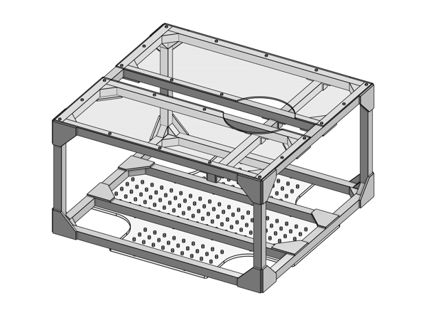{ width="49.45%" }

    Click to open online CAD viewer in new tab: [[Onshape](https://cad.onshape.com/documents/4426192f22cdac86f1d998e3/w/4b79d7e6bd9dc6f7ddcf85e2/e/0e3c7ad4393164cfdd9eb182?renderMode=0&uiState=6752f5f76637ec4971736937){:target="_blank"}]

=== "Franka"

    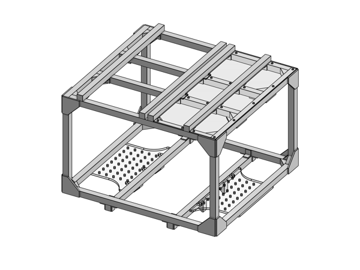{ width="49.45%" }

    Click to open online CAD viewer in new tab: [[Onshape](https://cad.onshape.com/documents/4426192f22cdac86f1d998e3/w/4b79d7e6bd9dc6f7ddcf85e2/e/e743169f33e6c49a074cb8e1?renderMode=0&uiState=6752f60e6637ec4971736975){:target="_blank"}]

=== "ARX5"

    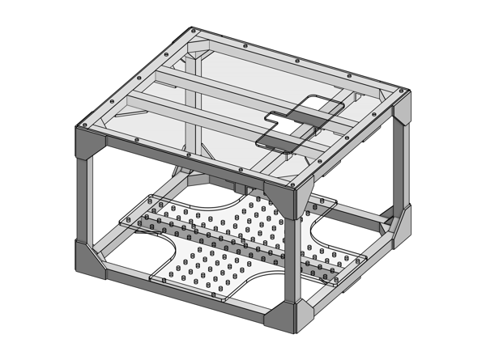{ width="49.45%" }

    Click to open online CAD viewer in new tab: [[Onshape](https://cad.onshape.com/documents/4426192f22cdac86f1d998e3/w/4b79d7e6bd9dc6f7ddcf85e2/e/cbb48496b5abe3af1641c8c5?renderMode=0&uiState=6752f6196637ec49717369a3){:target="_blank"}]

!!! tip

    To rotate the Onshape 3D view, hold down the right mouse button and drag.
    To identify a part, click on it in the 3D view, and its name will be highlighted in the parts list on the left side.
    You can hide and show parts to improve visibility.
    For more tips on navigating the user interface, please see the [Onshape docs](https://cad.onshape.com/help/Content/moving.htm).

We also provide the following drawing which shows all relevant measurements (in mm):

=== "Kinova"

    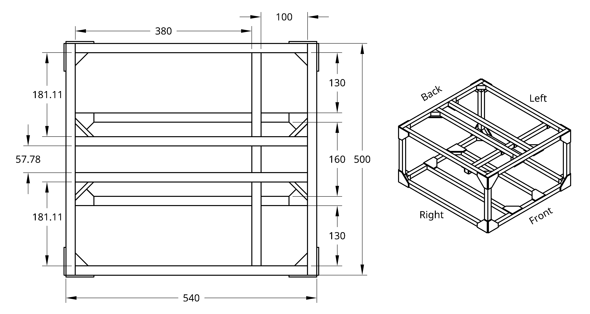

=== "Franka"

    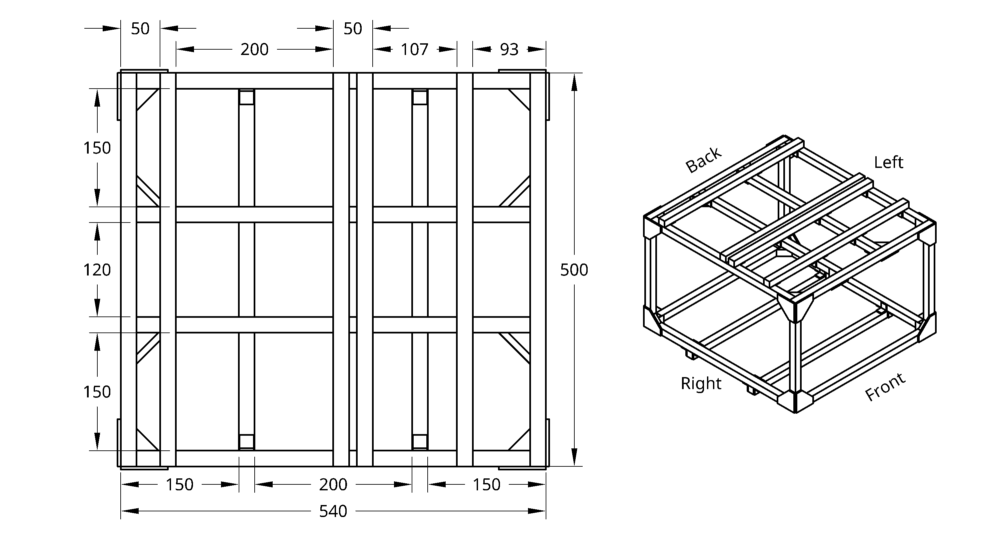

=== "ARX5"

    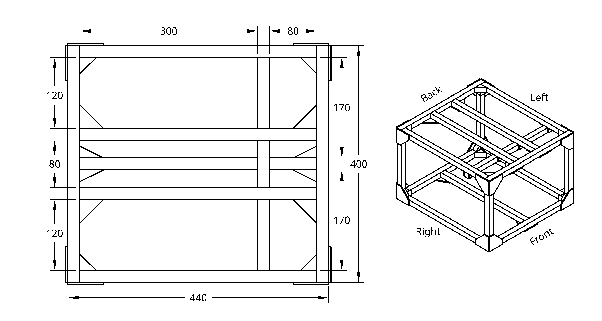

## Parts

You will need the following parts to build the frame:

=== "Kinova"

    | Item | Quantity |
    |-|-|
    | 2020 500mm rail          | 13 |
    | 2020 250mm rail          | 4 |
    | 2020 28mm gusset         | 24 |
    | 2020 20mm gusset         | 8 |
    | 2020 90 degree plate     | 24 |
    | 2020 20mm corner bracket | 8 |
    | 2020 M5 slide-in T-nuts  | 222 |
    | M5 8mm screws            | 174 |
    | M5 10mm screws           | 48 |

=== "Franka"

    | Item | Quantity |
    |-|-|
    | 2020 500mm rail          | 16 |
    | 2020 300mm rail          | 4 |
    | 2020 28mm gusset         | 20 |
    | 2020 20mm gusset         | 8 |
    | 2020 90 degree plate     | 20 |
    | 2020 20mm corner bracket | 32 |
    | 2020 M5 slide-in T-nuts  | 237 |
    | M5 8mm screws            | 197 |
    | M5 10mm screws           | 40 |

=== "ARX5"

    | Item | Quantity |
    |-|-|
    | 2020 400mm rail          | 12 |
    | 2020 250mm rail          | 4 |
    | 2020 28mm gusset         | 16 |
    | 2020 20mm gusset         | 8 |
    | 2020 90 degree plate     | 20 |
    | 2020 tee plate           | 2 |
    | 2020 20mm corner bracket | 8 |
    | 2020 M5 slide-in T-nuts  | 201 |
    | M5 8mm screws            | 158 |
    | M5 10mm screws           | 43 |

!!! note

    Some parts come with hex keys included:

    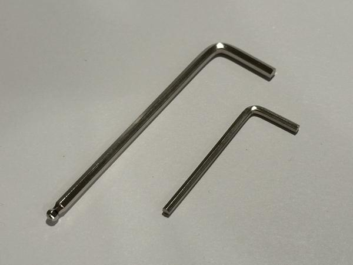{ width="32.55%" }

    We recommend discarding these, as they are typically low-quality and can easily strip screws.

!!! note

    The 90 degree plates come with their own screws (right).
    We recommend discarding them because they look very similar to the 8mm screws but are not as strong.

    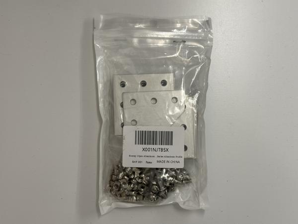{ width="32.55%" }
    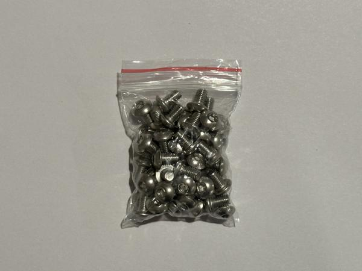{ width="32.55%" }

The following table shows which screws and T-nuts to use for each part:

| Item | Screw | T-nut |
|-|-|-|
| 28mm gusset | **Included** | **Included** |
| 20mm gusset | 8mm | Slide-in |
| 90 degree plate | 8mm| Slide-in |
| Tee plate | 8mm | Slide-in |
| Corner bracket | 8mm | Slide-in |
| Top plate (3mm acrylic) | 8mm | Slide-in |
| Bottom plate (6mm acrylic) | **10mm** | Slide-in |
| Caster module | **10mm** | Slide-in |

!!! note

    You will find three kinds of T-nuts:

    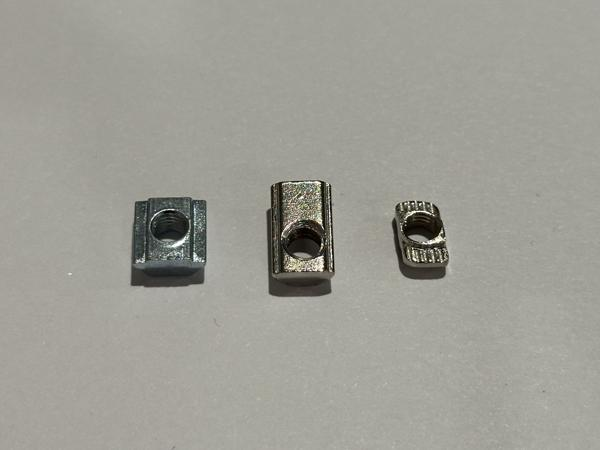{ width="32.55%" }

    We will primarily use slide-in T-nuts (left), which need to be pre-installed because they are inserted from the end of the rail.
    Roll-in T-nuts (middle) can be used if you forgot to pre-install a slide-in T-nut.
    We recommend discarding all drop-in T-nuts (right), as we will not use them.

!!! note

    The 28mm gussets come with their own screws and T-nuts (middle), which are slightly different from the standard M5 screws and T-nuts (right).
    The screws for the 28mm gussets have wider heads to accommodate the larger mounting holes in the gussets.

    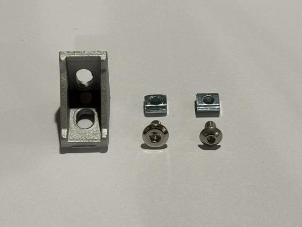{ width="32.55%" }

!!! note

    For all other parts, we will use these two types of M5 screws:

    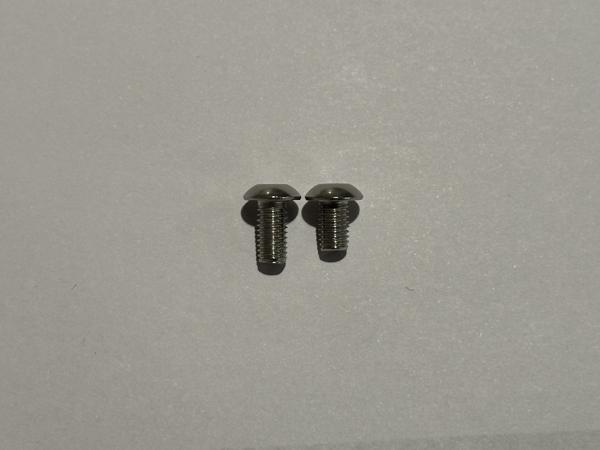{ width="32.55%" }

    Most parts will use the shorter 8mm screw.
    The longer 10mm screw should be used when mounting thicker parts, such as the caster modules and the bottom acrylic plate.

## Assembly

Please follow the CAD model to assemble your frame.
We break down the process into more detailed steps below, but feel free to assemble in any way you prefer.

!!! note

    The frame uses hex screws in metric sizes only.
    To avoid accidentally stripping screws, do not use any Imperial hex keys during frame assembly.
    If you are using Bondhus hex tools, use only the red ones, not the yellow ones.

!!! tip

    Before starting assembly, gather all parts and lay each one next to where it will be installed.
    This helps ensure that all parts are accounted for.

!!! tip

    Make sure screws are tight.
    Vibrations from robot movement may cause screws to loosen and fall out.

!!! tip

    Screws should go in smoothly and should not feel tight until fully seated.
    If you find that a partially inserted screw is difficult to turn, it is most likely due to misalignment.
    Please loosen the screw and check the alignment.
    Do not force the screw in.

### Bottom frame

Assemble the bottom frame:

=== "Kinova"

    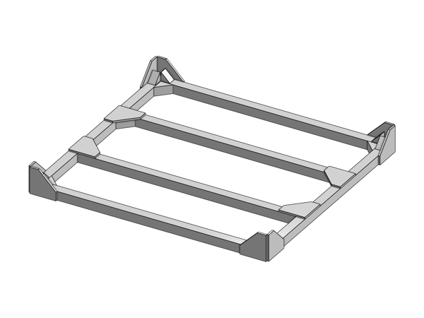{ width="49.45%" }

=== "Franka"

    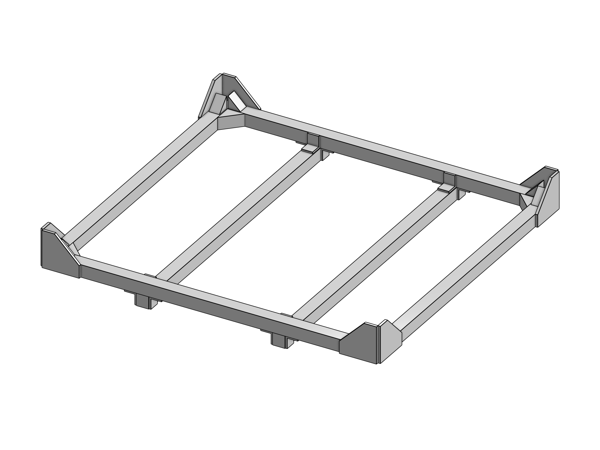{ width="49.45%" }

=== "ARX5"

    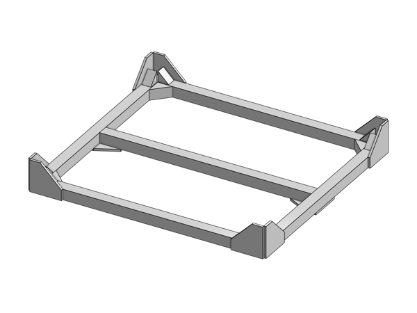{ width="49.45%" }

!!! note

    There are two sizes of gussets: 28mm (left) and 20mm (right).

    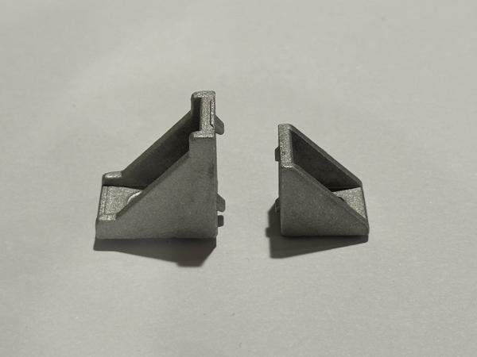{ width="32.55%" }

    We primarily use the larger 28mm gusset, but there are 8 locations where the smaller 20mm gusset must be used, as shown in the image below.
    If the 28mm gusset is used in any of these locations, it will collide with the caster module, preventing proper installation.

    === "Kinova"

        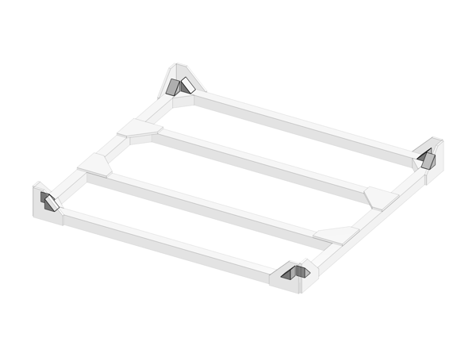{ width="49.45%" }

    === "Franka"

        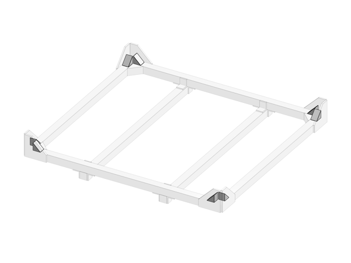{ width="49.45%" }

    === "ARX5"

        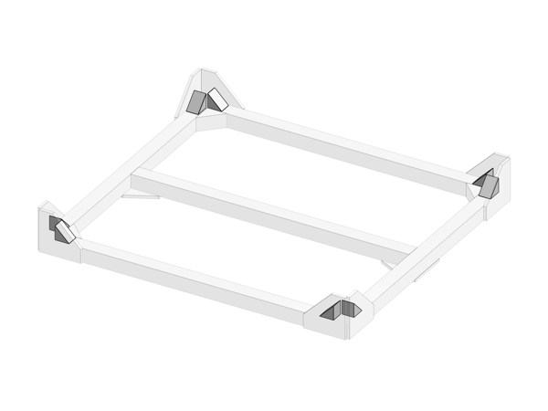{ width="49.45%" }

!!! note

    Please pre-install slide-in T-nuts for the caster modules and the bottom acrylic plate:

    === "Kinova"

        | Item | T-nuts |
        |-|-|
        | Caster module | 32 |
        | Bottom plate | 16 |

    === "Franka"

        | Item | T-nuts |
        |-|-|
        | Caster module | 32 |
        | Bottom plate | 8 |

    === "ARX5"

        | Item | T-nuts |
        |-|-|
        | Caster module | 32 |
        | Bottom plate | 11 |

    For the caster modules, each corner of the bottom frame should contain 8 T-nuts:

    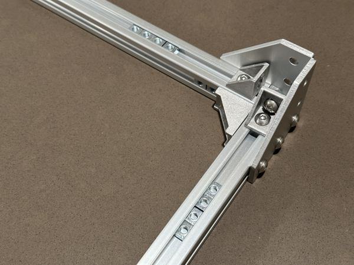{ width="32.55%" }

    For the bottom acrylic plate, please refer to the mounting hole locations in the CAD model for T-nut placement.

!!! note

    If the bottom of your frame is not level, your mobile base may have one wheel constantly off the ground.
    Before installing the middle crossbars, place your bottom frame on a flat, level surface (such as a tabletop) and make sure it does not rock back and forth.

### Top frame

Assemble the top frame:

=== "Kinova"

    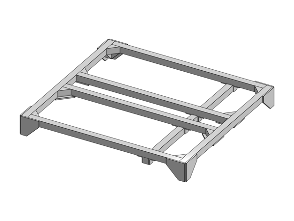{ width="49.45%" }

=== "Franka"

    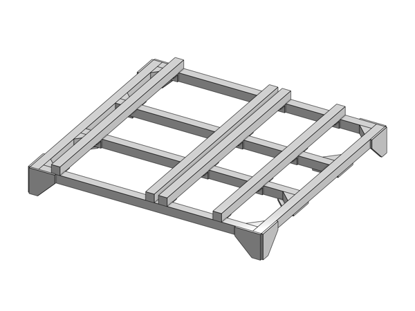{ width="49.45%" }

=== "ARX5"

    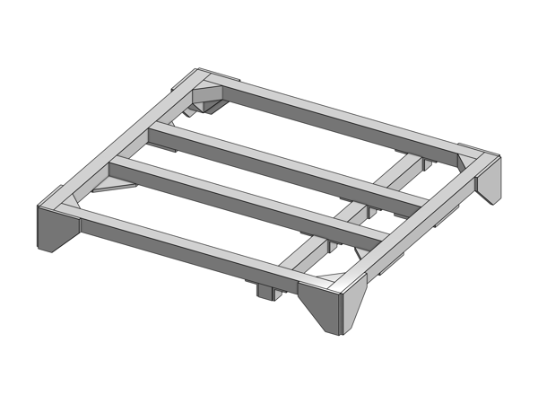{ width="49.45%" }

!!! note

    If you will be using the top acrylic plate on your mobile base, please pre-install the corresponding slide-in T-nuts for mounting the plate:

    === "Kinova"

        | Item | T-nuts |
        |-|-|
        | Top plate | 22 |

    === "Franka"

        | Item | T-nuts |
        |-|-|
        | Top plate | 17 |

    === "ARX5"

        | Item | T-nuts |
        |-|-|
        | Top plate | 16 |

    For T-nut placement, please refer to the mounting hole locations for the top acrylic plate in the CAD model.

### Uprights

Attach the 4 vertical rails to the bottom frame:

=== "Kinova"

    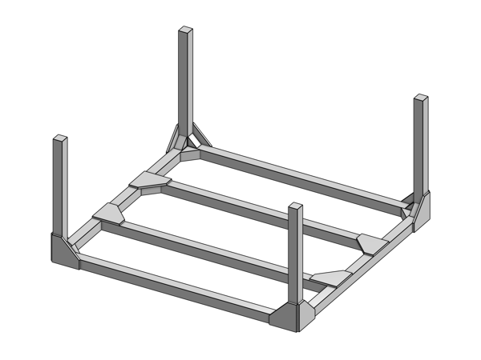{ width="49.45%" }

=== "Franka"

    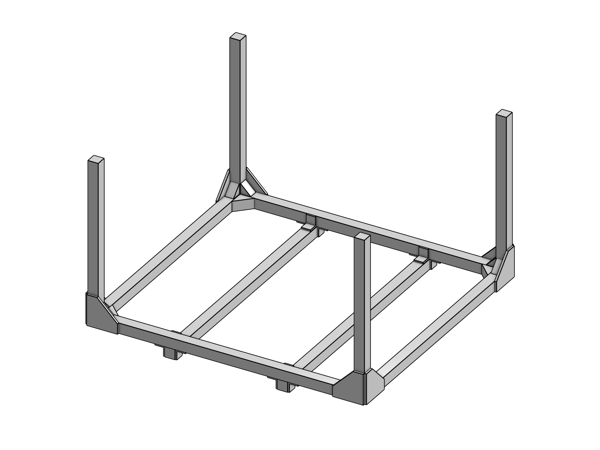{ width="49.45%" }

=== "ARX5"

    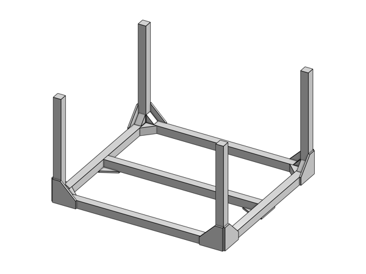{ width="49.45%" }

!!! tip

    For this step, we found it helpful to turn the frame sideways to prevent the T-nuts from moving around during screw installation.

### Complete frame

Put together the top and bottom parts to complete the frame:

=== "Kinova"

    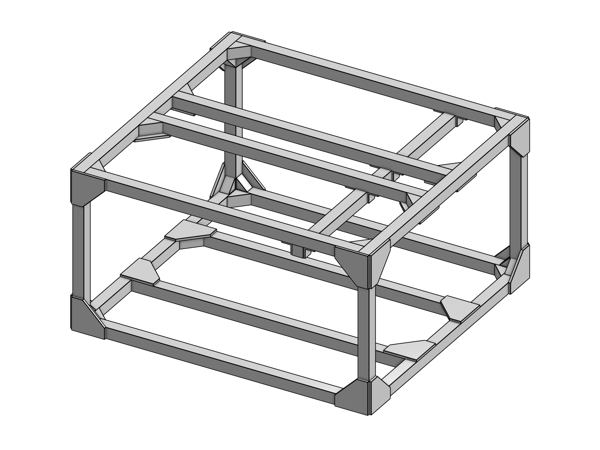{ width="49.45%" }

=== "Franka"

    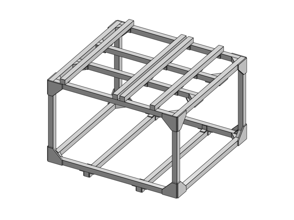{ width="49.45%" }

=== "ARX5"

    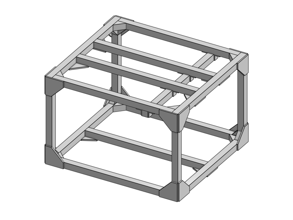{ width="49.45%" }

!!! tip

    We turned the frame sideways for this step as well.
    Make sure to pre-install T-nuts in the vertical uprights before attaching the top frame.

!!! note

    The top and bottom acrylic plates will be installed later as part of [Integration](integration.md).
