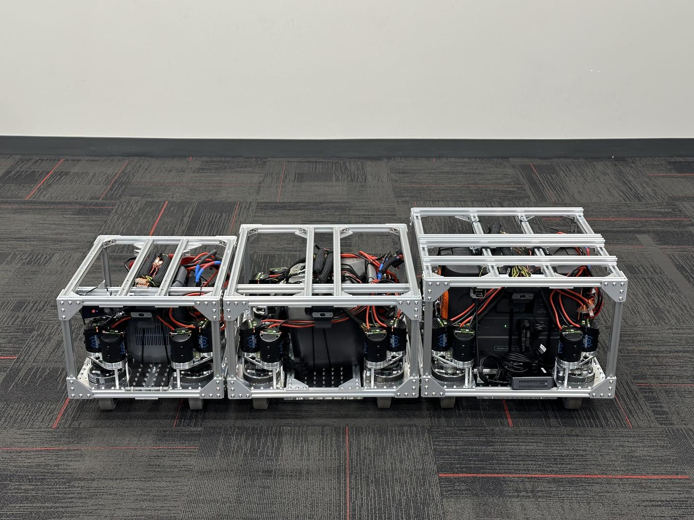
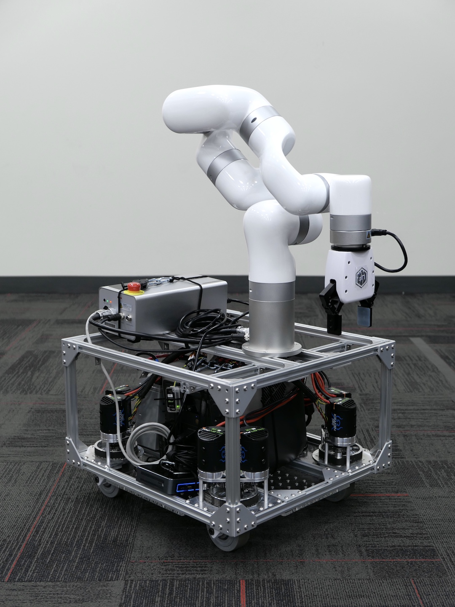
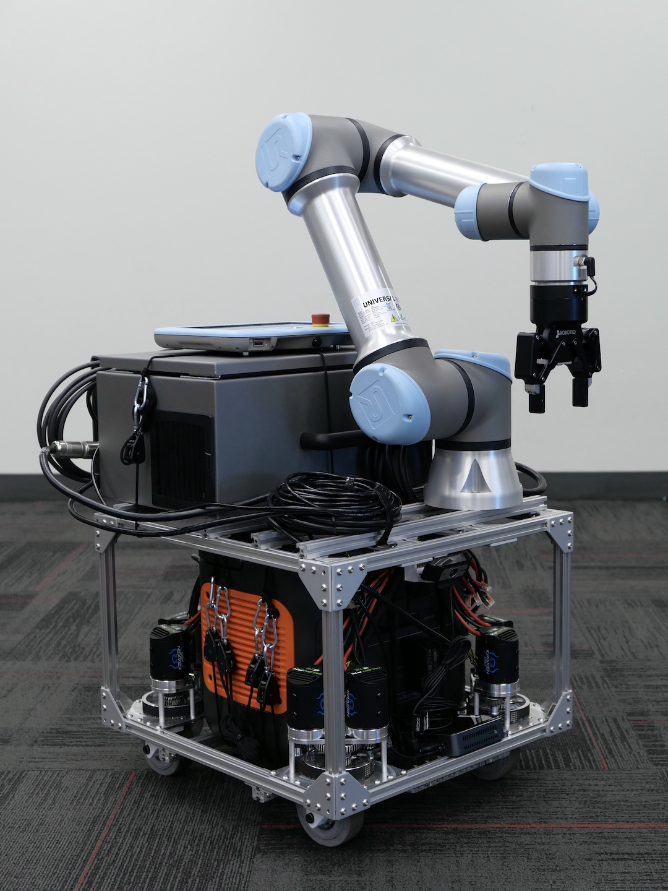
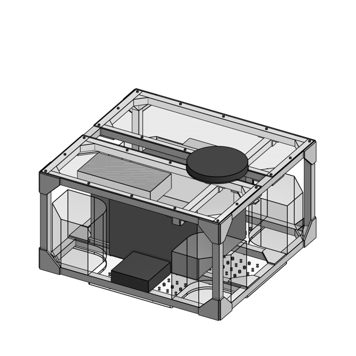
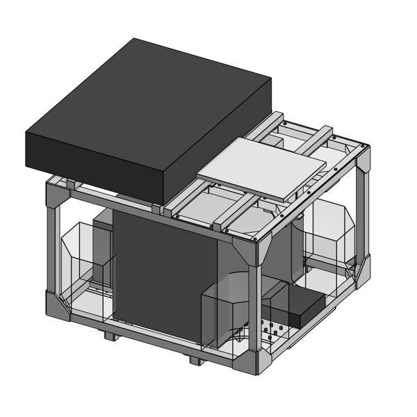
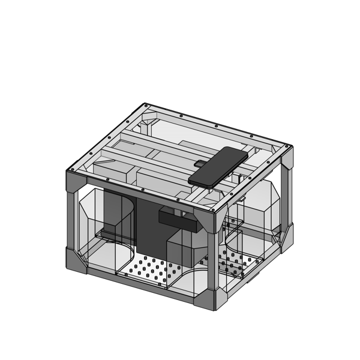
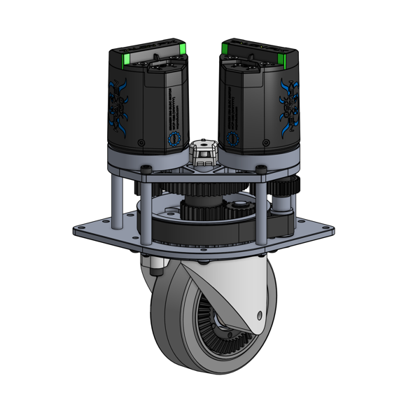

---
social:
  cards_layout_options:
    title: TidyBot++ Docs
---

# Introduction

Welcome to the [TidyBot++](http://tidybot2.github.io) documentation!
This website hosts the hardware assembly guide and usage instructions for our open-source robot.

| Kinova | Franka | ARX5 |
|:-:|:-:|:-:|
|  |  |  |

This table summarizes what is included in our open-source release:

| Arm | Hardware design | Phone teleoperation | Policy learning |
|-|:-:|:-:|:-:|
| Kinova | ✔️ | ✔️ | ✔️ |
| Franka | ✔️ | | |
| ARX5 | ✔️ | ✔️ | |
| xArm | ✔️ | | |
| UR5 | ✔️ | | |
| ViperX | ✔️ | | |

In the sections below, we describe each of these components in more detail.

## Hardware design

Our open-source robot is highly customizable, having been designed from the ground up to maximize research productivity.
To accommodate diverse research needs, we provide three reference designs of different sizes (shown in the photos above).
These designs can be used directly or serve as starting points for further customization.

The following table summarizes the main differences between the three designs:

| Design | Intended use | Dimensions | Weight | Battery capacity | Runtime |
|-|-|-|-|-|-|
| ARX5 | ~5 kg arm (ARX5, ViperX) | 40 x 44 x 37.5 cm | 26 kg | 288 Wh | 4.5 hr |
| Kinova | ~10 kg arm (Kinova, xArm) | 50 x 54 x 37.5 cm | 34 kg | 768 Wh | 8 hr |
| Franka | ~20 kg arm (Franka, UR5) | 50 x 54 x 44.5 cm | 45 kg | 2160 Wh | 8 hr |

!!! note

    The dimensions (W x L x H) and weight are for the mobile base (arm not included).
    The capacity and runtime are for the camping battery, which powers the mounted arm and onboard computer.

Below is a size comparison of the three different frame designs:

{ width="49.45%" }

We also provide mounting instructions for three other arms on the [Arm mounting](arm-mounting.md) page.
Each requires only minor modifications to the appropriately-sized reference design:

| xArm | UR5 | ViperX |
|:-:|:-:|:-:|
|  |  |  |

To get started building your own TidyBot++ robot, please proceed to the [BOM](bom.md) page to purchase the required parts.
The entire assembly process typically takes around 10 hours, which can be completed over 1-2 days.
If this is your first time, you might want to allocate a few extra days.

For those looking to customize our reference designs, we provide the relevant CAD files below:

| Kinova | Franka | ARX5 | Caster module |
|:-:|:-:|:-:|:-:|
|  [[Onshape](https://cad.onshape.com/documents/9411bc7d719e9f6eb565bc1e/w/5c6b940aec689592d9b510cc/e/2453a121ad51c0a4ba743269?renderMode=0&uiState=6756f89b65c727311cdff749)] [[STEP](https://github.com/jimmyyhwu/tidybot2-resources/blob/main/STEP/Mobile%20Base%20-%20Kinova.step)] |  [[Onshape](https://cad.onshape.com/documents/4d90b88781c2785381a04524/w/9f92a77c9ad58cb912e56821/e/11759bcf6afce1da864a93c0?renderMode=0&uiState=6756fb474a4a43331b73f128)] [[STEP](https://github.com/jimmyyhwu/tidybot2-resources/blob/main/STEP/Mobile%20Base%20-%20Franka.step)] |  [[Onshape](https://cad.onshape.com/documents/fd2a667359c85167f1f0db03/w/54cadefb8dd97063f51795c3/e/b13b7fe3a55383be6c5d46d8?renderMode=0&uiState=6756f7a582b17831681de46f)] [[STEP](https://github.com/jimmyyhwu/tidybot2-resources/blob/main/STEP/Mobile%20Base%20-%20ARX5.step)] |  [[Onshape](https://cad.onshape.com/documents/a975ca30200d2cf562f0bdcc/w/b20898673655d4308b86c9f8/e/2e23963d318f59e68f1df865?renderMode=0&uiState=6756f6321d7dea43b0f5bf4e)] [[STEP](https://github.com/jimmyyhwu/tidybot2-resources/blob/main/STEP/Caster%20Module/Caster%20Module.step)] |

## Phone teleoperation

We open source our intuitive phone teleoperation interface, shown below (4x speed):

<video src="videos/usage/IMG_0781-4x.mp4" controls autoplay loop muted playsinline style="width: 49.45%;"></video>
<video src="videos/usage/IMG_0786-4x.mp4" controls autoplay loop muted playsinline style="width: 49.45%;"></video>

This interface was used in our paper experiments to collect data for policy training.
Detailed instructions for using the interface can be found in the [Usage guide](usage.md/#phone-teleoperation).

We used the Kinova arm in our experiments, but the interface can be adapted for other arms as well by swapping out the arm controller.
We did this for the ARX5 arm, as shown below (4x speed):

<video src="videos/usage/IMG_1826-4x.mp4" controls autoplay loop muted playsinline style="width: 49.45%;"></video>
<video src="videos/usage/IMG_1861-4x.mp4" controls autoplay loop muted playsinline style="width: 49.45%;"></video>

## Policy learning

Using teleoperation data, we trained [diffusion policies](http://diffusion-policy.cs.columbia.edu) to execute tasks autonomously, as shown below (2x speed):

<video src="videos/usage/IMG_0598-2x.mp4" controls autoplay loop muted playsinline style="width: 49.45%;"></video>
<video src="videos/usage/IMG_0616-2x.mp4" controls autoplay loop muted playsinline style="width: 49.45%;"></video>

We have open sourced the full learning pipeline we used, including policy training and policy inference.
Detailed instructions can be found in the [codebase README](https://github.com/jimmyyhwu/tidybot2#usage).
While we have only tested the pipeline with the Kinova arm, it should work with other arms as well with minimal modifications.

## Contact

We hope this project can serve as a valuable resource for the robot learning community, and we're always looking to improve this documentation.
If you have any questions, comments, or suggestions, please feel free to reach out by:

* Sending an email to [Jimmy Wu](http://jimmyyhwu.github.io)
* Creating an issue on [GitHub](https://github.com/jimmyyhwu/tidybot2/issues)
* Filling out the anonymous [feedback form](https://docs.google.com/forms/d/e/1FAIpQLSfbiWzCW_GHD1S7jvza5ynSHmWDhtgOEsHq_iqdvzEj_AU8GA/viewform)
