# Integration

*Estimated time: 2 hours*

This page will guide you through the process of installing all components into the frame.

## Rope ratcheting

We will use rope ratchets to secure the following components to the frame:

* Portable power station
* SLA battery
* Mini PC

Here is a demonstration of using a rope ratchet to secure a small box to the bottom acrylic plate.
See video (2x speed):

<video data-src="../videos/integration/IMG_6720-2x.mp4#t=0.001" controls playsinline></video>

!!! note

    We use rope ratchets because they enable components to be installed or removed in just a few seconds.
    For a more permanent setup, custom component mounts can be designed.

## Portable power station

*Estimated time: 15 minutes*

Follow the steps below to secure the portable power station (camping battery) to the frame.

!!! note

    It is important to secure the camping battery to the frame because:

    * We don't want the camping battery to move around or fall out of the base during operation
    * For controller setup, we need to elevate the wheels off the ground by turning the base on its side

!!! tip

    Make sure the portable power station is operational before installing it into the frame.
    Check that the AC outlets can power your arm and mini PC.

=== "Kinova"

    Attach the bottom acrylic plate using 10mm screws:

    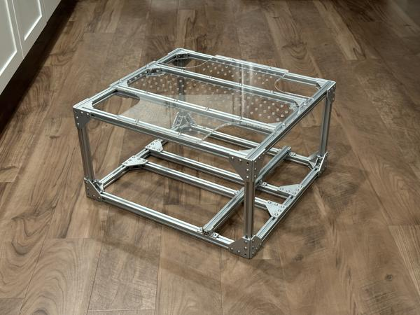{ width="49.45%" }

    Secure the camping battery to the bottom plate using 3 double-looped rope ratchets:

    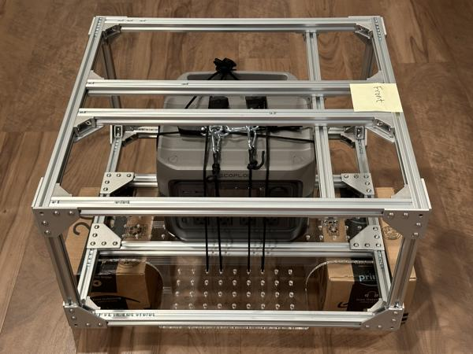{ width="49.45%" }
    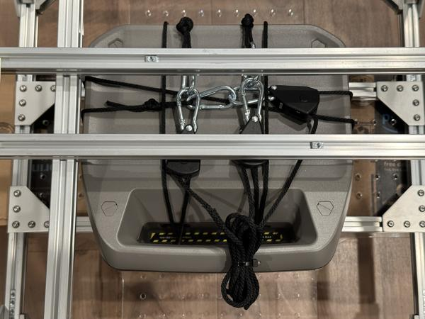{ width="49.45%" }

    !!! note

        We used these mounting holes:

        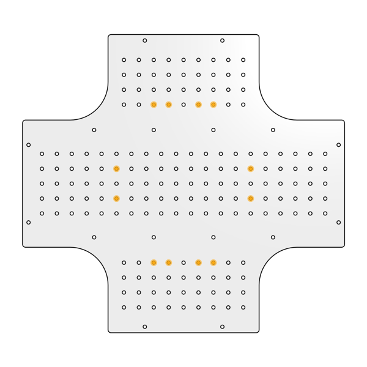{ width="49.45%" }

    !!! note

        The AC outlets should be on the right side of the mobile base.

    Here is a view of the bottom of the mobile base:

    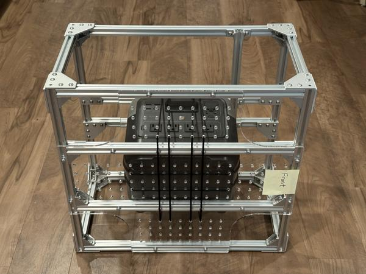{ width="49.45%" }

    !!! note

        On the underside of the base, perpendicular ropes should be arranged such that they do not touch each other.

    !!! note

        We place the front edge of the camping battery on the bottom plate rather than the crossbar, as we found this arrangement to be less prone to sliding:

        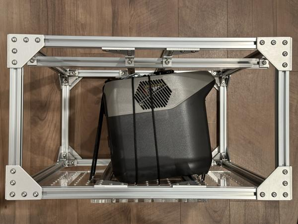{ width="49.45%" }

    !!! note

        Turn the mobile base on its side to test the stability of the mounting.
        If the rope ratchets are sufficiently tight, the camping battery should remain securely in place:

        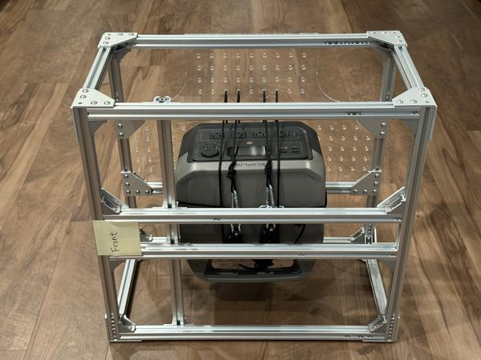{ width="49.45%" }
        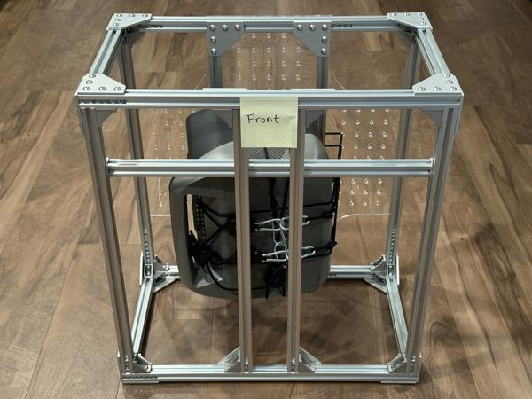{ width="49.45%" }

=== "Franka"

    Move one of the bottom crossbars to create an opening for inserting the camping battery:

    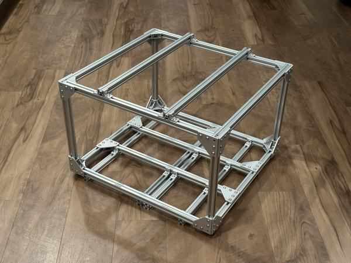{ width="49.45%" }
    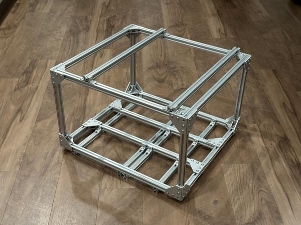{ width="49.45%" }

    Insert the camping battery, then move the crossbar back to its original position:

    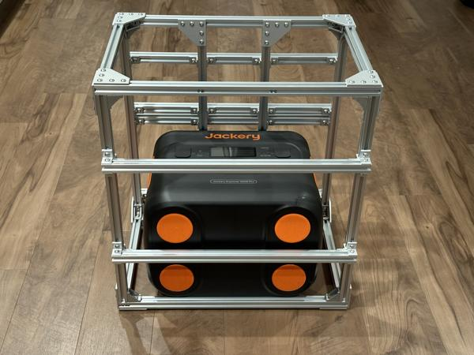{ width="49.45%" }
    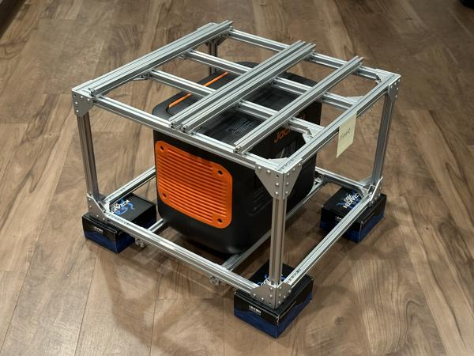{ width="49.45%" }

    Secure the camping battery to the bottom crossbars using 3 rope ratchets in the front-to-back direction:

    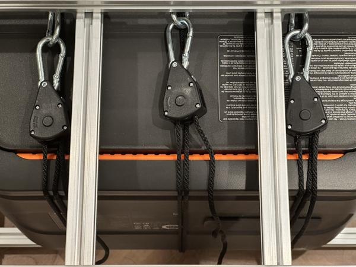{ width="49.45%" }
    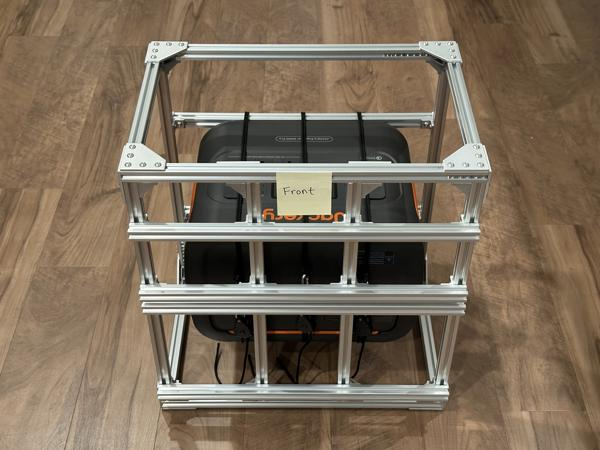{ width="49.45%" }

    !!! note

        The 3 ropes will fit into these notches on the bottom acrylic plates:

        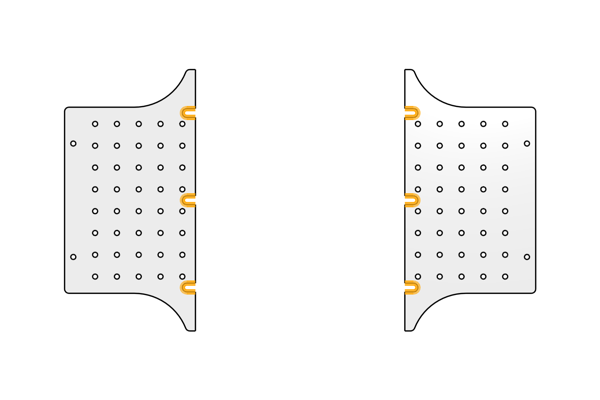{ width="49.45%" }

    !!! note

        The AC outlets should be on the front side of the mobile base.

    Use 4 more rope ratchets in the side-to-side direction to secure the battery to the top crossbars:

    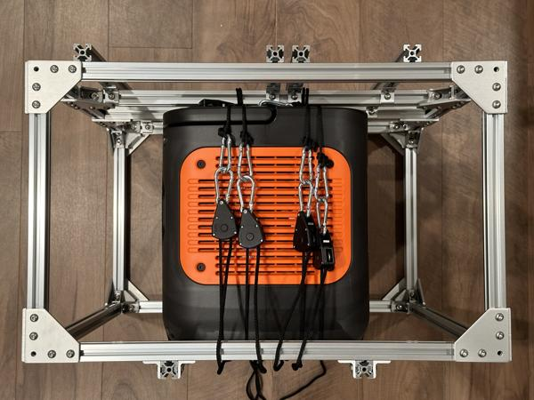{ width="49.45%" }

    !!! note

        These ropes should be looped around the top crossbars to keep the battery from sliding side to side:

        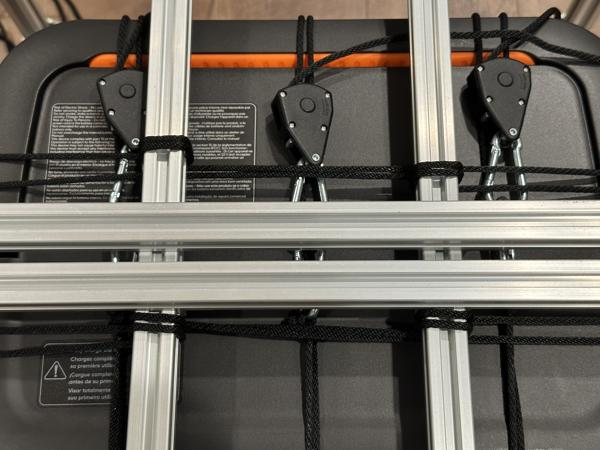{ width="49.45%" }

        To maintain compatibility with the top acrylic plate, loop around the crossbars only at these specified locations.

    Here is a view of the bottom of the mobile base:

    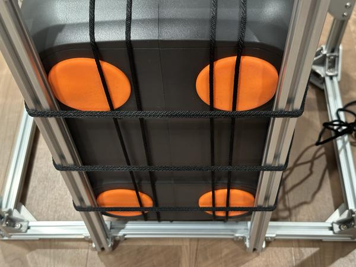{ width="49.45%" }

    !!! note

        On the underside of the base, perpendicular ropes should be arranged such that they do not touch each other.

    Attach the bottom acrylic plates using 4 [support brackets](https://github.com/jimmyyhwu/tidybot2-resources/blob/main/3D%20Printing/Franka/Franka%20Bottom%20Plate%20Support%20Bracket.stl), 10mm screws, and slide-in T-nuts:

    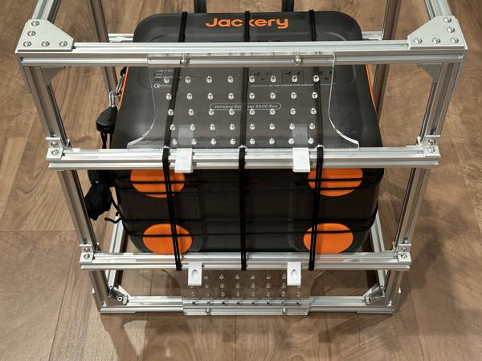{ width="49.45%" }

    !!! note

        Turn the mobile base on its side to test the stability of the mounting.
        If the rope ratchets are sufficiently tight, the camping battery should remain securely in place.

=== "ARX5"

    Attach the bottom acrylic plate using 10mm screws:

    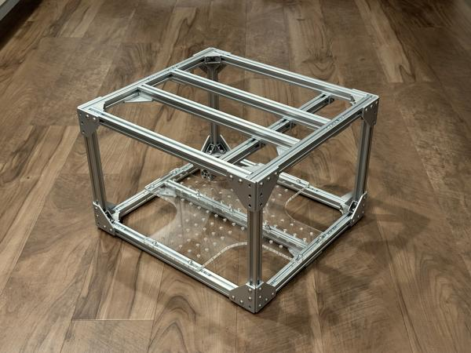{ width="49.45%" }

    Secure the camping battery to the bottom plate using 2 double-looped rope ratchets:

    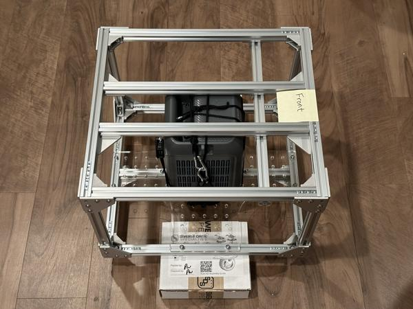{ width="49.45%" }
    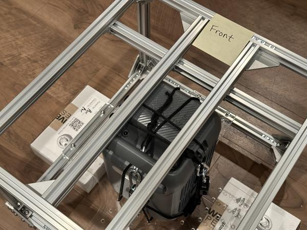{ width="49.45%" }

    !!! note

        We used these mounting holes:

        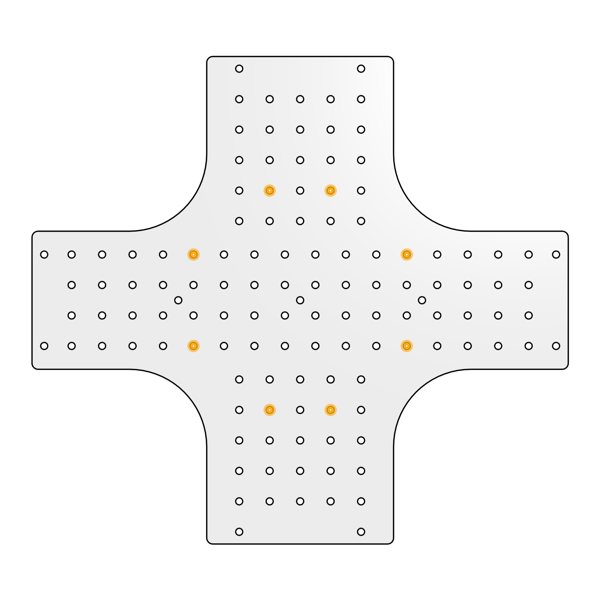{ width="49.45%" }

    !!! note

        The AC outlets should be on the front side of the mobile base.

    !!! note

        Turn the mobile base on its side to test the stability of the mounting.
        If the rope ratchets are sufficiently tight, the camping battery should remain securely in place:

        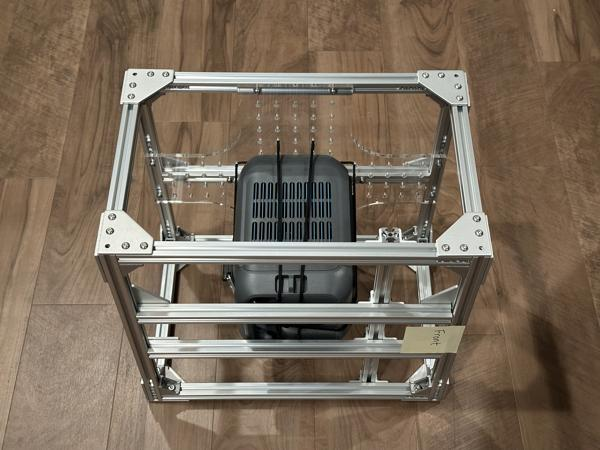{ width="49.45%" }
        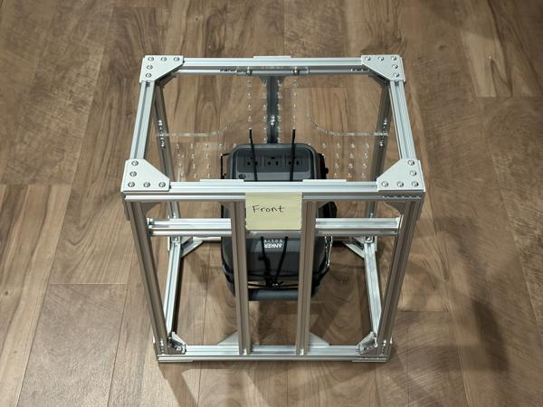{ width="49.45%" }

Once the portable power station is securely attached to the frame, plug in the charging cable:

=== "Kinova"

    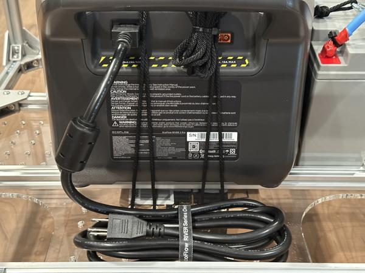{ width="49.45%" }

=== "Franka"

    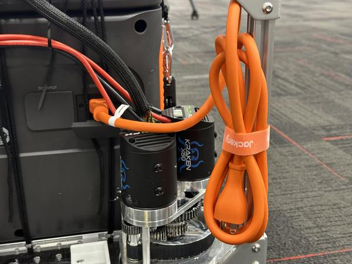{ width="49.45%" }

=== "ARX5"

    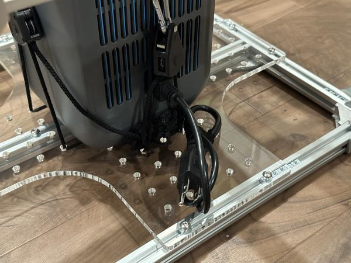{ width="49.45%" }

## SLA battery

*Estimated time: 5 minutes*

Follow these steps to set up the SLA battery mount on the back side of the mobile base:

1. Attach the 3D-printed battery mount to the bottom plate using four 10mm screws and T-nuts
1. Install a rope ratchet on the bottom plate for securing the SLA battery to the mount

=== "Kinova"

    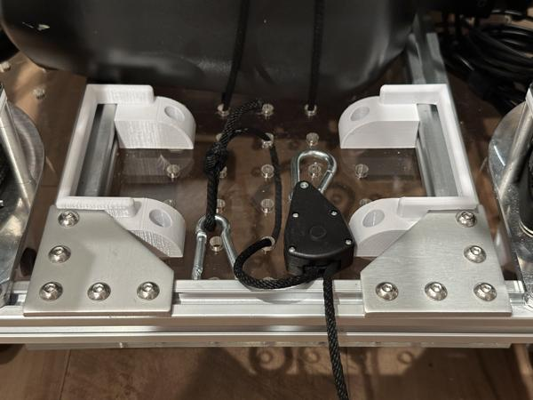{ width="49.45%" }

=== "Franka"

    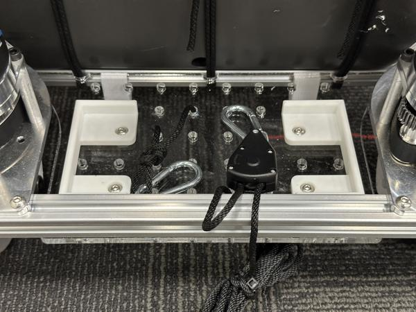{ width="49.45%" }

=== "ARX5"

    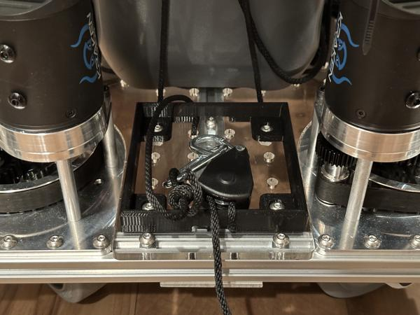{ width="49.45%" }

Place an SLA battery into the mount and secure it with the rope ratchet:

=== "Kinova"

    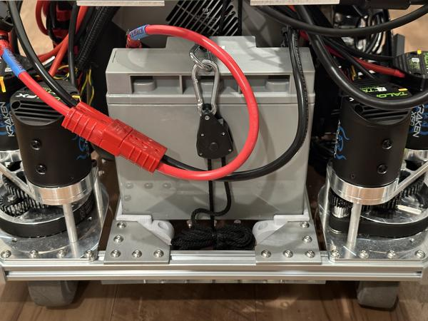{ width="49.45%" }

=== "Franka"

    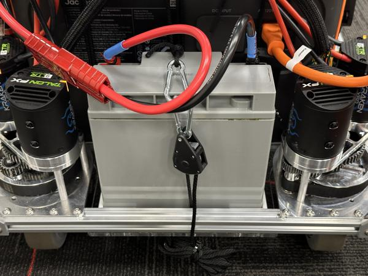{ width="49.45%" }

=== "ARX5"

    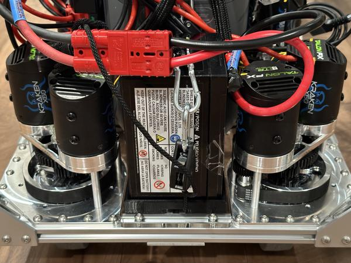{ width="49.45%" }

Verify that the mount functions properly by turning the robot on its side.
The SLA battery should stay securely fixed in place:

=== "Kinova"

    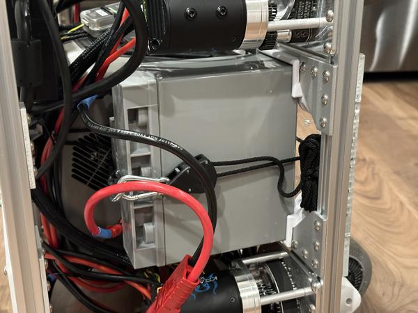{ width="49.45%" }

=== "Franka"

    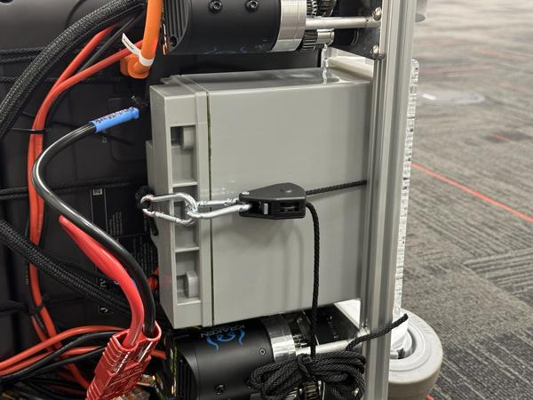{ width="49.45%" }

=== "ARX5"

    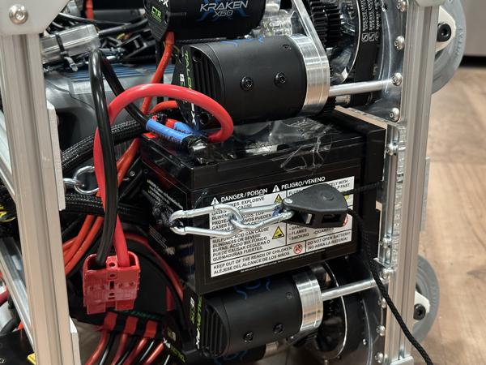{ width="49.45%" }

## Caster modules

*Estimated time: 20 minutes*

Install the caster modules into the frame according to the following schematic:

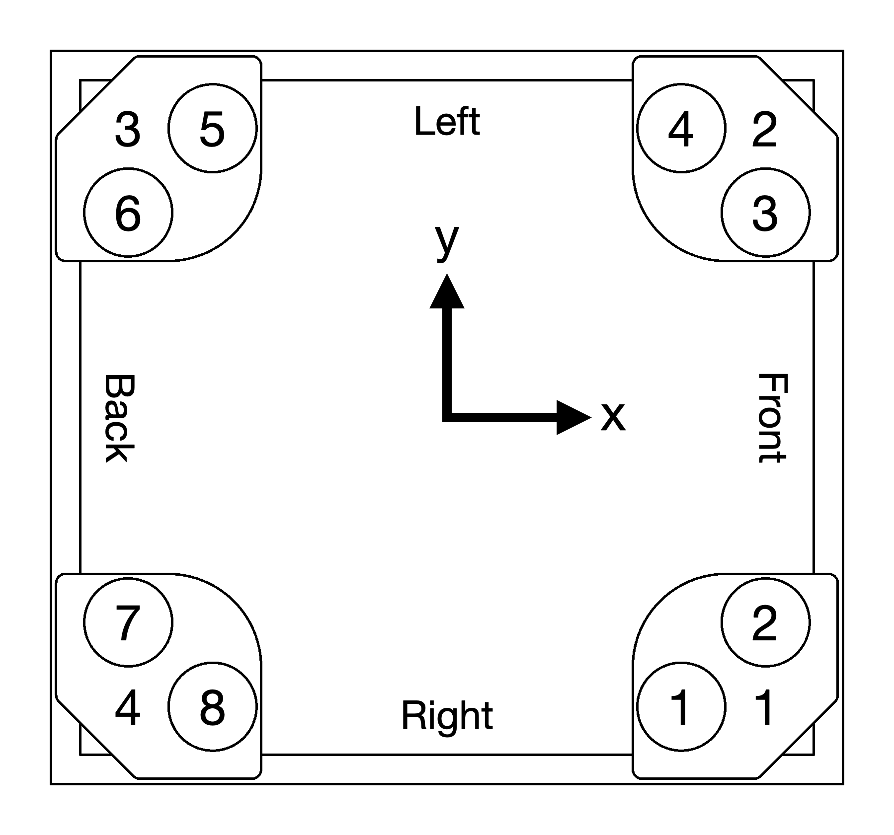{ width="49.45%" }

!!! note

    This is the caster configuration used by our low-level controller.

For each caster module, start by using the [alignment jig](https://github.com/jimmyyhwu/tidybot2-resources/blob/main/3D%20Printing/Caster%20Module%20Alignment%20Jig.stl) to position the eight T-nuts:

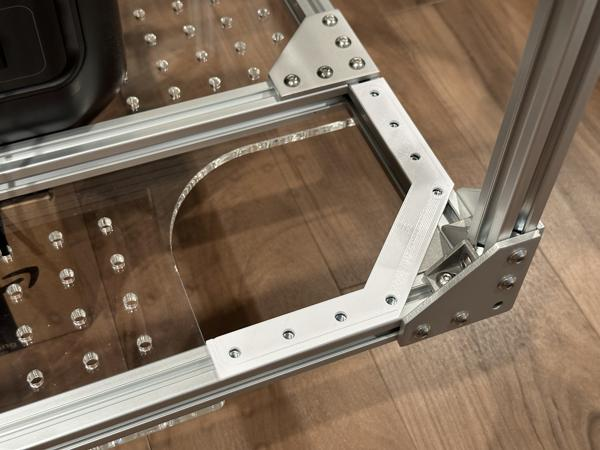{ width="49.45%" }
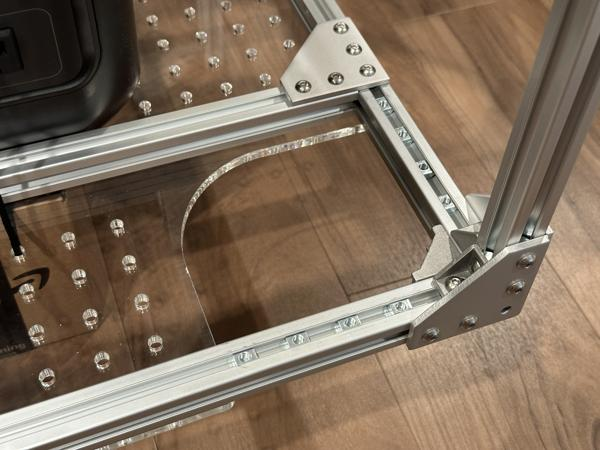{ width="49.45%" }

Next, use eight 10mm screws to secure the caster module to the frame.
See video (2x speed):

<video data-src="../videos/integration/IMG_6783-2x.mp4#t=0.001" controls playsinline></video>

!!! note

    Make sure to use the longer 10mm screws, not the 8mm screws.

!!! note

    We are using the 1/4" tapped holes in the caster module main plate as M5 clearance holes.

!!! tip

    The screws are not supposed to feel tight until they are fully inserted.
    However, these screw holes are highly sensitive to misalignment.
    If a screw feels stuck, loosen it slightly and wiggle the module to correct the alignment before continuing.

!!! note

    After installing the caster modules, check that each one is completely flush against the frame like in the left photo.
    There should not be a gap like in the right photo.

    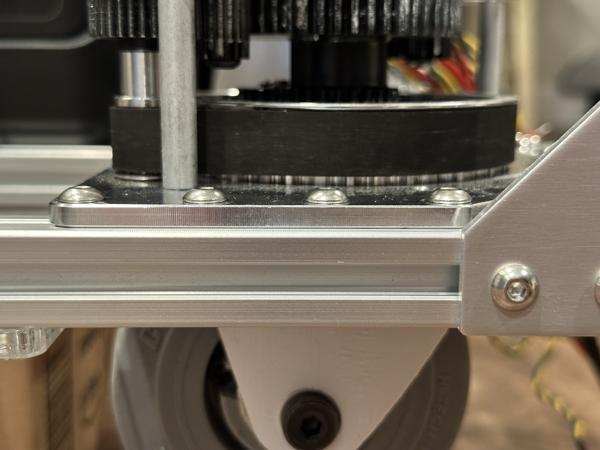{ width="49.45%" }
    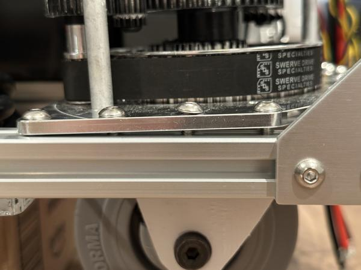{ width="49.45%" }

After installation, the configuration of the caster modules should match the schematic:

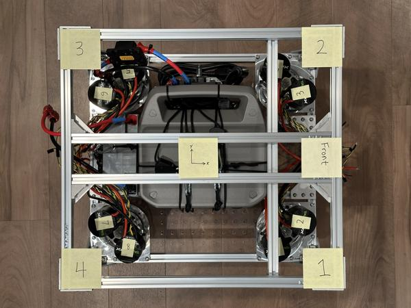{ width="49.45%" }

## Power system

*Estimated time: 30 minutes*

=== "Kinova"

    Use zip ties to secure the PDP to the left side of the mobile base:

    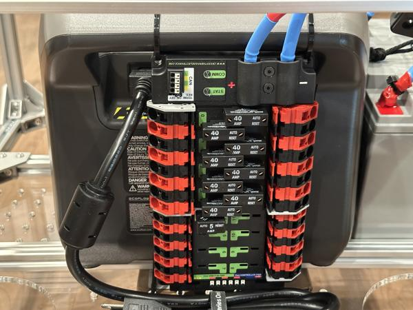{ width="49.45%" }

    Connect all motor power cables to the PDP and organize them using zip ties:

    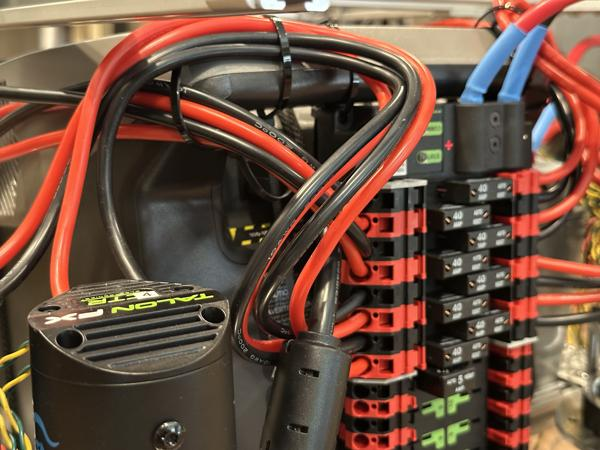{ width="49.45%" }
    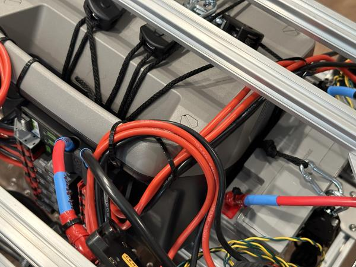{ width="49.45%" }

=== "Franka"

    Due to the large size of the camping battery, 8 of the 16 motor cables are too short to reach the PDP.
    Follow these steps to set up extensions for those cables:

    1. Cut eight pieces of 10 AWG wire (4 red and 4 black) to a length of 10–20 cm
    1. Connect the wires to the PDP
    1. Attach a 10 AWG wire connector to the free ends of the wires

    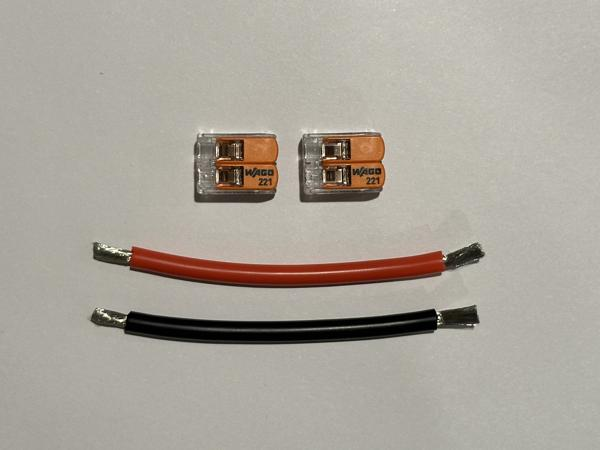{ width="49.45%" }
    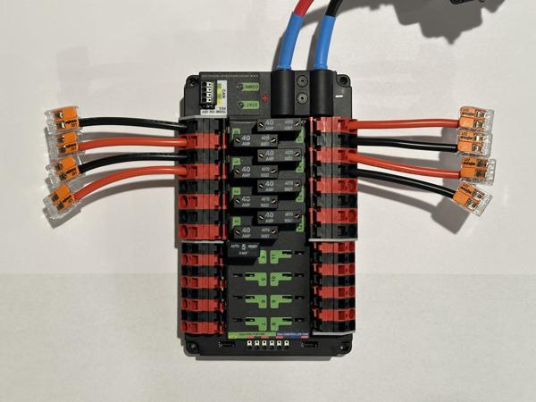{ width="49.45%" }

    Use zip ties to secure the PDP to the left side of the mobile base.
    Then, connect all motor power cables to the PDP and organize them with zip ties:

    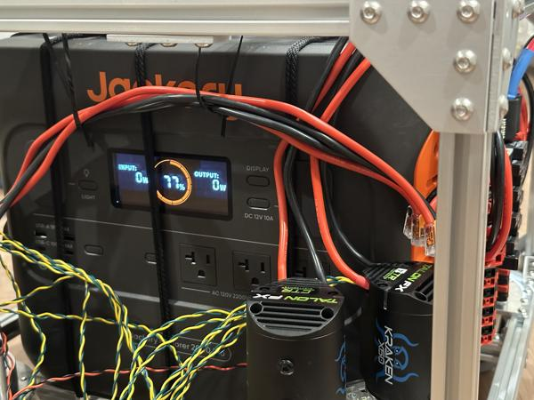{ width="49.45%" }
    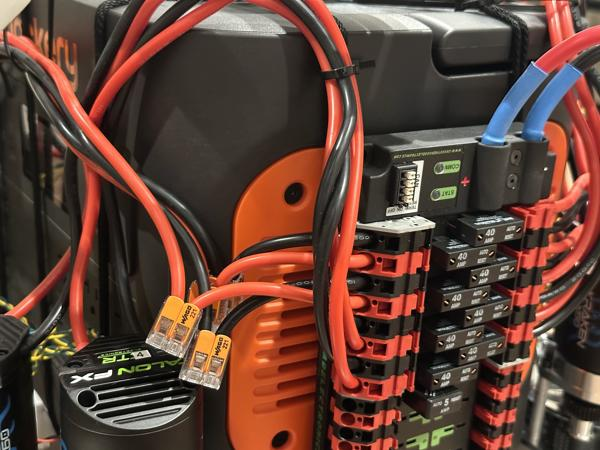{ width="49.45%" }
    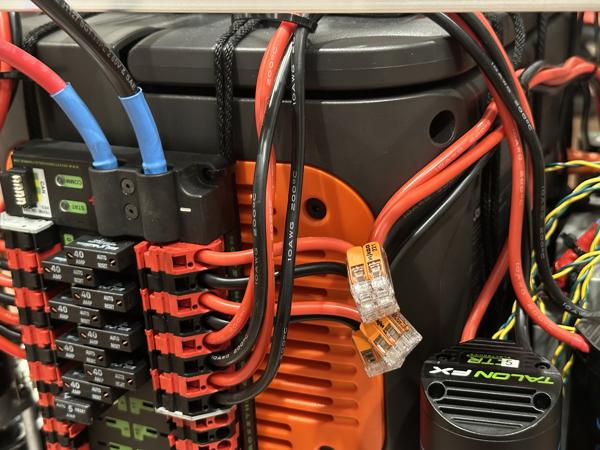{ width="49.45%" }
    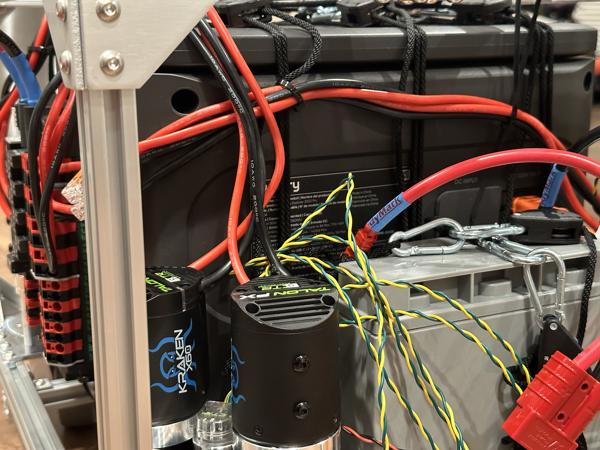{ width="49.45%" }

    !!! tip

        Wires can easily detach if not fully inserted into the connectors.
        Check that all connections are secure by giving each one a tug:

        <video data-src="../videos/integration/IMG_6703.mp4#t=0.001" controls playsinline style="width: 49.45%;"></video>

    The 120A circuit breaker can stick out of the frame (left photo), which can lead to motors shutting off unexpectedly if the red manual trip button is accidentally bumped.
    To avoid this, secure the breaker to the camping battery using a zip tie (right photo).

    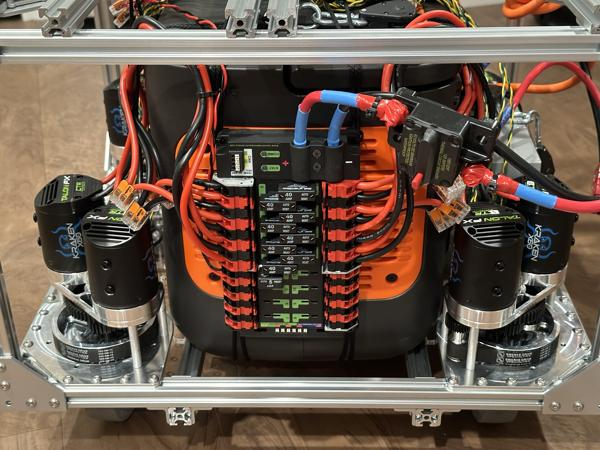{ width="49.45%" }
    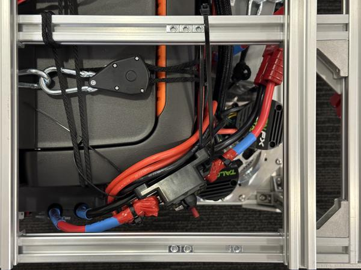{ width="49.45%" }

=== "ARX5"

    Use zip ties to secure the PDP to the left side of the mobile base:

    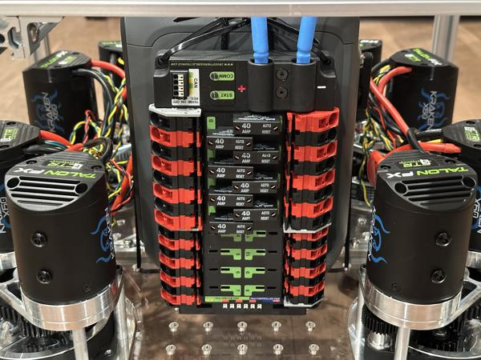{ width="49.45%" }

    Connect all motor power cables to the PDP and organize them using zip ties:

    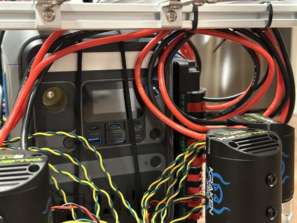{ width="49.45%" }
    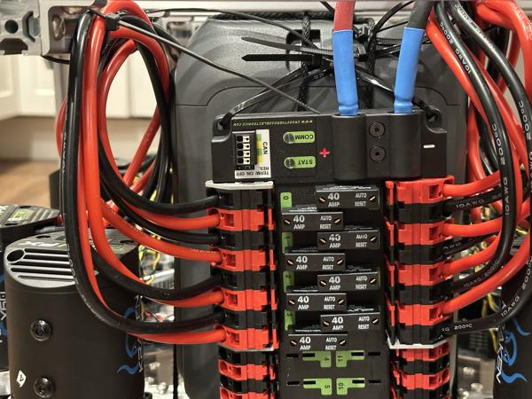{ width="49.45%" }
    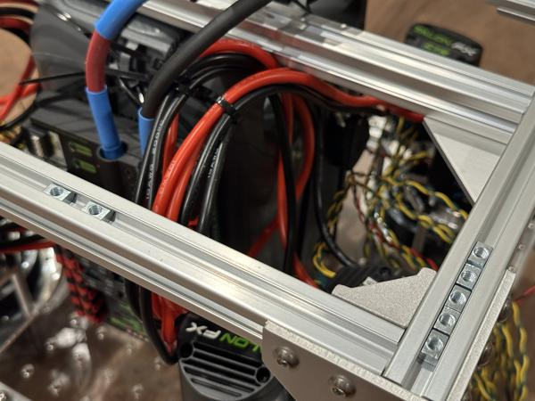{ width="49.45%" }

!!! tip

    Double-check all PDP connections and make sure there is no exposed metal like with the black wire in this photo:

    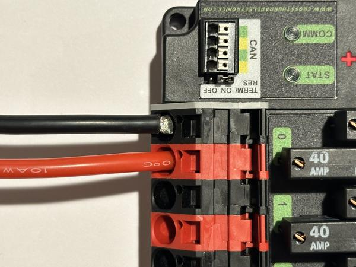{ width="49.45%" }

Connect all encoder power cables to the PDP using the previously assembled wiring harness:

=== "Kinova"

    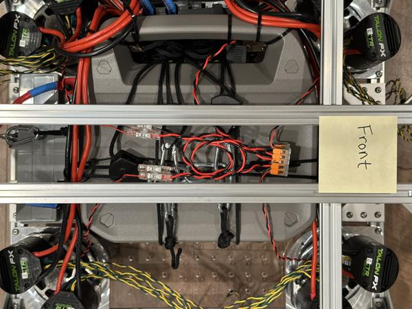{ width="49.45%" }

=== "Franka"

    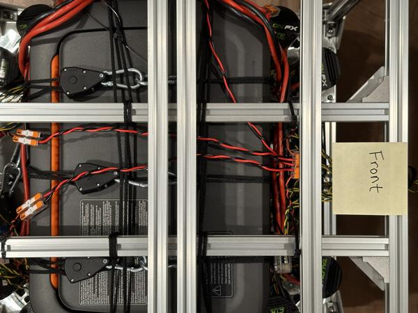{ width="49.45%" }

=== "ARX5"

    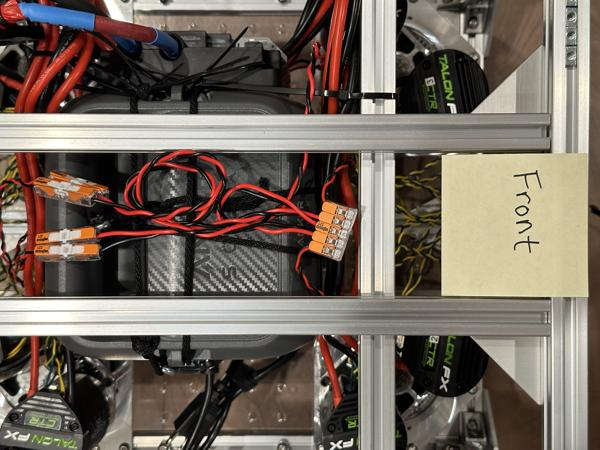{ width="49.45%" }

## CAN system

*Estimated time: 10 minutes*

Secure the CANivore to the portable power station using a zip tie.
Connect the CANivore to motor 1 and the termination resistor to motor 8:

=== "Kinova"

    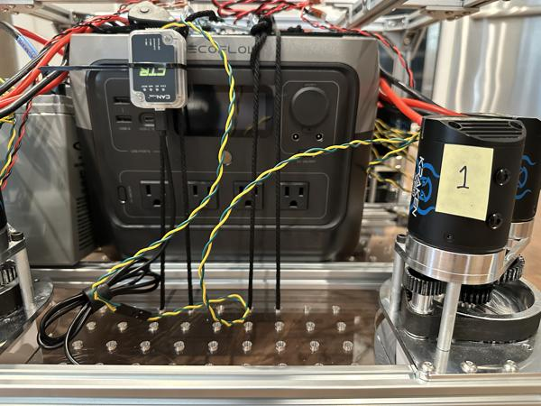{ width="49.45%" }
    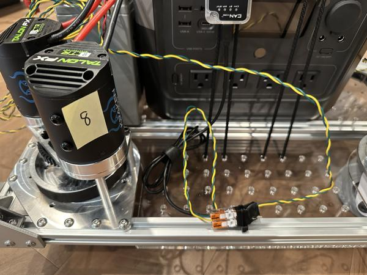{ width="49.45%" }

=== "Franka"

    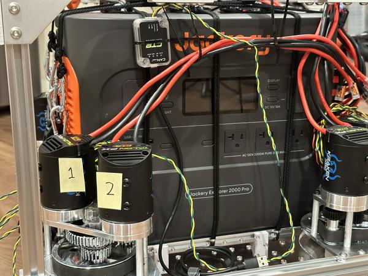{ width="49.45%" }
    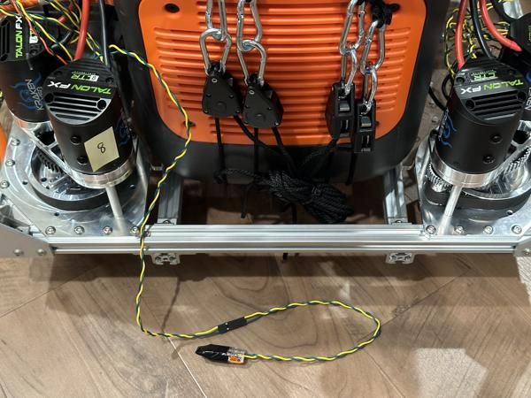{ width="49.45%" }

=== "ARX5"

    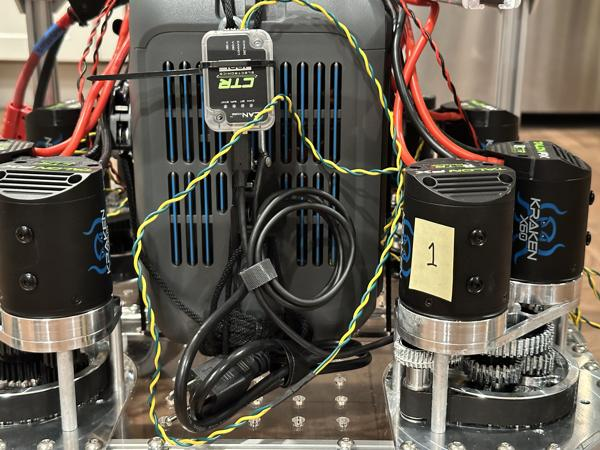{ width="49.45%" }
    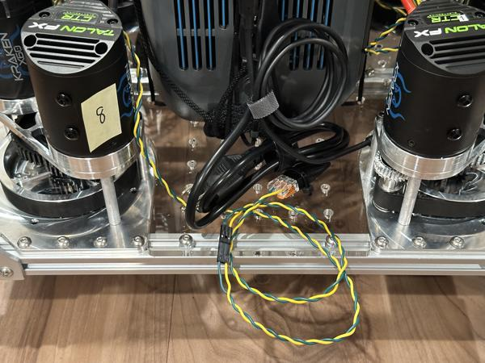{ width="49.45%" }

Next, connect the remaining CAN bus cables and organize them using Velcro cable ties:

=== "Kinova"

    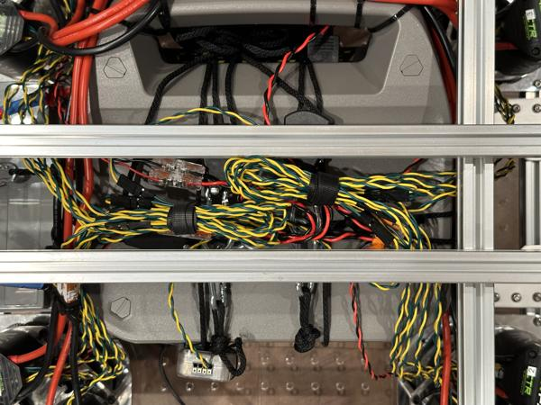{ width="49.45%" }

=== "Franka"

    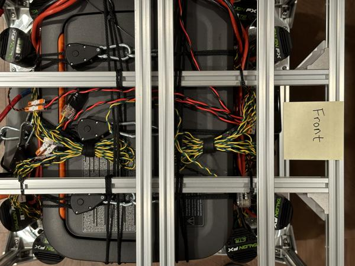{ width="49.45%" }

=== "ARX5"

    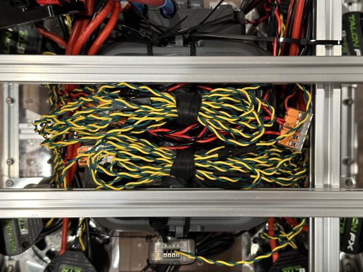{ width="49.45%" }

## Mini PC

*Estimated time: 5 minutes*

Attach the mini PC to the frame using rope ratchets, zip ties, and/or frame gussets.
Next, plug the power adapter into an AC outlet on the portable power station:

=== "Kinova"

    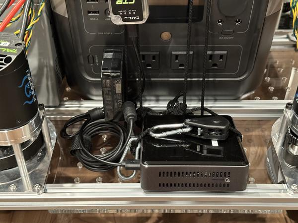{ width="49.45%" }

=== "Franka"

    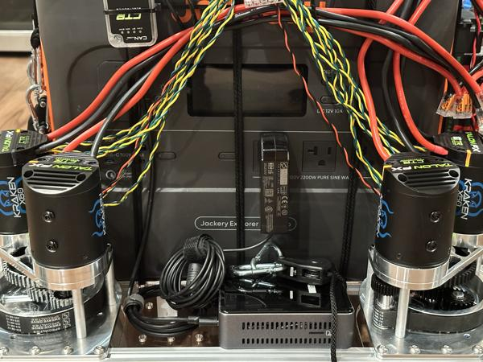{ width="49.45%" }

=== "ARX5"

    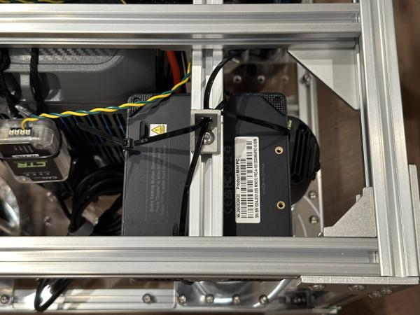{ width="49.45%" }

Install the USB hub and HDMI extender, which are useful for connecting a monitor, keyboard, and mouse to the mini PC.

!!! note

    Make sure all cables are securely fastened to prevent them from accidentally getting caught in the caster module gears.

## Encoder offsets

To set up our codebase for a newly assembled mobile base, you will need to determine an encoder offset for each caster so that the controller has a reference point for the zero steer position.

Follow these steps to prepare the base:

1. Double-check that everything inside the mobile base, including the camping battery and SLA battery, is fully secured
1. Ensure that all cables are properly secured and kept away from the caster module gears
1. Turn the mobile base onto its side, with the right side of the base facing up

We define the zero steer position as the configuration that the base assumes when driving forwards, with all casters in the trailing position:

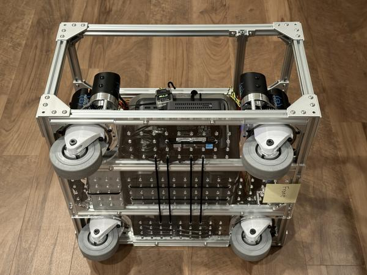{ width="49.45%" }

!!! note

    In these photos, the robot's forward +x direction is towards the right side.

Use a straightedge to align the top wheels so that they are both in the zero position:

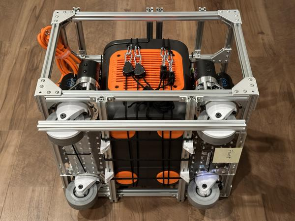{ width="49.45%" }

The [wheel alignment jig](https://github.com/jimmyyhwu/tidybot2-resources/blob/main/3D%20Printing/Wheel%20Alignment%20Jig.stl) helps create a level surface on each wheel:

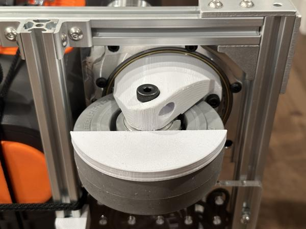{ width="49.45%" }

Repeat the process to orient the bottom two wheels as well.

Once all four casters are in the zero steer position, follow the instructions in the [codebase](https://github.com/jimmyyhwu/tidybot2) to print out the encoder offsets and store them in `constants.py`.

!!! tip

    If you find later on that your base odometry is not accurate, you can improve performance by fine-tuning the encoder offsets in increments of 1/4096 for better accuracy. For example, inaccurate odometry may cause the robot, when commanded to go straight, to take a curved path or rotate slightly.

## Integration testing

The mobile base should now be ready for integration testing with the software.
Before proceeding, please perform the following checks:

1. Double-check the polarity of all power and CAN connections
1. Verify that all connections are securely attached by gently tugging on each one

If everything checks out, please proceed to the [Software](software.md) page to set up the mini PC, and then the [codebase](https://github.com/jimmyyhwu/tidybot2) for further setup.

We typically perform an integration test by controlling the base using gamepad teleoperation and verifying that the casters move as expected:

<video data-src="../videos/usage/IMG_6867.mp4#t=0.001" controls playsinline></video>

After confirming that the mobile base is operational via gamepad teleoperation, return to this page to complete the remaining integration steps.

## Cable organization

*Estimated time: 5 minutes*

After confirming that the mobile base is operational, use cable sleeves to further organize the CAN wiring:

=== "Kinova"

    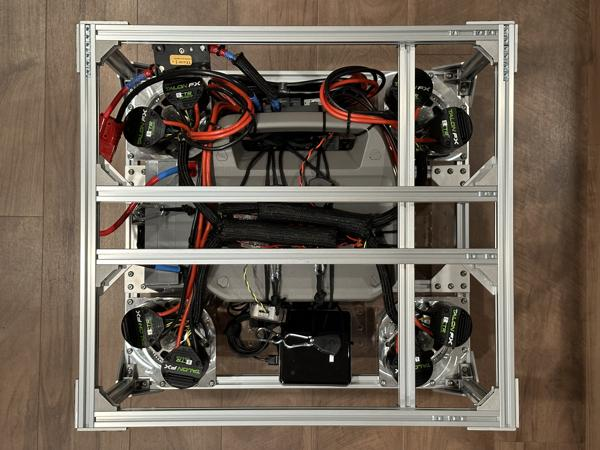{ width="49.45%" }
    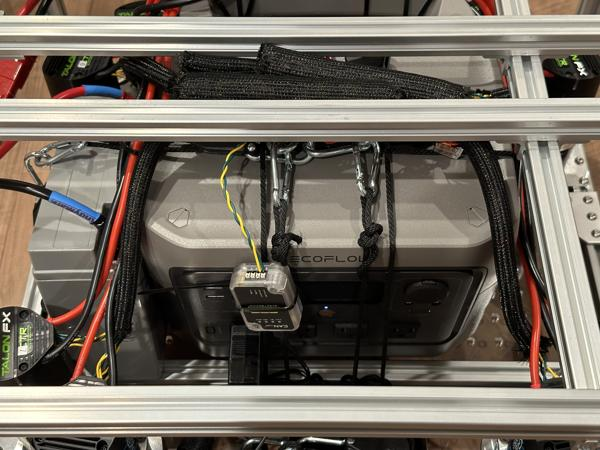{ width="49.45%" }

=== "Franka"

    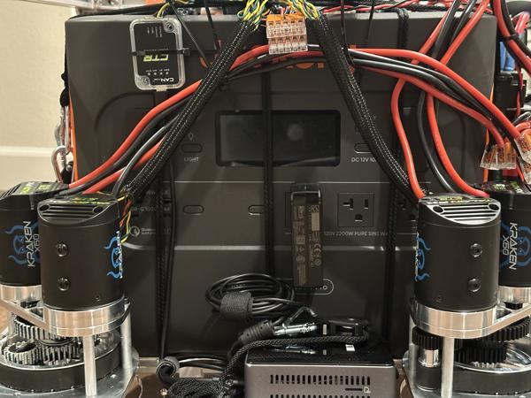{ width="49.45%" }
    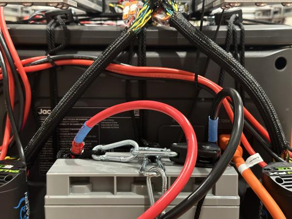{ width="49.45%" }
    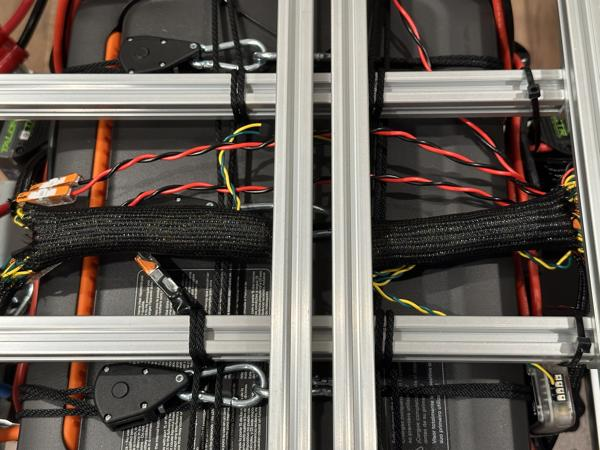{ width="49.45%" }

=== "ARX5"

    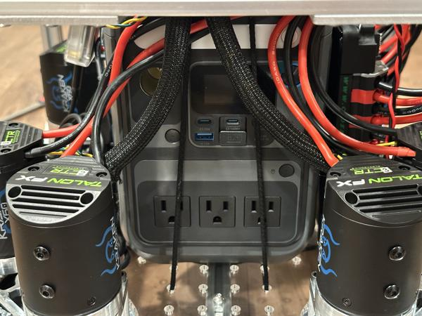{ width="49.45%" }
    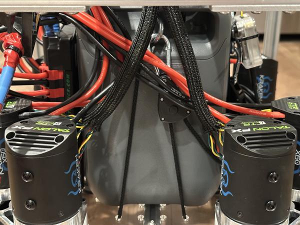{ width="49.45%" }
    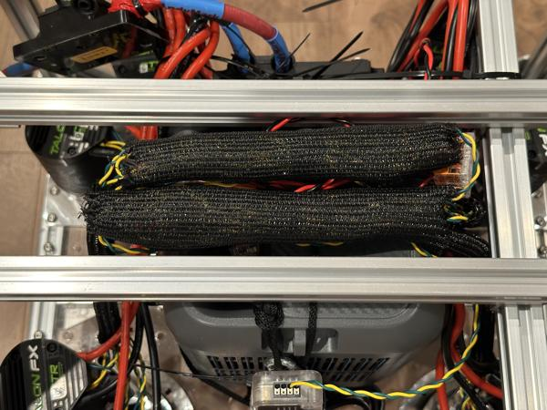{ width="49.45%" }

## Base camera

*Estimated time: 5 minutes*

Install the Logitech camera to the front of the mobile base using these steps:

1. Insert the 3D-printed shim into the hinge to lock the camera angle
1. Place the camera between the top and bottom parts of the 3D-printed camera mount
1. Secure the mount to the frame using two 10mm screws and roll-in T-nuts
1. Route the USB cable to the mini PC and plug it in

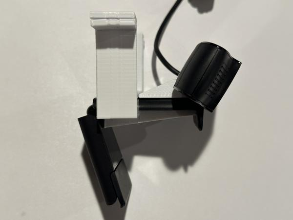{ width="49.45%" }
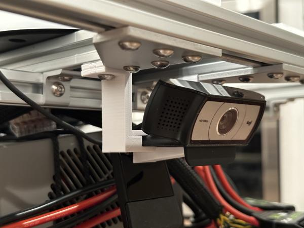{ width="49.45%" }
