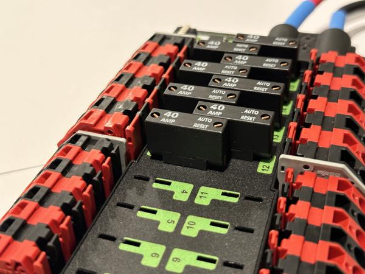
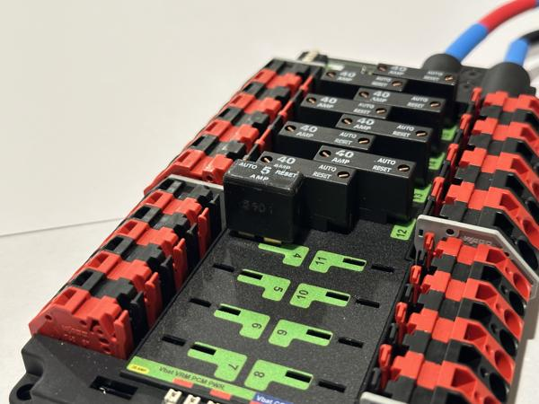
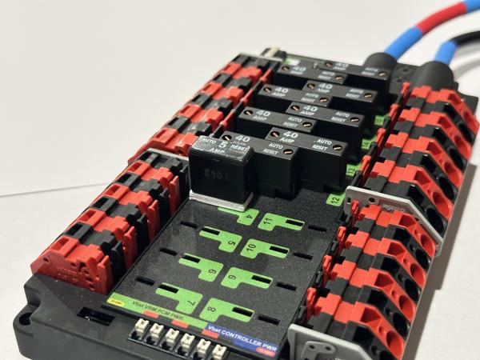
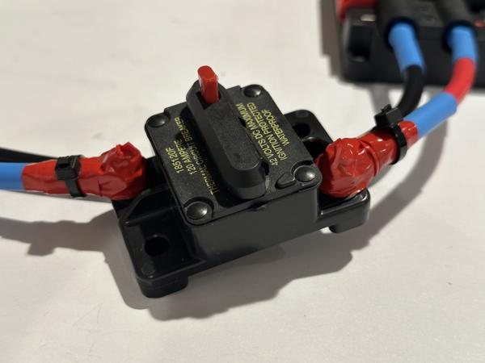
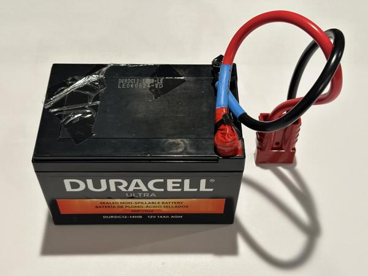
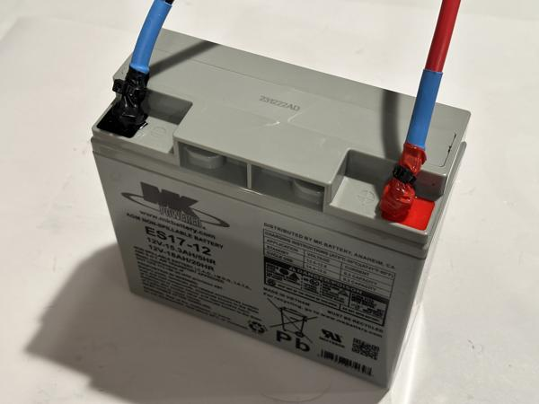
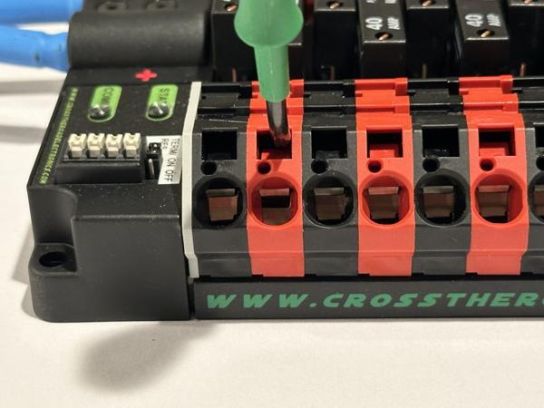
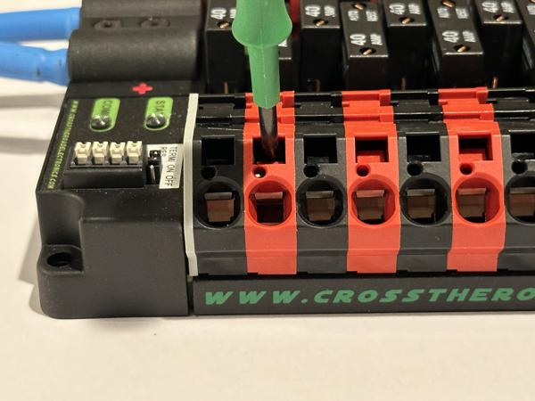
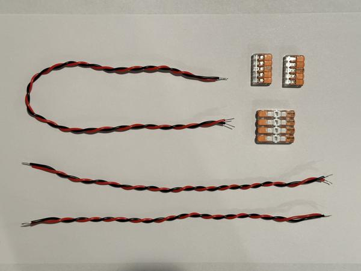
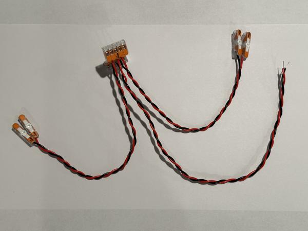

# Power system

*Estimated time: 30 minutes*

This page describes how to set up the power system, which supplies power from the SLA battery to the motors and encoders.

## Power cable assembly

[Tools:](bom.md#tools)

* 5mm hex key
* 5/64" hex key
* Socket wrench with 10mm socket
* Electrical tape
* Zip ties

Assemble the power distribution panel (PDP) and power cable using the following procedure:

1. Connect the power cable and 120A circuit breaker to the PDP
2. Use electrical tape to cover any exposed connections, and use zip ties to secure the tape
3. Install the eight 40A breakers into channels 0-3 and 12-15
4. Install the 5A breaker into channel 4 with the [terminal spacer](https://github.com/jimmyyhwu/tidybot2-resources/blob/main/3D%20Printing/Breaker%20Terminal%20Spacer.stl)

See video (4x speed):

<video data-src="../videos/power-system/IMG_4764-4x.mp4#t=0.001" controls playsinline></video>

!!! note

    Make sure that all of the power cable connections are tight! Loose connections can be very difficult to troubleshoot.

!!! note

    The 40A breakers should be fully inserted, with no exposed metal:

    { width="49.45%" }

!!! note

    The 5A breaker needs a terminal spacer because the terminals are too long (left photo). The spacer covers the exposed terminals to help prevent accidental shorts (right photo).

    { width="49.45%" }
    { width="49.45%" }

!!! note

    Use electrical tape to cover all exposed metal:

    { width="49.45%" }

!!! tip

    Double-check the polarities of the power cable connections. Red goes with plus and black goes with minus.

!!! tip

    The [FRC robot wiring guide](https://docs.wpilib.org/en/stable/docs/zero-to-robot/step-1/intro-to-frc-robot-wiring.html) might be a helpful resource here.

## Battery assembly

[Tools:](bom.md#tools)

* Socket wrench with 5/16" socket
* Adjustable wrench
* Electrical tape
* Zip ties

For each sealed lead acid (SLA) battery, connect a battery cable (battery comes with screws, nuts, and washers) and use electrical tape to cover the exposed terminals.
See video (4x speed):

<video data-src="../videos/power-system/IMG_4762-4x.mp4#t=0.001" controls playsinline></video>

!!! note

    Make sure the battery cable connections are tight! Loose connections can be very difficult to troubleshoot.

!!! note

    Here is how the cable should be oriented for the smaller battery:

    { width="49.45%" }

!!! note

    Use electrical tape to cover all exposed metal:

    { width="49.45%" }

!!! tip

    Double-check the polarities of the battery cable connections. Red goes with red and black goes with black.

## Motor power

[Tools:](bom.md#tools)

* WAGO tool

Connect the power cables of all 8 motors to the PDP.
See video (4x/16x speed):

<video data-src="../videos/power-system/IMG_6709-4x-16x.mp4#t=0.001" controls playsinline></video>

!!! note

    In this step, we are temporarily wiring the motors and encoders for bench testing.

!!! note

    Some people may find the WAGO connectors on the PDP challenging to work with.
    Here is a close-up video demonstrating their usage (2x speed):

    <video data-src="../videos/power-system/IMG_6687-2x.mp4#t=0.001" controls playsinline></video>

    As shown in the video, the WAGO operating tool should be inserted straight into the actuation slot at a slight angle to horizontal.
    Then, the end of the tool should be pushed downwards to open the slot.

    We also recommend watching this video explaining how WAGO connectors work: [WAGO connectors explained](https://www.youtube.com/watch?v=t-zb7j4ikHM)

!!! note

    **Do not forcefully wiggle the WAGO tool or pry the end of the tool upwards!**
    Doing so can deform the plastic housing, making the connector harder to operate in the future.

!!! tip

    If you are having trouble getting the wires to go all the way in, look inside the wire insertion slot.
    Since the wires are thick, it is not sufficient for the slot to be partially open (left), it needs to be fully open (right):

    { width="49.45%" }
    { width="49.45%" }

## Encoder power

[Tools:](bom.md#tools)

* WAGO tool
* Wire stripper (22 AWG solid)

To build the encoder wiring harness, start by using 22AWG wire to make one 45cm cable and two 30cm cables.
Strip 1 cm of insulation from the ends of the wires.
Next, connect the wires using two 5-port wire connectors (one for red and one for black), and add inline wire connectors to the free ends of the 30cm cables.
See photos for reference:

{ width="49.45%" }
{ width="49.45%" }

!!! note

    Be sure to strip at least 1 cm of insulation.
    If there is not enough exposed wire, the WAGO connector may clamp onto the insulation, resulting in intermittent power to the encoder.

Use the wiring harness to connect all 4 encoders to the PDP.
See video (2x speed):

<video data-src="../videos/power-system/IMG_6710-2x.mp4#t=0.001" controls playsinline></video>

## Setup complete

At this point, the power system setup is complete and you should be ready to connect the SLA battery.
Make sure to double-check the polarity of all power connections (power cable, battery cable, motors, encoders) before proceeding.
Once the battery is connected, all motors and encoders should light up, indicating that they are powered on.

!!! note

    For battery charging instructions, please see the [Usage](usage.md#power-off-procedure) page.
