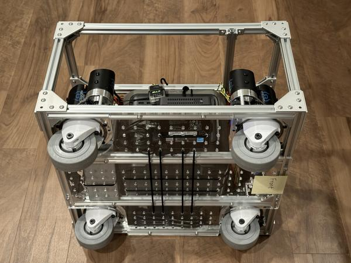
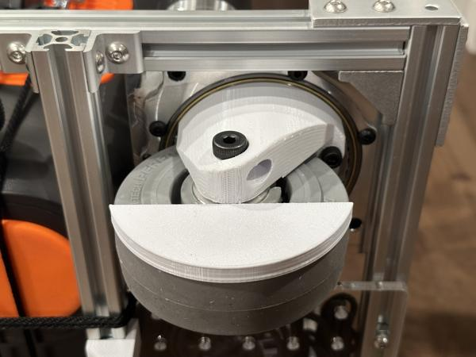
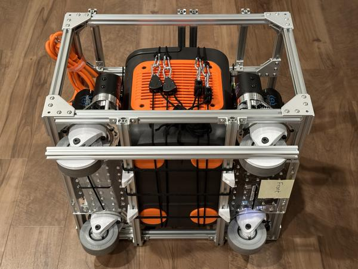

# Software

This page provides instructions for:

* Configuring a new mini PC to run real-time controllers.
* Setting up the TidyBot++ [codebase](https://github.com/jimmyyhwu/tidybot2) on the mini PC.

!!! note

    These setup steps are only necessary when working with the real robot.
    If you are only using simulation, please follow the instructions in the [codebase](https://github.com/jimmyyhwu/tidybot2) README.
    Note that our entire policy learning pipeline (phone teleoperation, data collection, policy training, and policy inference) can be tested in simulation without a physical robot.

## Mini PC setup

This section describes how we configured a "Beelink S12 Pro" mini PC as an onboard computer for running real-time controllers.
While these steps are tailored for this model, they should apply to other mini PCs as well.

### Ubuntu 22

Follow these steps to create a bootable USB drive for Ubuntu 22:

1. Go to the [Ubuntu 22 release page](https://releases.ubuntu.com/jammy/).
1. Scroll down and download the `ubuntu-22.04.4-desktop-amd64.iso` image file.
1. Download and install [balenaEtcher](https://etcher.balena.io).
1. Use balenaEtcher to flash the ISO image onto a USB drive.

!!! note

    We used Ubuntu 22.04.4 LTS.
    Newer versions should also work but may require additional modifications.

!!! tip

    We recommend using a USB drive that supports USB 3.0 or higher.
    The Ubuntu installation will take much longer with a USB 2.0 drive.

Next, follow these steps to install Ubuntu 22 on the mini PC:

1. Insert the Ubuntu 22 USB drive into the mini PC.
1. Power on the mini PC and press `<F7>` to enter the boot menu.
1. Select the `UEFI USB` option to boot from the USB drive.
1. When prompted, select *Install Ubuntu*.
1. When prompted, connect to a Wi-Fi network.
1. In the *Updates and other Software* screen, choose *Minimal installation* (instead of *Normal installation*) and do not check the box for *Install third-party software*.
1. In the *Installation type* screen, select *Erase disk and install Ubuntu*.
1. Continue with the installation procedure until completion.

!!! tip

    If the boot menu does not appear, restart the mini PC and repeatedly press `<F7>` during the boot process.

!!! note

    Because this mini PC is intended to run performance-critical real-time controllers, we use the "minimal installation" to avoid unnecessary software.

### Automatic power on

For convenience, we recommend configuring the mini PC to automatically power on when plugged in.
Follow these steps to enable this feature in the BIOS:

1. Reboot the mini PC and press `<Del>` to enter BIOS setup.
1. Navigate to `Chipset > PCH-IO Configuration > State After G3`.
1. Change `S5 State` to `S0 State`.
1. Save changes and exit.
1. Turn off the mini PC and unplug the power adapter.
1. Plug the power adapter back in and verify that the mini PC powers on automatically.

### Headless setup

The mini PC will mainly be used in headless mode without a monitor via SSH and `tmux`, as it is inconvenient to keep a monitor connected to a moving mobile base.

Run the following command to install SSH and `tmux`:

```bash
sudo apt install openssh-server tmux
```

We use `tmux` to create persistent sessions that continue running if the SSH connection drops.
Below is an example headless workflow using `tmux`:

1. SSH into the mini PC:
```bash
ssh <username>@<minipc-hostname>
```
1. If there is no existing `tmux` session, start a new one:
```bash
tmux
```
Or, if a `tmux` session already exists, reattach to it:
```bash
tmux a
```
1. Run tasks in the `tmux` session (tasks continue to run even if your connection drops).
1. Create new windows within the `tmux` session  as needed to run tasks in parallel.
1. If the SSH connection drops, reconnect SSH and reattach to the `tmux` session.

!!! tip

    If you are on a network with no DNS server, try appending `.local` to the hostname when connecting via SSH:

    ```bash
    ssh <username>@<minipc-hostname>.local
    ```

!!! tip

    If you have not used `tmux` before, please see the "Sessions" and "Windows" sections in the `tmux` [cheat sheet](https://tmuxcheatsheet.com).

!!! tip

    By default, mouse scrolling is disabled in `tmux`.
    Follow these steps to enable it:

    1. Open `~/.tmux.conf` in a text editor.
    1. Add the following line:
    ```
    set -g mouse on
    ```
    1. Save and exit.
    1. Reload the config file:
    ```bash
    tmux source ~/.tmux.conf
    ```

### CPU frequency scaling

To help minimize latency when running real-time controllers, follow these steps to disable CPU frequency scaling:

1. Install `cpufrequtils`:
```bash
sudo apt install cpufrequtils
```
1. Check the current CPU frequency policy:
```bash
cpufreq-info -p
```
Example output showing that the `powersave` governor is active:
```
400000 4000000 powersave
700000 3400000 powersave
```
1. To disable scaling, set the `performance` governor as default:
```bash
sudo sh -c 'echo "GOVERNOR=performance" > /etc/default/cpufrequtils'
```

This change will take effect upon reboot.

### Wi-Fi power management

For improved performance and latency when communicating over Wi-Fi, power management should be disabled.

Run this command to show the current wireless interface power management settings:

```bash
iwconfig
```

If `Power Management: on` appears in the output, follow these steps to disable Wi-FI power management:

1. Open `/etc/NetworkManager/conf.d/default-wifi-powersave-on.conf` in a text editor.
1. Change `wifi.powersave` to `wifi.powersave = 2`.
1. Save and exit.

### Real-time kernel

For optimal real-time performance of controllers running on the mini PC, we highly recommend installing the `PREEMPT_RT` real-time kernel.

!!! note

    The real-time kernel is not compatible with Nvidia drivers.

**Building the real-time kernel**

Please follow the [setup guide](https://frankaemika.github.io/docs/installation_linux.html#setting-up-the-real-time-kernel) from the Franka documentation to build the real-time kernel.

!!! note

    If you prefer to install the exact kernel image we built rather than building it yourself, you can download our files here:

    * [`linux-image-6.8.2-rt11_6.8.2-1_amd64.deb`](https://www.dropbox.com/scl/fi/tf43oizgvi69ef18fdtrn/linux-image-6.8.2-rt11_6.8.2-1_amd64.deb?rlkey=gmlsnpsq2pc1nqmwe297rsojg&st=u4xt7wfo)
    * [`linux-headers-6.8.2-rt11_6.8.2-1_amd64.deb`](https://www.dropbox.com/scl/fi/x6pymtd48nqpyxe2bgvsp/linux-headers-6.8.2-rt11_6.8.2-1_amd64.deb?rlkey=4u8do5syr0pkmyko9w5vyp97s&st=bknqqs69)

    To install these files, run the following command:

    ```bash
    sudo dpkg -i linux-image-6.8.2-rt11_6.8.2-1_amd64.deb linux-headers-6.8.2-rt11_6.8.2-1_amd64.deb
    ```

    If this installs successfully, you can skip ahead to the section on setting the default boot option.

Below is a summary of the steps we followed:

1. Install required dependencies:
```bash
sudo apt-get install build-essential bc curl ca-certificates gnupg2 libssl-dev lsb-release libelf-dev bison flex dwarves zstd libncurses-dev debhelper
```
1. Download the source files:
```bash
mkdir linux-6.8.2-rt11
cd linux-6.8.2-rt11
curl -SLO https://mirrors.edge.kernel.org/pub/linux/kernel/v6.x/linux-6.8.2.tar.xz
curl -SLO https://mirrors.edge.kernel.org/pub/linux/kernel/v6.x/linux-6.8.2.tar.sign
curl -SLO https://mirrors.edge.kernel.org/pub/linux/kernel/projects/rt/6.8/patch-6.8.2-rt11.patch.xz
curl -SLO https://mirrors.edge.kernel.org/pub/linux/kernel/projects/rt/6.5/patch-6.8.2-rt11.patch.sign
```
1. Extract and patch the kernel:
```bash
xz -d *.xz
tar xf linux-*.tar
cd linux-*/
patch -p1 < ../patch-*.patch
cp -v /boot/config-$(uname -r) .config
make olddefconfig
make menuconfig
```
1. In the menu interface that opens, make the following changes and save before exiting:
    * Under *General setup > Preemption Model*, select *Fully Preemptible Kernel (Real-Time)*.
    * Under *Cryptographic API > Certificates for signature checking > Additional X.509 keys for default system keyring*, remove `"debian/canonical-certs.pem"`.
    * Under *Cryptographic API > Certificates for signature checking > X.509 certificates to be preloaded into the system blacklist keyring*, remove `"debian/canonical-revoked-certs.pem"`.
    * Under *Device Drivers > Graphics support > Intel 8xx/9xx/G3x/G4x/HD Graphics*, press `<N>` to exclude (this option addresses i915 latency spikes in `cyclictest`).
1. Build the kernel:
```bash
make -j$(nproc) bindeb-pkg
```
1. Once it has been built, install the kernel:
```bash
sudo dpkg -i linux-image-6.8.2-rt11_6.8.2-1_amd64.deb linux-headers-6.8.2-rt11_6.8.2-1_amd64.deb
```

!!! note

    We recommend installing the exact `PREEMPT_RT` version we used, as other versions may have issues such as broken Wi-Fi or Ethernet connectivity.

!!! note

    One side effect of excluding the Intel graphics driver is that if you connect a monitor after the mini PC has already booted, it will not display anything.
    If you want to use a monitor, you can simply plug it in **before** booting the mini PC.
    If you prefer normal monitor behavior, you can include the Intel graphics driver when building your kernel (at the cost of worse latency performance).

!!! tip

    Building the kernel in parallel can hide error messages.
    For clearer output, you can also build sequentially:

    ```bash
    make bindeb-pkg
    ```

    However, note that a sequential build can take up to 4 hours.

**Setting the default boot option**

Follow these steps to set the new real-time kernel as the default boot option:

1. Open `/etc/default/grub` in a text editor.
1. Change `GRUB_DEFAULT=0` to:
```
GRUB_DEFAULT="Advanced options for Ubuntu>Ubuntu, with Linux 6.8.2-rt11"
```
1. Save and exit.
1. Update GRUB:
```bash
sudo update-grub
```

!!! note

    If you are not using `6.8.2-rt11`, adjust the text to match your kernel version.
    You can check `/boot/grub/grub.cfg` for the correct identifier of the real-time kernel menu entry.

### Verification

Reboot the mini PC, then perform the following checks:

**CPU frequency scaling**

Run this command to verify that CPU frequency scaling is disabled:

```bash
cpufreq-info -p
```

You should see the `performance` governor in the output:

```
700000 3400000 performance
```

**Wi-Fi power management**

Run this command to verify that Wi-Fi power management is disabled:

```bash
iwconfig
```

You should see this line in the output:

```
Power Management:off
```

You can also ping the mini PC from your dev machine to verify that you get ping times of 1-3 ms.
When power management is enabled, ping times can be much higher (40-100 ms).

**Real-time kernel**

Run this command to confirm that the real-time kernel is in use:

```bash
uname -a
```

You should see the `PREEMPT_RT` label in the output, for example:

```
Linux minipc-01 6.8.2-rt11 #1 SMP PREEMPT_RT Sun Oct 27 18:09:44 PDT 2024 x86_64 x86_64 x86_64 GNU/Linux
```

If you see `generic` in the output, then your mini PC is still using the generic kernel, not the real-time one:

```
Linux minipc-01 6.8.0-48-generic #48~22.04.1-Ubuntu SMP PREEMPT_DYNAMIC Mon Oct  7 11:24:13 UTC 2 x86_64 x86_64 x86_64 GNU/Linux
```

**Latency testing**

Follow these steps to measure the real-time latency performance of your system with the `cyclictest` tool:

1. Install the `rt-tests` package:
```bash
sudo apt install rt-tests
```
1. Run the latency test:
```bash
sudo cyclictest --mlockall --smp --priority=80 --interval=200 --distance=0 --duration=1h
```
1. Wait 1 hour for the test to finish.

The test will output latency statistics per CPU core.
In our tests with the "Beelink S12 Pro", the generic kernel showed significantly higher latencies, as expected:

| Kernel | Max latency |
|-|-|
| `6.8.2-rt11` | < 20 us |
| `6.8.0-48-generic` | 1000+ us |

!!! note

    We recommend unplugging peripherals such as monitors during the test as they can cause latency spikes.
    We performed our tests over SSH in a `tmux` session.

!!! tip

    Please see the [wiki page](https://wiki.linuxfoundation.org/realtime/documentation/howto/tools/cyclictest/start) to learn more about `cyclictest`.

### Arm setup

Follow the steps below to configure the mini PC for controlling your robotic arm.

=== "Kinova"

    **Ethernet setup**

    Follow these steps to set up an Ethernet connection to the Kinova arm:

    1. Create a new Ethernet connection named `Kinova` with static IP address `192.168.1.11`:
    ```bash
    sudo nmcli con add type ethernet con-name Kinova ifname <ethernet-interface> ipv4.method manual ipv4.addresses 192.168.1.11/24
    ```
    Make sure to replace `<ethernet-interface>` with the actual interface name, which you can find by running `ip link`.
    1. List available network connections and verify that the new `Kinova` connection is present:
    ```bash
    nmcli con
    ```
    1. Turn on the arm and connect its Ethernet cable to the mini PC.
    1. Activate the `Kinova` Ethernet connection:
    ```bash
    sudo nmcli con up Kinova
    ```
    1. Test the connection by pinging the arm:
    ```bash
    ping 192.168.1.10
    ```

    **Communication test**

    Run the following command to perform a simple network communication test where we ping the arm at 1 kHz for 100 seconds:

    ```bash
    sudo ping 192.168.1.10 -i 0.001 -D -c 100000 -s 1200
    ```

    The output should show 0% packet loss and round-trip times (RTTs) well under 1 ms.
    Here is some example output:

    ```
    100000 packets transmitted, 100000 received, 0% packet loss, time 99999ms
    rtt min/avg/max/mdev = 0.143/0.252/0.495/0.059 ms
    ```

=== "ARX5"

    **CAN setup**

    Follow the setup instructions in the [ARX5 SDK](https://github.com/real-stanford/arx5-sdk) to set up the USB-to-CAN adapter for your ARX5 arm.
    The only modification required for TidyBot++ is to replace all instances of `can0` with `can1`, as `can0` is already used by the mobile base.

## Codebase setup

This section describes how to set up the [codebase](https://github.com/jimmyyhwu/tidybot2) on the mini PC for use with the real robot.

### Real-time priority

To ensure optimal performance and minimal latency, the low-level controllers should be run with real-time process priority.

Follow these steps to allow all users to set real-time priority for processes:

1. Open `/etc/security/limits.d/99-realtime.conf` in a text editor.
1. Add the following lines (including the `*` symbols):
```
* soft rtprio 99
* hard rtprio 99
```
1. Save and exit.

!!! note

    These permission changes take effect only after logging out and logging back in.

### CANivore

Follow these steps to enable support for the CANivore USB-to-CAN adapter, which is used to communicate with the drive system:

1. Add the CTR Electronics package repository:
```bash
export YEAR=2024
sudo curl -s --compressed -o /usr/share/keyrings/ctr-pubkey.gpg "https://deb.ctr-electronics.com/ctr-pubkey.gpg"
sudo curl -s --compressed -o /etc/apt/sources.list.d/ctr${YEAR}.list "https://deb.ctr-electronics.com/ctr${YEAR}.list"
```
1. Install the `canivore-usb` package:
```bash
sudo apt update
sudo apt install canivore-usb
```

!!! note

    For more details, see the official [CANivore documentation](https://v6.docs.ctr-electronics.com/en/stable/docs/installation/installation-nonfrc.html#canivore-installation).

### Gamepad

The gamepad is used for [teleoperating](usage.md#gamepad-teleoperation) the mobile base.
Follow these steps to enable gamepad access in headless sessions:

1. Open `/etc/udev/rules.d/99-gamepad.rules` in a text editor.
1. Add the following lines:
```
# Logitech F710
SUBSYSTEM=="input", ATTRS{idVendor}=="046d", ATTRS{idProduct}=="c21f", MODE="0666"
```
1. Save and exit.
1. Apply the new udev rule:
```bash
sudo udevadm control --reload-rules
sudo udevadm trigger
```

!!! tip

    To confirm that inputs are being received from the gamepad, you can use `jstest`:

    ```
    sudo apt install joystick
    jstest /dev/input/js0
    ```

    Here is some example `jstest` output:

    ```
    Driver version is 2.1.0.
    Joystick (Logitech Gamepad F710) has 8 axes (X, Y, Z, Rx, Ry, Rz, Hat0X, Hat0Y)
    and 11 buttons (BtnA, BtnB, BtnX, BtnY, BtnTL, BtnTR, BtnSelect, BtnStart, BtnMode, BtnThumbL, BtnThumbR).
    Testing ... (interrupt to exit)
    Axes:  0:     0  1:    -2  2:-32767  3:     0  4:    -2  5:-32767  6:     0  7:     0 Buttons:  0:off  1:off  2:off  3:off  4:off  5:off  6:off  7:off  8:off  9:off 10:off
    ```

### Logitech camera

If you plan to use a Logitech camera (as a base or wrist camera), follow these steps to enable camera access in headless sessions:

1. Open `/etc/udev/rules.d/99-webcam.rules` in a text editor.
1. Add the following lines:
```
# Logitech C930e
SUBSYSTEMS=="usb", ATTRS{idVendor}=="046d", ATTRS{idProduct}=="0843", MODE="0666"
```
1. Save and exit.
1. Apply the new udev rule:
```bash
sudo udevadm control --reload-rules
sudo udevadm trigger
```

### Mamba environment

Please install Mamba following the [official instructions](https://mamba.readthedocs.io/en/latest/installation/mamba-installation.html) (we use the Miniforge distribution).

Then run the following commands to set up the Mamba environment:

```bash
git clone https://github.com/jimmyyhwu/tidybot2.git
cd ~/tidybot2
mamba create -n tidybot2 python=3.10.14
mamba activate tidybot2
pip install -r requirements.txt
```

### Constants

There are a few hardware-specific constants in the codebase which need to be modified before you run the robot.
Please follow the steps below to set these constants in [`constants.py`](https://github.com/jimmyyhwu/tidybot2/blob/main/constants.py):

**Encoder offsets**

Each mobile base has a unique set of encoder offsets which are used by the low-level controller to determine the absolute steer position of each caster.

First, follow these steps to elevate the casters off the floor:

1. Double-check that all components inside the mobile base, including the camping battery and SLA battery, are fully secured.
1. Ensure that all cables are properly secured and kept away from the caster module gears.
1. Turn the mobile base onto its side, with the right side of the base facing up.

Manually move all casters to the zero steer position.
This is the configuration assumed by the base when driving forward, with all casters in the trailing position:

{ width="49.45%" }

!!! note

    In these photos, the robot's forward (+x) direction is toward the right side.

Place a [wheel alignment jig](https://github.com/jimmyyhwu/tidybot2-resources/blob/main/3D%20Printing/Wheel%20Alignment%20Jig.stl) on each of the top wheels to create a flat surface:

{ width="49.45%" }

Use a straightedge to align the top wheels so that they face as precisely forward as possible:

{ width="49.45%" }

Repeat this process for the bottom two wheels as well.

Once all four casters are aligned, run the following Python code snippet to print the current encoder magnet offsets:

```python
from base_controller import Vehicle
vehicle = Vehicle()
vehicle.get_encoder_offsets()
```

In [`constants.py`](https://github.com/jimmyyhwu/tidybot2/blob/main/constants.py), update `ENCODER_MAGNET_OFFSETS` with the printed values.

!!! tip

    If you find later on that your base odometry is not accurate (e.g., the robot takes a curved path or rotates slightly when commanded to go straight), you can improve its performance by fine-tuning the encoder offsets in increments of 1/4096.

**Base dimensions**

The constants `h_x` and `h_y` in `constants.py` specify the distance (in the `x` and `y` directions) from the center of the mobile base to each caster's steer axis.
If you are using one of our reference designs, simply uncomment the appropriate line in [`constants.py`](https://github.com/jimmyyhwu/tidybot2/blob/main/constants.py).

For the larger Kinova or Franka designs:

```python
h_x, h_y = 0.190150 * np.array([1.0, 1.0, -1.0, -1.0]), 0.170150 * np.array([-1.0, 1.0, 1.0, -1.0])  # Kinova / Franka
```

For the smaller ARX5 design:

```python
h_x, h_y = 0.140150 * np.array([1.0, 1.0, -1.0, -1.0]), 0.120150 * np.array([-1.0, 1.0, 1.0, -1.0])  # ARX5
```

If you are using a custom frame size, please modify `h_x` and `h_y` to match your robot's measurements.

**Logitech camera**

If you plan to use a Logitech camera, please specify its serial number in `constants.py`.
Retrieve the camera's serial number using either of these commands:

```bash
lsusb -v -d 046d:0843 | grep iSerial
udevadm info -n video0 | grep ID_SERIAL_SHORT
```

Then, set `BASE_CAMERA_SERIAL` in [`constants.py`](https://github.com/jimmyyhwu/tidybot2/blob/main/constants.py) to your camera's serial number.

### Gamepad teleop service

It can be useful to automatically start [gamepad teleoperation](usage.md#gamepad-teleoperation) on boot, such as during robot transport.
Follow these steps to create a `systemd` service for that purpose:

1. Open `/etc/systemd/system/gamepad-teleop.service` in a text editor.
1. Add the following contents:
```
[Unit]
Description=Gamepad Teleop

[Service]
ExecStart=/bin/bash -c "/home/jwu/miniforge3/envs/tidybot2/bin/python /home/jwu/tidybot2/gamepad_teleop.py"
User=jwu
Restart=on-failure
RestartSec=5

[Install]
WantedBy=multi-user.target
```
Make sure to replace the paths in `ExecStart` with the correct paths for your setup.
1. Save and exit.
1. Register and start the service:
```bash
sudo systemctl daemon-reload
sudo systemctl enable gamepad-teleop.service
sudo systemctl start gamepad-teleop.service
sudo systemctl status gamepad-teleop.service
```

!!! note

    To disable the service later, run the following commands:

    ```bash
    sudo systemctl stop gamepad-teleop.service
    sudo systemctl disable gamepad-teleop.service
    ```

### Arm setup

=== "Kinova"

    To use the Kinova Gen3 arm with our codebase, please follow the additional setup steps below:

    **Kortex API**

    Download the Kortex Python API from either of these links:

    * [Kinova Artifactory](https://artifactory.kinovaapps.com/ui/repos/tree/General/generic-public/kortex/API/2.6.0/kortex_api-2.6.0.post3-py3-none-any.whl)
    * [`kortex_api-2.6.0.post3-py3-none-any.whl`](https://www.dropbox.com/scl/fi/behem9thid9benovogfdf/kortex_api-2.6.0.post3-py3-none-any.whl?rlkey=13zikoe4cwtk59q86jfx3a2k5&dl=1)

    Install the downloaded wheel file in the `tidybot2` Mamba environment:

    ```bash
    pip install kortex_api-2.6.0.post3-py3-none-any.whl
    pip install protobuf==3.20.0  # kortex_api specifies protobuf==3.5.1 which is outdated
    ```

    **Wrist camera**

    If you need to read images from the Kinova wrist camera, please follow these steps to install OpenCV with GStreamer support:

    1. Install [GStreamer](https://gstreamer.freedesktop.org/documentation/installing/on-linux.html):
    ```bash
    sudo apt install libgstreamer1.0-dev libgstreamer-plugins-base1.0-dev libgstreamer-plugins-bad1.0-dev gstreamer1.0-plugins-base gstreamer1.0-plugins-good gstreamer1.0-plugins-bad gstreamer1.0-plugins-ugly gstreamer1.0-libav gstreamer1.0-tools gstreamer1.0-x gstreamer1.0-alsa gstreamer1.0-gl gstreamer1.0-gtk3 gstreamer1.0-qt5 gstreamer1.0-pulseaudio
    ```
    1. Download our pre-built OpenCV wheel which includes GStreamer support: [`opencv_python-4.9.0.80-cp310-cp310-linux_x86_64.whl`](https://www.dropbox.com/scl/fi/9gr7u1dw3ef5x73ppkpxi/opencv_python-4.9.0.80-cp310-cp310-linux_x86_64.whl?rlkey=8bh4tl7is0ixp69zm9ohko0yb&st=5prf2cxo)
    1. Install the downloaded wheel file:
    ```bash
    pip install --force-reinstall --no-deps opencv_python-4.9.0.80-cp310-cp310-linux_x86_64.whl
    ```
    1. Verify that the installed OpenCV has GStreamer support:
    ```bash
    python -c "import cv2 as cv; print(cv.getBuildInformation())" | grep GStreamer
    ```
    You should see the following line in the output:
    ```
        GStreamer:                   YES (1.20.3)
    ```

    !!! note

        If you are not using the same mini PC as us, you may need to build the Python wheel yourself.
        Follow these steps to build OpenCV with GStreamer support:

        1. Install OpenCV [build dependencies](https://docs.opencv.org/4.9.0/d2/de6/tutorial_py_setup_in_ubuntu.html):
        ```bash
        sudo apt install python3-dev python3-numpy libavcodec-dev libavformat-dev libswscale-dev libgstreamer-plugins-base1.0-dev libgstreamer1.0-dev libgtk-3-dev
        ```
        1. Create a dedicated Mamba environment to avoid conflicts:
        ```bash
        mamba create -n opencv-build python=3.10.14
        pip install scikit-build==0.17.6 numpy==1.26.4
        mamba activate opencv-build
        ```
        1. Build OpenCV from source with GStreamer support (using the `opencv-build` environment):
        ```bash
        git clone --recursive https://github.com/opencv/opencv-python.git
        git checkout tags/80
        export CMAKE_ARGS="-DWITH_GSTREAMER=ON"
        pip wheel . --verbose
        ```
        1. Locate the resulting wheel file: `opencv_python-4.9.0.80-cp310-cp310-linux_x86_64.whl`

    **Torque offsets**

    If you have never used torque control on the Kinova arm before, please follow these steps to zero the torque offsets:

    1. Ensure the surrounding area is clear of obstacles, as the arm will move to the zero configuration and may sweep a large space while doing so.
    1. Run the following Python code snippet:
    ```python
    from kinova import TorqueControlledArm

    arm = TorqueControlledArm()
    arm.zero_torque_offsets()
    arm.disconnect()
    ```
    1. Follow the terminal prompts and press `<Enter>` after each stage.

=== "ARX5"

    **ARX5 controller**

    To use the ARX5 arm with our codebase, please install the [ARX5 SDK](https://github.com/real-stanford/arx5-sdk) following the steps below:

    1. Switch to the `arx5` branch of our codebase, which adds support for the ARX5 arm:
    ```bash
    git clone https://github.com/jimmyyhwu/tidybot2.git
    cd ~/tidybot2
    git fetch origin arx5  # Branch for ARX5 arm
    git checkout arx5
    ```
    1. Install the `arx5-sdk` package within the `tidybot2` directory:
    ```bash
    cd ~/tidybot2
    git clone https://github.com/real-stanford/arx5-sdk.git
    cd arx5-sdk
    git checkout d046707  # Last tested commit
    mamba env create -f conda_environments/py310_environment.yaml
    mamba activate arx-py310
    mkdir build && cd build
    cmake .. && make -j
    ```
    1. Install additional dependencies in the `arx-py310` environment:
    ```bash
    pip install mujoco==3.2.4 scipy==1.12.0
    ```

    You should now be able to use the ARX5 arm following the same steps described in the [Usage](usage.md) page.

    !!! note

        Be sure to activate the `arx-py310` Mamba environment in the terminal session where you run `arm_server.py`.
