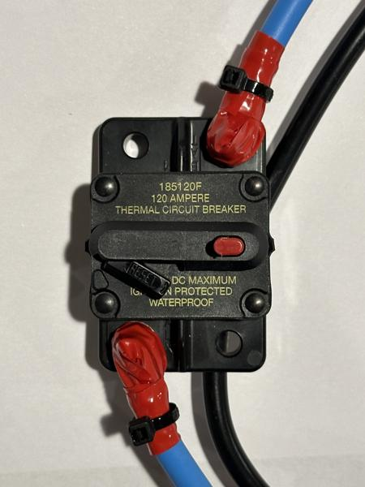
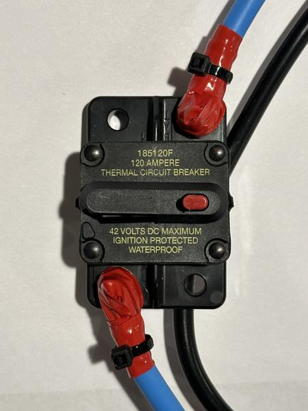
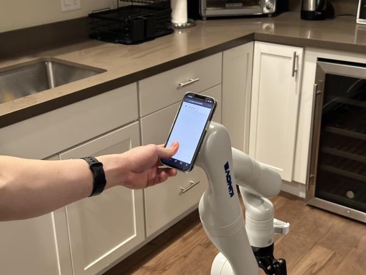
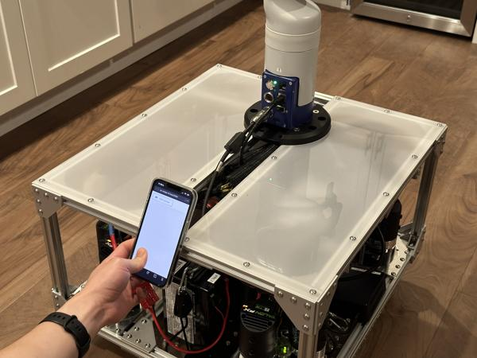
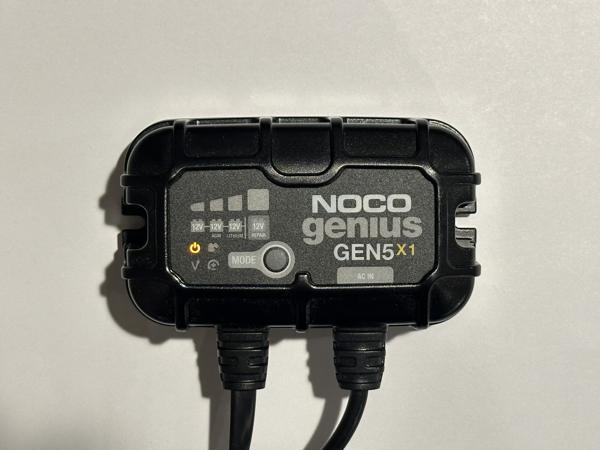
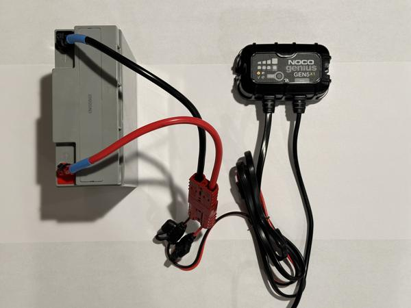
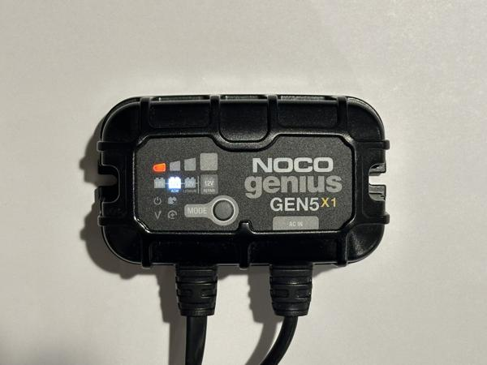
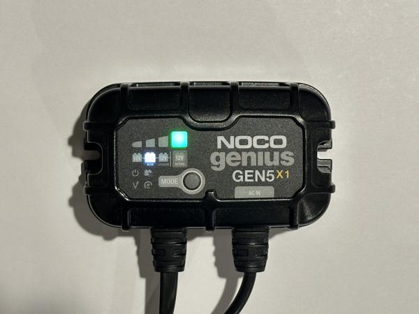
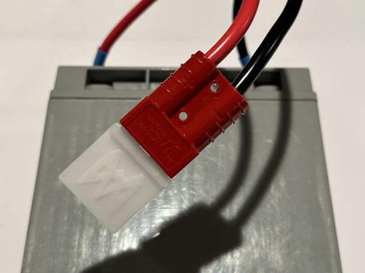

# Usage

Welcome to the TidyBot++ usage guide!
This page provides instructions for operating the robot, including teleoperation, data collection, and policy inference.

!!! note

    Before proceeding, please make sure that you have already set up the mini PC and codebase following the steps on the [Software](software.md) page.

!!! tip

    If you plan to use phone teleoperation, data collection, or policy inference on the real robot, we recommend trying these components in simulation first.
    You can find instructions in the [Usage](https://github.com/jimmyyhwu/tidybot2#usage) section of the codebase README.

## General safety

It is very important to monitor the robot closely at all times during operation.
The mobile base is equipped with powerful motors, which can cause damage or injury if not handled properly.
The open-source software includes the following safety features to help mitigate risk:

**Enabling device**

Both teleoperation and policy inference use a mobile phone as an enabling device (deadman switch).
This means the robot will only move while the user is actively enabling the robot.
If the user stops providing input or the connection is lost, then the robot will stop moving.
This helps prevent unintended robot movements.

**Torque limits**

The base controller applies torque limits to the mobile base motors to prevent the base from exerting excessive forces.
These limits are set to a small fraction of the maximum torque capacity of the motors.
Here is a video demonstration showing the torque limits in action:

<video data-src="../videos/usage/IMG_6875.mp4#t=0.001" controls playsinline style="width: 49.45%;"></video>

**Compliant arm**

The arm controller is compliant, allowing the arm to yield when it encounters external forces.
This behavior helps prevent damage to both the arm and its surrounding environment.

!!! note

    Additional safety measures are highly recommended, especially if you plan to modify the low-level controller.
    Examples of additional measures include:

    * E-stop on the mobile base
    * Wireless remote E-stop
    * Safety barriers around the robot's operating area

## Power on procedure

### Portable power station

The portable power station (camping battery) powers the mini PC and onboard arm.
Follow these steps to power on the robot:

1. Unplug the camping battery's charging cable and check the battery level.
1. Press the button next to the AC outlets to turn them on.
1. The mini PC should turn on automatically.
1. Power on the onboard arm.

!!! tip

    If the battery level runs low, just plug the charging cable back in (about 1 hour to recharge).
    The robot will no longer be mobile, but you can continue using it while the battery is charging.

### SLA battery

The sealed lead acid (SLA) battery powers the mobile base motors and encoders.
Follow these steps to connect the SLA battery to the robot:

1. Place the SLA battery into the battery mount on the back of the mobile base.
1. Tighten the rope ratchet to secure the battery.
1. Connect the battery to the robot's power cable.

See video (2x speed):

=== "Kinova"

    <video data-src="../videos/usage/IMG_2671-2x.mp4#t=0.001" controls playsinline></video>

=== "Franka"

    <video data-src="../videos/usage/IMG_2716-2x.mp4#t=0.001" controls playsinline></video>

=== "ARX5"

    <video data-src="../videos/usage/IMG_2674-2x.mp4#t=0.001" controls playsinline></video>

!!! note

    Please remember to recharge the SLA battery after use.
    Leaving an SLA battery in a discharged state for an extended period of time can degrade its performance and shorten its lifespan.

!!! note

    The SLA battery typically lasts all day and can be hot-swapped when it runs low without having to turn off the robot.

!!! tip

    Once the battery is connected, all motors and encoders should light up.
    If nothing happens, check whether the 120A circuit breaker has been accidentally tripped.
    Pressing the red manual trip button opens the circuit, which causes the reset button to pop out (left photo).
    To close the circuit, push the reset button back in (right photo).

    { width="32.55%" }
    { width="32.55%" }

!!! tip

    The Anderson connectors can be tricky to operate.
    Below are videos demonstrating how to plug and unplug them:

    <video data-src="../videos/usage/IMG_1560-2x.mp4#t=0.001" controls playsinline style="width: 49.45%;"></video>
    <video data-src="../videos/usage/IMG_1570-2x.mp4#t=0.001" controls playsinline style="width: 49.45%;"></video>

## Gamepad teleoperation

Follow these steps to control the mobile base with the wireless gamepad:

1. Plug the gamepad's USB receiver into the mini PC.
1. SSH into the mini PC and start a `tmux` session.
1. Inside the `tmux` session, run:
```bash
python gamepad_teleop.py
```
1. Press the "Start" button on the gamepad to begin teleoperation.
1. Hold down the left shoulder button to "enable" the robot.
1. Move the two joysticks to control translation and rotation.
1. Release the shoulder button at any time to "disable" the robot.

<video data-src="../videos/usage/IMG_1662.mp4#t=0.001" controls playsinline></video>

!!! note

    The interface mode switch on the side of the gamepad should be set to "X" (XInput mode) rather than "D" (DirectInput mode).

!!! tip

    Pressing the "Mode" button switches the left joystick and D-pad functionality.
    If the left joystick seems unresponsive, try pressing the "Mode" button.

To control the robot in global frame rather than local frame, hold down the right shoulder button instead.
Below are videos comparing local frame (left) and global frame (right) control:

<video data-src="../videos/usage/IMG_1663.mp4#t=0.001" controls playsinline style="width: 49.45%;"></video>
<video data-src="../videos/usage/IMG_1665.mp4#t=0.001" controls playsinline style="width: 49.45%;"></video>

!!! note

    The global frame is set to the robot's current position when you press the "Start" button to begin teleoperation.
    To reset the global frame, press the "Back" button to stop teleoperation, then press "Start" again to restart and set a new global frame.

!!! tip

    Use local frame if you are following behind the moving robot or riding on top of it.
    Use global frame if you are standing still while controlling the robot.

## Phone teleoperation

This section describes how to start the phone teleoperation system, connect your phone, and control the robot with it.

### Starting the server

Start the Flask server, which hosts the teleop web app:

=== "Real robot"

    1. SSH into the mini PC and start a `tmux` session  with three windows.
    1. In `tmux` window 1, run:
    ```bash
    python base_server.py
    ```
    1. In `tmux` window 2, run:
    ```bash
    python arm_server.py
    ```
    1. In `tmux` window 3, run:
    ```bash
    python main.py --teleop
    ```

    This starts a Flask server on port `5000`, which you can connect to from your phone.

    !!! tip

        If you have not used `tmux` before, please see the "Sessions" and "Windows" sections in the `tmux` [cheat sheet](https://tmuxcheatsheet.com).

=== "Simulation"

    On your dev machine, run:

    ```bash
    python main.py --sim --teleop
    ```

    This starts a Flask server on port `5000`, which you can connect to from your phone.

### Connecting the client

Follow these steps to connect your phone to the server and start teleoperation:

1. Connect your phone to the same network as the Flask server.
1. Open the [XR Browser](https://apps.apple.com/us/app/xr-browser/id1588029989) or [XRViewer](https://apps.apple.com/us/app/webxr-viewer/id1295998056) app on your iPhone and navigate to `<server-hostname>:5000` to open the teleoperation web app.
1. Align your phone with the robot (see photos below).
1. Press "Start episode" to begin teleoperation.

!!! note

    For proper coordinate frame alignment, the phone should face the same direction as the robot when you press "Start episode".
    You can achieve this by physically placing the phone on the arm or base like in these photos:

    { width="49.45%" }
    { width="49.45%" }

!!! note

    To run the teleop web app, both the server and the phone need internet access.

!!! tip

    If `<server-hostname>:5000` does not connect, try `<server-hostname>.local:5000` instead.
    If that does not connect either, try the IP address of the mini PC instead of the hostname.

### Controlling the robot

To control the arm, hold your thumb on the center of the screen (it will turn blue) and move your phone.
The arm will try to match the phone's relative translation (left video) and rotation (right video):

<video data-src="../videos/usage/IMG_1700.mp4#t=0.001" controls playsinline style="width: 49.45%;"></video>
<video data-src="../videos/usage/IMG_1703.mp4#t=0.001" controls playsinline style="width: 49.45%;"></video>

!!! tip

    If the arm ends up in an undesirable configuration or enters a fault state (e.g., self-collision), you can easily reset it from the phone web app:

    1. Press "End episode".
    1. Make sure the space around the arm is clear.
    1. Press "Reset env" to automatically clear faults and return the arm to its starting configuration.
    1. Align your phone with the robot.
    1. Press "Start episode".

!!! tip

    If the arm is moving in an unintuitive way, these tips may be helpful:

    * After pressing "Start episode", wait until the web app has fully loaded before moving your phone.
    * Hold your phone upright in portrait orientation, with the top edge facing up, not forward.
    * Make sure your phone is locked to portrait orientation.
    * Keep your body aligned with the robot so that you are both facing the same direction.

!!! tip

    If your hand position feels uncomfortable, you can release the screen at any time to "disable" the robot.
    The robot will hold its current pose while disabled, allowing you to reposition your phone before continuing.

!!! tip

    The numbers on the phone screen show the current min/avg/max/std for the round-trip time (RTT) between your phone and the mini PC.
    On 5 GHz Wi-Fi, the expected average RTT is around **7 ms**.
    In some environments (e.g., a crowded conference venue with many wireless devices), the connection quality may degrade, causing large latency spikes that significantly worsen the teleoperation experience.
    In such cases, we recommend using a [USB-C to Ethernet adapter](https://www.amazon.com/Anker-Ethernet-PowerExpand-Aluminum-Portable/dp/B08CK9X9Z8) to create a wired Ethernet connection between your phone and the mini PC.

To precisely control the gripper width, slide your thumb up and down on the screen:

<video data-src="../videos/usage/IMG_1691.mp4#t=0.001" controls playsinline style="width: 49.45%;"></video>

To control the mobile base, hold your thumb on the right edge of the screen (it will turn red) and move your phone to direct the base's movement:

<video data-src="../videos/usage/IMG_1693.mp4#t=0.001" controls playsinline style="width: 49.45%;"></video>

!!! tip

    The base is controlled by moving the phone, not by sliding your thumb on the screen.

Here is a video (4x speed) showing how we use the phone interface to teleoperate the *load dishwasher* task:

<video data-src="../videos/usage/IMG_0781-4x.mp4#t=0.001" controls playsinline></video>

!!! tip

    Here are a few other tips that might be helpful:

    * Avoid extending the arm too far, as it can enter a singularity state. Instead, move the mobile base forward.
    * If you restart the Flask server, you should also refresh the web app page on your phone.
    * In low-texture environments, phone teleoperation is more prone to drifting due to weaker visual feature tracking.
    * If the mobile base experiences wheel slip (e.g., when opening a heavy door), the base odometry may drift, causing the robot and phone coordinate frames to become misaligned. If this happens, please start a new episode.

??? note "Simultaneous teleoperation"

    The teleoperation system also supports using a second phone to simultaneously move the base while the arm is being controlled.
    This enables more efficient execution of tasks such as *wipe countertop*, as shown in the video below (4x speed):

    <video data-src="../videos/usage/IMG_0778-4x.mp4#t=0.001" controls playsinline></video>

    However, this setup has a steeper learning curve, so we recommend starting with a single phone.

## Data collection

To set up data collection, please follow the [Phone teleoperation](#phone-teleoperation) section to start the Flask server and connect the phone client.
When starting the server, add the `--save` flag to indicate that episodes should be saved to disk, and use `--output-dir` to specify the desired save location (default is `data/demos`):

=== "Real robot"

    ```bash
    python main.py --teleop --save --output-dir data/demos
    ```

=== "Simulation"

    ```bash
    python main.py --sim --teleop --save --output-dir data/demos
    ```

Next, follow these steps to collect a single episode of data:

1. Press "Start episode" and perform one demonstration of the task.
1. Press "End episode" to indicate that the episode has ended.
1. In the terminal, enter `y` or `n` to indicate whether to save the episode.
1. Use phone teleoperation to retract the arm and avoid potential collisions.
1. Use phone teleoperation to return the mobile base to its starting position.
1. Press "Reset env" to return the arm to its starting configuration.
1. Manually reset objects in the environment.

Repeat this process to collect additional episodes.

Here is a video (4x speed) showing the full data collection process for two episodes of the *load dishwasher* task, including episode saving and environment resets:

<video data-src="../videos/usage/IMG_0782-4x.mp4#t=0.001" controls playsinline></video>

!!! note

    Data is recorded only when the robot is enabled. Periods when the robot is disabled are not recorded.

!!! tip

    After collecting your first demonstration, it is a good idea to replay or visualize the data to check for any issues before proceeding further.

!!! tip

    To discard the ongoing episode, press "End episode" and enter `n` in the terminal to skip saving.

## Policy inference

To run policy inference, start the policy server on the GPU laptop with your desired checkpoint path:

```bash
python policy_server.py --ckpt-path <checkpoint-path>
```

!!! note

    The policy server runs within the `diffusion_policy` codebase (using the `robodiff` Mamba environment).

=== "Real robot"

    On the mini PC, create an SSH tunnel to the policy server:

    ```bash
    ssh -L 5555:localhost:5555 <gpu-laptop-hostname>
    ```

    This makes the policy server accessible at `localhost:5555` on the mini PC.

    Next, run `main.py` to connect to the policy server via `localhost:5555` and start policy inference:

    ```bash
    python main.py
    ```

    As before, this will start a Flask server on port `5000`, which you can connect to from your phone.

    !!! note

        The Flask server (on the mini PC) is different from the policy server (on the GPU laptop).

=== "Simulation"

    On your dev machine, create an SSH tunnel to the policy server:

    ```bash
    ssh -L 5555:localhost:5555 <gpu-laptop-hostname>
    ```

    This makes the policy server accessible at `localhost:5555` on your dev machine.

    Next, run `main.py` to connect to the policy server via `localhost:5555` and start policy inference:

    ```bash
    python main.py --sim
    ```

    As before, this will start a Flask server on port `5000`, which you can connect to from your phone.

    !!! note

        The Flask server (on your dev machine) is different from the policy server (on the GPU laptop).

Follow these steps to run one episode of policy inference:

1. Connect your phone and open the teleoperation web app.
1. Align your phone with the robot.
1. Press "Start episode".
1. Hold your thumb on the phone screen to enable the robot and execute the policy.
1. Lift your thumb at any time to disable the robot and pause execution.
1. Press "End episode" to indicate that the episode has ended.
1. Use phone teleoperation to retract the arm and avoid potential collisions.
1. Use phone teleoperation to return the mobile base to its starting position.
1. Press "Reset env" to return the arm to its starting configuration.
1. Manually reset objects in the environment.

Repeat this process to run additional episodes.

!!! note

    Since the robot is teleoperated during environment resets, your phone still needs to be aligned with the robot when you press "Start episode" (to ensure proper coordinate frame alignment).

## Power off procedure

### Portable power station

Follow these steps to power off the robot:

1. Power off the onboard arm.
1. Power off the mini PC (`sudo shutdown 0`).
1. Power off the camping battery.
1. Plug in the charging cable to recharge the camping battery.

### SLA battery

Plug in the SLA battery charger:

{ width="49.45%" }

Connect the SLA battery to the charger:

{ width="49.45%" }

!!! note

    The SLA battery can also be charged without removing it from the robot.

The charging mode should be set to "AGM" (press the "Mode" button to change it):

{ width="49.45%" }

Once the battery is fully charged, the indicator light will turn green:

{ width="49.45%" }

!!! tip

    We recommend inserting a battery flag into the Anderson SB50 connector to mark batteries after they are fully charged.
    This helps distinguish fully charged batteries from used ones:

    { width="49.45%" }

    Battery flags can be purchased from [AndyMark](https://www.andymark.com/products/battery-flag) or [3D printed](https://github.com/jimmyyhwu/tidybot2-resources/blob/main/3D%20Printing/Battery%20Flag.stl).
