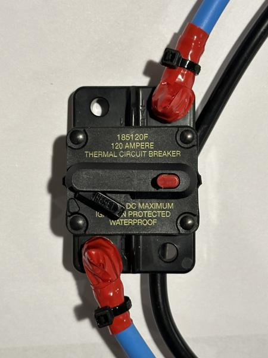
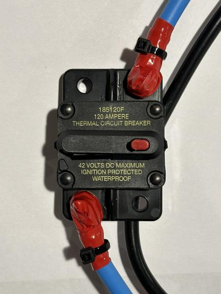
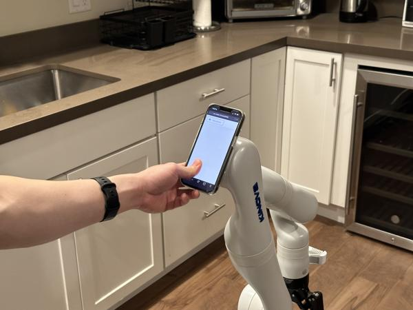
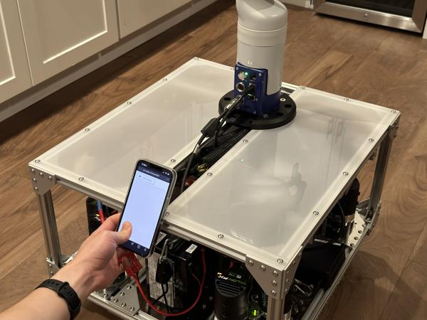
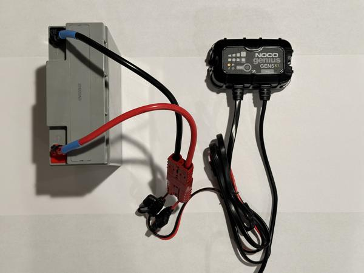
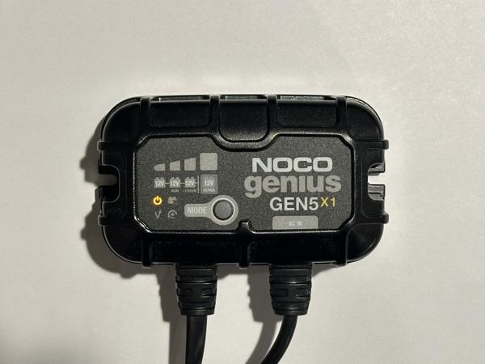
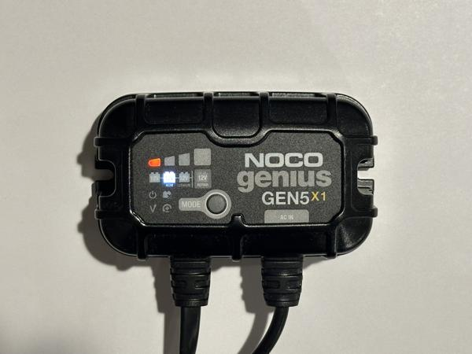
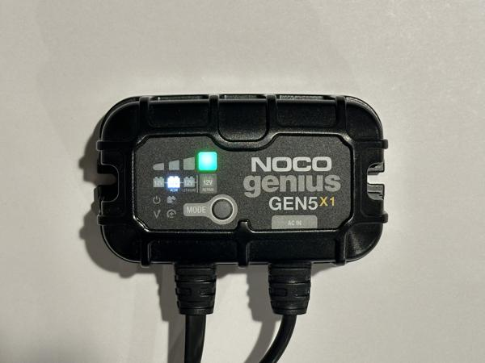
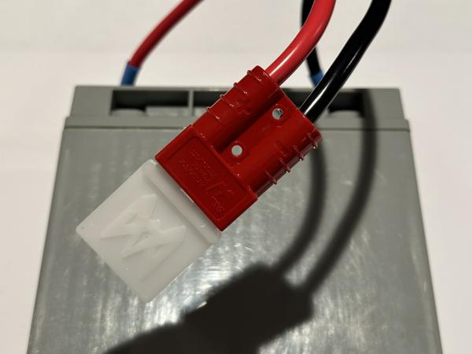

# Usage

Welcome to the TidyBot++ usage guide! This page provides operating instructions for the various capabilities of the robot, such as teleoperation, data collection, and policy inference.

## General safety

It is very important to monitor the robot closely at all times during operation.
The mobile base is equipped with powerful motors, which can cause damage or injury if not handled properly.
The open-source software includes the following safety features to improve the safety of operation:

**Enabling device**

Both teleoperation and policy inference use a mobile phone as an enabling device (dead man's switch).
This means the robot will only carry out movement when the user is actively enabling the robot using the phone.
If the user stops providing input or the connection drops, then the robot will stop moving, helping to prevent unintended movements of the robot.

**Torque limits**

The base controller uses torque limits for the mobile base motors to prevent the robot from exerting excessive forces.
These limits are set much lower than the maximum torque capacity of the motors.
Here is a video showing the torque limits in action:

<video data-src="../videos/usage/IMG_6875.mp4#t=0.001" controls playsinline style="width: 49.45%;"></video>

**Compliant arm**

Additionally, the Kinova arm controller is compliant, allowing the arm to yield when subjected to external forces, preventing damage to itself and the environment.

!!! note

    Additional safety measures are highly recommended, especially if you plan to modify the low-level controller.
    Here are some examples:

    * E-stop on the mobile base
    * Wireless remote E-stop
    * Safety barriers around the robot operating area

## Power on procedure

### Portable power station

The portable power station (camping battery) powers the mini PC and onboard arm.
Here is the procedure for powering on the camping battery and using the robot:

1. Unplug the charging cable and check the battery level
1. Press the button next to the AC outlets to turn them on
1. The mini PC should boot up automatically
1. Power on the onboard arm
1. Use the robot

!!! tip

    If the battery runs low, plug the charging cable back in (about 1 hour to recharge).
    You can continue using the mini PC and arm while the battery is charging, though the robot will no longer be mobile.

### SLA battery

The sealed lead-acid (SLA) battery powers the mobile base motors and encoders.
Follow these steps to connect the SLA battery to the robot:

1. Place the SLA battery into the battery mount on the back of the mobile base
1. Tighten the rope ratchet to secure the battery
1. Connect the battery to the robot power cable

See video (2x speed):

=== "Kinova"

    <video data-src="../videos/usage/IMG_2671-2x.mp4#t=0.001" controls playsinline></video>

=== "Franka"

    <video data-src="../videos/usage/IMG_2716-2x.mp4#t=0.001" controls playsinline></video>

=== "ARX5"

    <video data-src="../videos/usage/IMG_2674-2x.mp4#t=0.001" controls playsinline></video>

!!! note

    The SLA battery can be hot-swapped when it runs low without turning off the robot.

!!! tip

    All motors and encoders should power on and light up once the battery is connected.
    If nothing happens, check if the 120A circuit breaker has been tripped.
    Pressing the red manual trip button opens the circuit and makes the reset button pop out (left photo).
    To close the circuit again, push the reset button back in (right photo).

    { width="32.55%" }
    { width="32.55%" }

!!! tip

    The Anderson connectors can be tricky to operate.
    Here are videos demonstrating how to plug and unplug them:

    <video data-src="../videos/usage/IMG_1560-2x.mp4#t=0.001" controls playsinline style="width: 49.45%;"></video>
    <video data-src="../videos/usage/IMG_1570-2x.mp4#t=0.001" controls playsinline style="width: 49.45%;"></video>

## Gamepad teleoperation

Follow these steps control the mobile base using a Logitech gamepad:

1. Plug the Logitech gamepad's USB receiver into the mini PC
1. SSH into the mini PC and start a tmux session
1. Inside the tmux session, run `python gamepad_teleop.py`
1. Press the "Start" button on the gamepad to start teleop
1. Hold down the left shoulder button to "enable" the robot
1. Use the two joysticks to issue translation and rotation commands
1. Let go of the shoulder button at any time to "disable" the robot

<video data-src="../videos/usage/IMG_1662.mp4#t=0.001" controls playsinline></video>

!!! note

    The interface mode switch on the side of the gamepad should be on "X" (XInput mode) rather than "D" (DirectInput mode).

!!! tip

    Pressing the "Mode" button switches the left joystick and D-pad functionality.
    If the left joystick doesn't seem to work, try pressing the "Mode" button.

You can also control the robot in global frame rather than local frame.
Below are videos comparing local frame (left) and global frame (right) control:

<video data-src="../videos/usage/IMG_1663.mp4#t=0.001" controls playsinline style="width: 49.45%;"></video>
<video data-src="../videos/usage/IMG_1665.mp4#t=0.001" controls playsinline style="width: 49.45%;"></video>

!!! note

    The global frame is set to the robot's current position when you press the "Start" button to begin teleoperation.
    To reset the global frame, press the "Back" button to stop teleoperation, then press "Start" again to restart and set the global frame to the robot's new position.

!!! tip

    Use local frame if you are following behind the moving robot or riding on top of it.
    Use global frame if you are standing still while controlling the robot.

## Phone teleoperation

Follow these steps to start up the phone teleoperation system:

1. SSH into the mini PC and start a tmux session
1. In separate `tmux` windows, run `python base_server.py` and `python arm_server.py`
1. In another `tmux` window, run `python main.py --teleop`. This command starts a Flask server on port 5000.
1. Connect your iPhone to the same network as the mini PC to enable communication between the devices
1. Open the [XR Browser](https://apps.apple.com/us/app/xr-browser/id1588029989) or [XRViewer](https://apps.apple.com/us/app/webxr-viewer/id1295998056) app on your iPhone and navigate to `<minipc-hostname>:5000` to open the teleoperation web app
1. Align your phone with the robot, and then press the "Start episode" button to begin teleoperation

!!! note

    To run the teleop web app, both the mini PC and the phone require internet access.
    Typically, we connect all devices to a router with internet access.

!!! tip

    If `<minipc-hostname>:5000` does not connect, try `<minipc-hostname>.local:5000` instead.
    If that does not connect either, use the IP address of the mini PC instead of the hostname.

!!! tip

    If you have not used tmux before, please see the "Sessions" and "Windows" sections in the [tmux cheat sheet](https://tmuxcheatsheet.com).

To control the arm, hold your thumb on the middle of the screen (it will turn blue) and move your phone.
The arm will attempt to match the relative translation (left video) and rotation (right video) of your phone:

<video data-src="../videos/usage/IMG_1700.mp4#t=0.001" controls playsinline style="width: 49.45%;"></video>
<video data-src="../videos/usage/IMG_1703.mp4#t=0.001" controls playsinline style="width: 49.45%;"></video>

!!! note

    For proper coordinate frame alignment, the phone should face the same direction as the robot when you press the "Start episode" button.
    We recommend physically placing the phone on the arm or base like in these photos:

    { width="49.45%" }
    { width="49.45%" }

!!! tip

    If the arm is moving in an unintuitive way, here are a few tips that might be helpful:

    * After pressing "Start episode", wait until the web app has fully loaded before moving the phone
    * Hold your phone upright in portrait orientation, with the top facing up, not forwards
    * Make sure your phone is locked to portrait orientation
    * During the episode, keep your body aligned with the robot so that you are both facing the same direction

!!! tip

    You can release the screen at any time to "disable" the robot if you your hand position becomes uncomfortable.
    The robot will hold its current position while it disabled, allowing you to reposition the phone before continuing.

!!! tip

    The numbers on the phone screen show the current min/avg/max/std for the round-trip time (RTT) between the phone and mini PC.
    On 5 GHz Wi-Fi, the expected average RTT is around **7 ms**.
    In some environments, such as crowded conference venues with many wireless devices, the connection quality may degrade, causing large latency spikes that significantly worsen the teleoperation experience.
    In such cases, we recommend using a [USB-C to Ethernet adapter](https://www.amazon.com/Anker-Ethernet-PowerExpand-Aluminum-Portable/dp/B08CK9X9Z8) to establish a wired Ethernet connection between the phone and mini PC.

To precisely control the gripper width, slide your thumb up and down on the screen:

<video data-src="../videos/usage/IMG_1691.mp4#t=0.001" controls playsinline style="width: 49.45%;"></video>

To control the mobile base, hold your thumb down on the right edge of the screen (it will turn red) to enable base control mode, and move the phone to direct the base's movement:

<video data-src="../videos/usage/IMG_1693.mp4#t=0.001" controls playsinline style="width: 49.45%;"></video>

!!! tip

    The base is controlled by moving the phone, not by sliding your thumb on the screen.

Here is a video (4x speed) showing how we use the phone interface to teleoperate the *load dishwasher* task:

<video data-src="../videos/usage/IMG_0781-4x.mp4#t=0.001" controls playsinline></video>

!!! tip

    If the arm ends up in an undesirable configuration or enters a fault state (e.g., self-collision), you can easily reset it from the phone web app:

    1. Press the "End episode" button
    1. Make sure the space around the arm is clear
    1. Press the "Reset env" button to automatically clear faults and return the arm to its starting configuration

!!! tip

    Here are some other useful tips:

    * Avoid extending the arm too far, as it can enter a singularity state. Instead, move the mobile base forward.
    * If you restart the Flask server, you should also refresh the web app page on your phone
    * In textureless environments, phone teleoperation is more prone to drifting due to weaker feature tracking for Visual SLAM
    * If the mobile base experiences wheel slip (e.g., when opening a heavy door), the base odometry may drift, causing the robot and phone coordinate frames to become misaligned. If this happens, please start a new episode.

??? note "Simultaneous teleoperation"

    The teleoperation system also supports using a second phone to simultaneously move the base while the arm is being controlled.
    This enables more efficient execution of tasks such as *wipe countertop*:

    <video data-src="../videos/usage/IMG_0778-4x.mp4#t=0.001" controls playsinline></video>

    However, this setup has a steeper learning curve, so we recommend starting with a single phone.

## Data collection

The data collection setup follows the same procedure as phone teleoperation, with the addition of the `--save` flag to enable data saving:

```
python main.py --teleop --save
```

Follow these steps to collect a single episode of data:

1. Press "Start episode" and perform one demonstration of the task
1. Press "End episode" to indicate that the episode has ended
1. In the terminal, enter `y` or `n` to indicate whether to save the episode
1. Use phone teleoperation to retract the arm for avoiding potential collisions
1. Use phone teleoperation to return the mobile base to its starting position
1. Press "Reset env" to reset the arm
1. Manually reset objects in the environment

Repeat this process to collect additional episodes.

Here is a video (4x speed) showing the full process for 2 episode of the *load dishwasher* task, including environment resets:

<video data-src="../videos/usage/IMG_0782-4x.mp4#t=0.001" controls playsinline></video>

!!! note

    Data is recorded only when the robot is enabled. Periods when the robot is disabled are not recorded.

!!! tip

    After collecting your first demonstration, it is a good idea to replay or visualize the data to check for any issues before proceeding further.

!!! tip

    To discard the ongoing episode, press "End episode" and enter `n` in the terminal to skip saving.

## Policy inference

On the GPU laptop, start the policy server with the desired checkpoint path:

```bash
python policy_server.py --ckpt-path <checkpoint-path>
```

On the mini PC, establish an SSH tunnel to the policy server running on port `5555` of the GPU laptop:

```bash
ssh -L 5555:localhost:5555 <gpu-laptop-hostname>.local
```

This makes the policy server accessible at localhost:5555 on the mini PC.

Next, run `main.py` on the mini PC to connect to the policy server and start policy inference:

```bash
python main.py
```

To execute the policy on the robot, follow these steps using the same phone web app as before:

1. Press "Start episode"
1. Hold your thumb on the phone screen to enable the robot and execute the policy
1. Lift your thumb at any time to disable the robot and pause execution
1. Press "End episode" to indicate that the episode has ended
1. Use phone teleoperation to return the robot to its starting position
1. Press "Reset env" to reset the arm
1. Manually reset objects in the environment

!!! tip

    Since the phone is used to teleoperate the robot for environment resets, the coordinate frames still need to be aligned at the beginning of each episode, just like in teleoperation.

## Power off procedure

Power off the robot by turning off the various components, and make sure to recharge both the camping battery and the SLA battery.

Power off the robot by turning off the various components, and make sure to recharge both the camping battery and the SLA battery.

!!! note

    SLA batteries should not be left in a discharged state, as this can degrade their performance and shorten their lifespan.

### Portable power station

To power off the camping battery and its connected components:

1. Power off the onboard arm
1. Power off the mini PC: `sudo shutdown 0`
1. Power off the camping battery
1. Plug in the charging cable to recharge the camping battery

### SLA battery

Charge the SLA battery by plugging in the charger and connecting the battery:

{ width="49.45%" }

Press the "Mode" button to set the charging mode to "AGM":

{ width="49.45%" }
{ width="49.45%" }

The indicator light will turn green once the battery is fully charged:

{ width="49.45%" }

!!! tip

    We recommend inserting a battery flag into the Anderson SB50 connector to mark batteries after they are fully charged.
    This helps distinguish fully charged batteries from used ones:

    { width="49.45%" }

    Battery flags can be purchased from [AndyMark](https://www.andymark.com/products/battery-flag) or [3D printed](https://github.com/jimmyyhwu/tidybot2-resources/blob/main/3D%20Printing/Battery%20Flag.stl).
